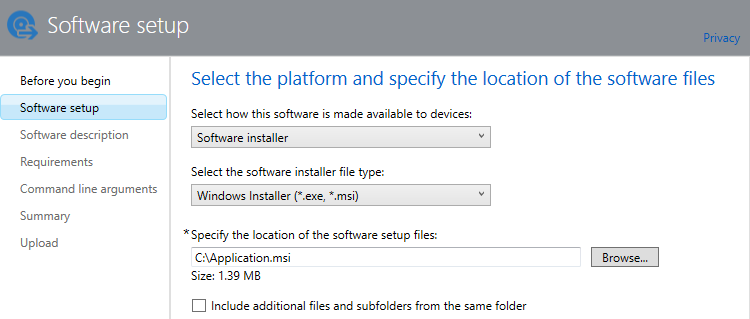

# Add apps for Windows PCs in Microsoft Intune

Use the information in this topic to learn how to add apps to Intune before you deploy them.

> [!IMPORTANT]
> The information in this topic helps you to add apps for Windows PCs that you manage using the Intune PC client software. If you want to add apps for enrolled Windows PCs and other mobile devices, see [Add apps for mobile devices in Microsoft Intune](add-apps-for-mobile-devices-in-microsoft-intune.md).

## Add the app
You use the Intune Software Publisher to configure the properties of the app and upload it to your cloud storage space by using the following procedure:

1.  In the [Microsoft Intune administrator console](https://manage.microsoft.com), click **Apps** &gt; **Add Apps** to start the Intune software publisher.

    > [!TIP]
    > You might need to enter your Intune username and password before the publisher starts.

2.  On the **Software setup** page of the software publisher, configure the following:

    **Select how this software is made available to devices** - Choose **Software installer**, then specify:

	- **Select the software installer file type**|This indicates the type of software you want to deploy. For a Windows PC, choose **Windows Installer**.|
    - **Specify the location of the software setup files**|Enter the location of the installation files or click **Browse** to select the location from a list.|
    - **Include additional files and subfolders from the same folder**|Some software that uses Windows Installer requires supporting files which are typically found in the same folder as the installation files. Select this option if you also want to deploy these supporting files.|
   This installation type uses some of your cloud storage space.

3.  On the **Software description** page, configure the following:

    Depending on the installer file you are using, some of these values might have been automatically entered, or might not appear.

	- **Publisher** - Enter the name of the publisher of the app.
    - **Name**- Enter the name of the app as it will be displayed in the company portal.  Make sure all app names you use are unique. If the same app name exists twice, only one of the apps will be displayed to users in the company portal.|
    - **Description** - Enter a description for the app. This will be displayed to users in the company portal.|
    - **URL for software information**|(optional) Enter the URL of a website that contains information about this app. The URL will be displayed to users in the company portal.
    - **Privacy URL**- (optional) Enter the URL of a website that contains privacy information for this app. The URL will be displayed to users in the company portal.
    - **Category**- (optional) Select one of the built-in app categories. This will make it easier for users to find the app when they browse the company portal.
    - **Icon** - (optional) Upload an icon that will be associated with the app. This is the icon that will be displayed with the app when users browse the company portal.

	For example, if you want to publish an app named Application.msi to Intune, the page would look like this:
	

4.  On the **Requirements** page, select the requirements that must be met before the app can start to install on a device from. Choose from **Architecture** - Select whether this app can be installed on 32-bit, 64-bit, or both operating systems, **Operating System** - Select the minimum operating system on which this app can be installed.

5.  For the **Windows Installer** file type only (exe only): On the **Detection rules** page, you can configure rules to detect if the app you are configuring is already installed on a PC, or  you can use the default detection rules to automatically overwrite any previously installed versions of the app.
	The rules you can configure are:
	- **File exists** - Specify the path to the file you want to detect. You can search under **%ProgramFiles%** (which searches **Program Files**\*&lt;path&gt;* and **Program Files (x86)**\*&lt;path&gt;*) on the PC or **%SystemDrive%** (which searches from the root drive of the PC, typically C:)
	- **MSI product code exists** - Click **Browse** to choose the Windows Installer (msi) file you want to detect. 
	- **Registry key exists** - Specify a registry key that begins with **HKEY_LOCAL_MACHINE\**. Both 32-bit and 64-bit registry paths are searched. If the key you specified exists in either location, the detection rule is satisfied.

    If the app satisfies any of the rules you have configured, it will not be installed.

6.  For the **Windows Installer** file type only (msi and exe): On the **Command line arguments** page, choose whether you want to supply optional command-line arguments for the installer. For example, some installers might support the argument **/q** to install silently with no user intervention.

7.  For the **Windows Installer** file type only (exe only): On the **Return codes** page, you can add new error codes that are interpreted by Intune when the app installs on a managed Windows PC.
    By default, Intune uses industry-standard return codes to report the failure or success of an app package installation: **0** - Success or **3010** - Success with restart. You can also add your own return codes to this list. If you specify a list of return codes and the app installation returns a code that isn't on the list, it is interpreted as a failure.

8.  On the **Summary** page, review the information you specified. Once you are ready, click **Upload**.

9. Click **Close** to finish.

The app is displayed on the **Apps** node of the **Apps** workspace.

## Next steps

Once you've created an app, the next step is to deploy it. To find out more, see [Deploy apps in Microsoft Intune.md](deploy-apps-in-microsoft-intune.md)