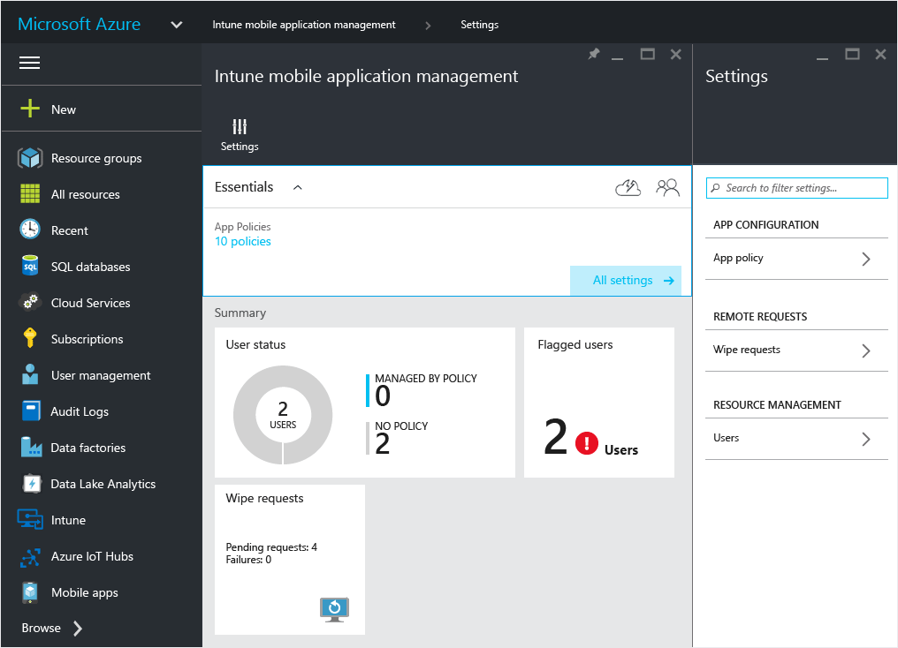
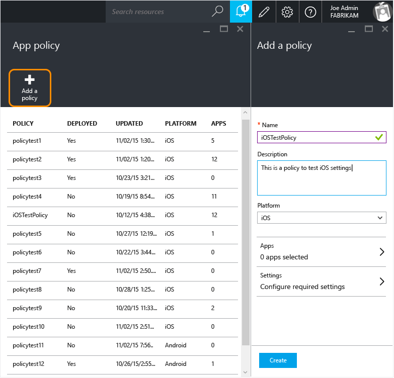
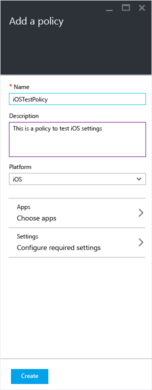
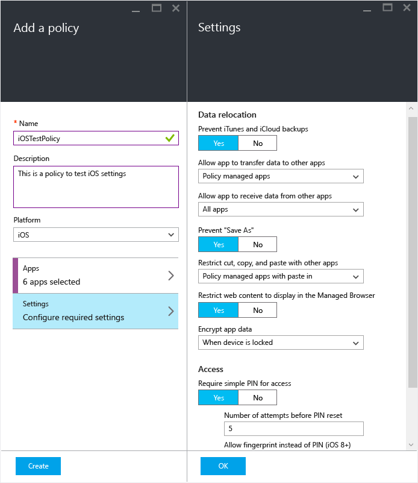
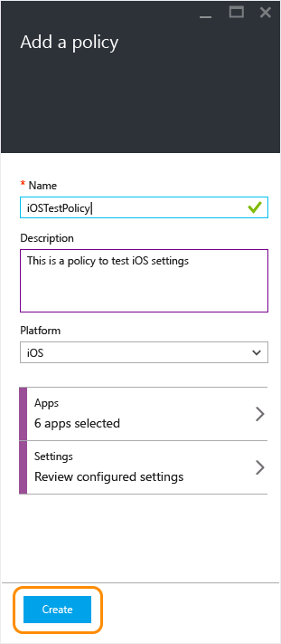
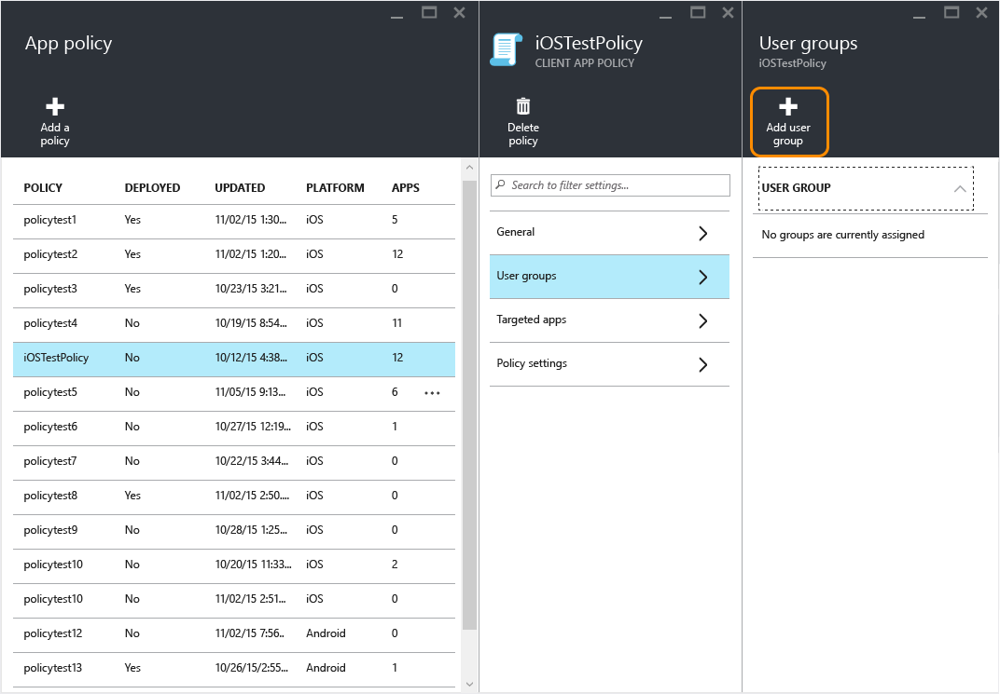
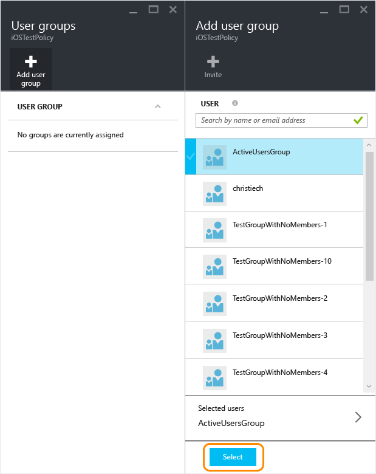
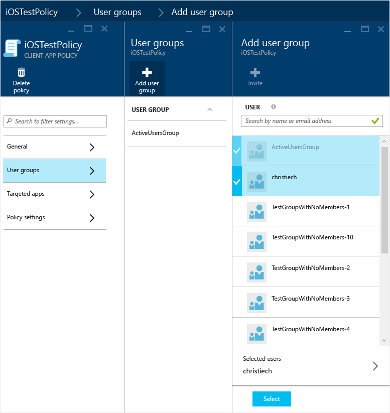
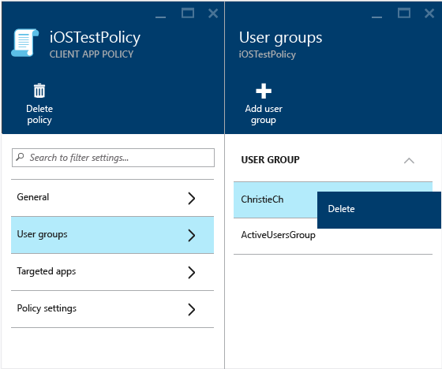
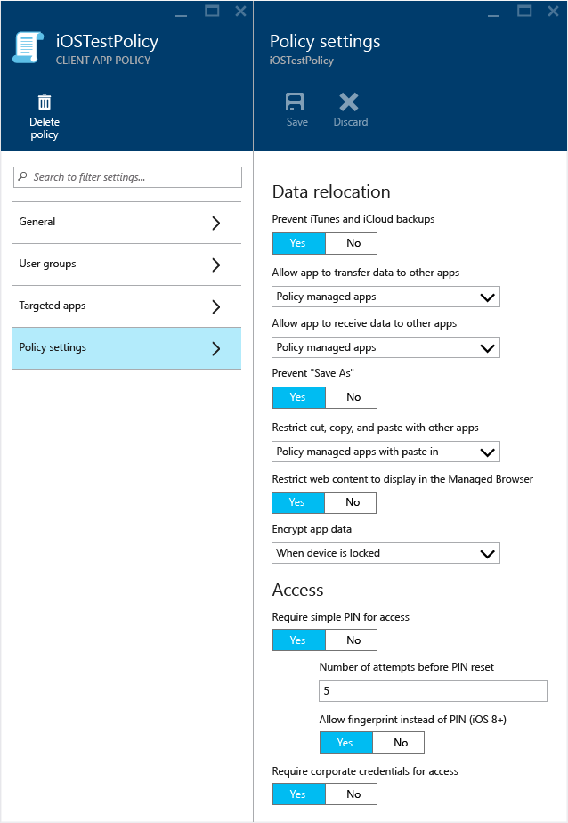

# Create and deploy mobile app management policies with Microsoft Intune
You can create mobile app management policies (MAM) policies and deploy them to users in the Azure  portal.  The MAM policies that you create here are independent of device enrollment, meaning that they can be used on devices that are not managed at all, or managed by [!INCLUDE[wit_firstref](../Token/wit_firstref_md.md)] or another third-party solution.

**In this topic**

[Create and deploy a MAM policy](#bkmk_createanddeploy)

[Change existing policies](#bkmk_changepolicy)

[Policy Settings](#bkmk_policysettings)

[Next steps](#bkmk_nextsteps)

### Create and deploy a MAM policy

##### Create a MAM policy

1.  Click **Intune mobile application management &gt; Settings** to open the **Settings** blade.

    

    > [!TIP]
    > If this is the first time you are using the Azure portal, read [Get started with mobile app management policies in the Azure portal](../Topic/Get-started-with-mobile-app-management-policies-in-the-Azure-portal.md) first to get familiar with the portal.

2.  In the **Settings** blade, click **App policy**.  This opens the **App policy** blade where you'll  create new policies and edit existing policies.

    

3.  Click **Add a policy**.

    

4.  Type  a name for the policy, add  a brief description, and select the platform type to create a policy for iOS or Android.  You can create more than one policy for each platform.

    

5.  Click **Apps** to open the **Apps blade** where a list of available apps is displayed. You can select one or more apps from the list that you want to associate with the policy that you are creating. One you have selected the apps, click the **Select** button at the bottom of the **Apps** blade to save your selection.

    > [!IMPORTANT]
    > You must select at least one app to create a policy.

6.  On the **Add a policy blade**, click **Configure required settings** to open the policy settings blade.

    There are two categories of policy settings-**Data relocation** and **Access**.  Data relocation policies are applicable to data movement in and out of the apps, while the access polices determine how the end-user accesses the apps in a work context.
    To get you started the policy settings have default values.  You do not have to make any changes if the default values meet your requirements.

    > [!TIP]
    > These policy settings are enforced only when using apps in the work context.  When the end-user uses the app to do a personal task, they will not be affected by these policies.

    

    Refer to [Policy Settings](#bkmk_policysettings)section in this topic for the full list of the policy settings and default values.

7.  Click **OK** to save this configuration.  You are now back in the **Add a policy** blade. Click **Create** to create the policy and save your settings.

    

    

When you finish creating a policy as described in the previous procedure, it is not deployed to any users.  Follow the steps described below to deploy the policy.

> [!NOTE]
> If you have created mobile application management policies from the Intune or Configuration Manager consoles, and also created an app management policy from the Azure console, then associated both policies with the same app, the policy you created from the Azure portal takes precedence. However, the reporting in the Intune or Configuration Manager console will report the policy settings created from the Azure  portal. For example:
>
> -   You created a mobile application management policy in the Intune admin console that blocks copy from an app.
> -   You created a mobile app management policy in the Azure console that allows copy from an app
> -   You associate both of these policies to the same app.
> -   The result is that the policy you created from the Azure console takes precedence and copy is allowed.
> -   However, status and reports in the Intune console will incorrectly indicate that copy is blocked.

##### Deploy a policy to users

1.  In the **Policy**blade, click  **User groups**, which opens the **User groups**blade. Click **Add user group** in the **User groups** blade to open the **Add user group** blade.

    

2.  A list of user groups is displayed on the **Add user group** blade. This is a list of all the security groups in your **Azure Active Directory**.  You can select the user groups you want this policy to apply to and click **Select**. **Clicking Select deploys the policy to users**.

    

    > [!NOTE]
    > Only users with [!INCLUDE[wit_nextref](../Token/wit_nextref_md.md)] licenses assigned to them will be affected by the policy.  Users who are in the security group that you selected that don’t have a [!INCLUDE[wit_nextref](../Token/wit_nextref_md.md)] license assigned to them are not affected.

    > [!NOTE]
    > If you are using Intune with Configuration Manager to manage your iOS and Android devices, the policy is only applied to the users directly in the group that you selected.  Members of child groups  nested within the group you selected will not be affected.

You have now created a policy and deployed it to users.

The end users can download the apps from the App store or Google Play. For a detailed walkthrough of the end user experience, see [End-user experience for apps associated with Microsoft Intune mobile app management policies](../Topic/End-user-experience-for-apps-associated-with-Microsoft-Intune-mobile-app-management-policies.md).

### Change existing policies
When you change existing policies,  users who are already signed  in to the apps won’t see the changes for a 8-hour period.

If you are testing and would like to see the changed policy immediately, sign out of the app and sign back in to see the new settings.

##### Change the list of apps associated with the policy

1.  In  the **App policy** blade, click the policy you want to change. This opens a blade specific to the policy you just selected.

    

2.  In the policy blade, click **Targeted apps** to open the list of apps.

3.  Remove or add apps from the list and click the **Save icon** to save your changes.

##### Change the list of user groups

1.  In  the **App policy** blade, click the policy you want to change. This opens the blade specific to the policy you selected.

2.  In the policy blade, click **User groups** to open the **User group** blade that shows the list of current user groups who have this policy.

3.  To **add a new user group** to the policy, click **Add user group**, and select the user group. Click **Select** to deploy the policy to the group you selected.

    

4.  To **delete a user group**, highlight the user group you want to remove, click the ellipses (…), then click **Delete** to remove the user group.

    

##### Change policy settings

1.  In the **App policy** blade, click the policy you want to change. This opens a blade specific to the policy you just selected.

    

2.  Click **Policy settings** to open the **Policy settings** blade.

3.  Change the settings, and click the **Save icon** to save your changes.

    

### Policy Settings
**IOS data relocation policies**

||||
|-|-|-|
|**Policy setting**|**Description**|**Default value**|
|**Prevent iTunes and iCloud backups**|Select **Yes** to disable, or **No** to allow backup of any information from the policy managed apps.|**Yes**|
|**Allow app to transfer data to other apps**|Select one of the options to specify the apps that the policy managed apps can send data to:  -   **Policy managed apps**: Allow transfer to only other restricted apps -   **All apps**: Allow transfer to any app -   **None**: Do not allow data transfer to any app  Additionally, if you set this option to **Policy Managed Apps** or **None**, the iOS 9 feature that allows Spotlight Search to search data within apps will be blocked.|**Policy managed apps**|
|**Allow app to receive data from other apps**|Specify  from which apps  can transfer data to the policy managed apps:  -   **Policy managed apps**: Allow data transfers only from other restricted apps -   **All apps**: Allow data transfer from any app -   **None**: Do not allow data transfer from any app|**All apps**|
|**Prevent Save As**|Select **Yes** to disable the use of the Save As option in any app that uses this policy. Select **No** if you want to allow the use of Save As.|**Yes**|
|**Restrict cut, copy and paste with other apps**|Specify when  cut, copy, and paste operations should be restricted. Choose from:  -   **Blocked:** Do not allow cut, copy, and paste operations between policy managed apps. -   **Policy Managed Apps**: Only allow cut, copy, and paste operations between policy managed apps. -   **Policy Managed Apps with paste In**: Allow data cut or copied between policy managed apps. Allow data cut or copied from any app to be pasted into this app. -   **Any App**: No restrictions for  cut, copy, and paste operations between any apps.|**Policy managed apps with paste in**|
|**Restrict web content to display in the Managed Browser**|When this setting is enabled, any links in the app will be opened in the Managed Browser.  For devices that are not enrolled in Intune, you can restrict web links in policy-managed apps to only open in the Managed Browser app using the mobile app management policy. If you are using Intune to manage your devices, see [Manage Internet access using managed browser policies with Microsoft Intune](../Topic/Manage-Internet-access-using-managed-browser-policies-with-Microsoft-Intune.md).|**Yes**|
|**Encrypt app data**|For apps that are associated with a [!INCLUDE[wit_nextref](../Token/wit_nextref_md.md)] mobile app management policy, data is encrypted at rest using device level encryption provided by the OS. When a PIN is required, the data is encrypted per the settings in the mobile app management policy. As stated in Apple documentation, [the modules used by iOS 7 are FIPS 140-2 certified](http://support.apple.com/en-us/HT202739).  In the policy settings, you can specify PIN encryption values.  These values determine when the data is encrypted. The options are:  -   **When device is locked:** All app data associated with this policy is encrypted while the device is locked. -   **When device is locked (except for open files):** All app data associated with this policy is encrypted while the device is locked, except for data that in the files that are opened in the app. -   **After device restart:** All app data associated with this policy is encrypted when the device is restarted, until the device is unlocked for the first time. -   **Use device settings:** App data is encrypted based on the default settings on the device.  When you enable this setting, the end-user is required to setup and use a PIN to access their device.  If there is not PIN setup for device access, the apps will not launch and the end-user will be prompted to set a PIN with a message -“Your company has required that you must first enable a device PIN to access this application.”|Encryption option is not selected|
|**ContactSyncDisabled**| Choose **Yes** to prevent contact information from synchronizing to the native address book app on the device. If you choose **No**, the app will save the  contact information to the native address book app on the device. When you do a selective wipe to remove company data, contacts synced directly from the app to the native address book are removed. Any contacts synced from the native address book to another external source cannot be wiped. Currently this is applicable only to the **Microsoft Outlook** app.|**Yes**
**iOS Access policy settings**

||||
|-|-|-|
|**Policy setting**|**Description**|**Default value**|
|**Require simple PIN for access**|Select **Yes** to require a PIN to use policy managed apps. The user is prompted to set this up the first time they run the app in a work context.|**Yes**|
|**Number of attempts before PIN reset**|Specify the number of PIN entry attempts that can be made before the user must reset the PIN.|There is no default value for this setting|
|**Require fingerprint instead of PIN (iOS 8.0+)**|Select **Yes** to require a fingerprint identity instead of a numbered PIN for app access.  On iOS devices, you can allow the user to identify themselves using fingerprint on iOS devices instead of a numbered PIN. When the end-user tries to access this app using their work account, they are prompted to provide their fingerprint identity instead of entering a PIN number.|**Yes**|
|**Require corporate credentials for access**|Select **Yes** to require corporate credentials instead of a PIN for app access. **Note:** If you set this to Yes, this overrides the requirements for PIN or Touch ID.  The user will be prompted to provide their corporate credentials.|**No**|
|**Block managed apps from running on jailbroken or rooted devices**|Select **Yes** to block apps from running on jailbroken or rooted devices. The user will continue to be able to use the apps for personal tasks, but will have to use a different device for work.|**Yes**|
|**Recheck the access requirements after (minutes)**|-   **Timeout:** Time (in minutes) before the access requirements for the app are rechecked. -   **Offline grace period:** If the device is offline, the time (in minutes) before the access requirements for the app are rechecked.|**30 minute timeout, and 720 minute offline grace period**|
|**Offline interval before app data is wiped (days)**|You can choose to wipe the company data if a device has been offline for a certain period.  Specify the number of days a device can be offline before the company data is removed from the device. **Tip:** Entering a value of  0 will turn this setting off.|**90 days**|
**Android data relocation settings**

||||
|-|-|-|
|**Policy setting**|**Description**|**Default value**|
|**Prevent Android backups**|Select **Yes** to disable, or **No** to allow backup of any information from the policy managed apps.|**Yes**|
|**Allow app to transfer data to other apps**|Select one of the options to specify the apps that the policy managed apps can send data to:  -   **Policy managed apps**: Allow transfer to only other restricted apps -   **All apps**: Allow transfer to any app -   **None**: Do not allow data transfer to any app|**Policy managed apps**|
|**Allow app to receive data from other apps**|Specify  from which apps  can transfer data to the policy managed apps:  -   **Policy managed apps**: Allow data transfers only from other restricted apps -   **All apps**: Allow data transfer from any app -   **None**: Do not allow data transfer from any app|**All apps**|
|**Prevent Save As**|Select **Yes** to disable the use of the Save As option in any app that uses this policy. Select **No** if you want to allow the use of Save As.|**Yes**|
|**Restrict cut, copy and paste with other apps**|Specify when  cut, copy, and paste operations should be restricted. Choose from:  -   **Blocked:** Do not allow cut, copy, and paste operations between policy managed apps. -   **Policy Managed Apps**: Only allow cut, copy, and paste operations between policy managed apps. -   **Policy Managed Apps with paste In**: Allow data cut or copied between policy managed apps. Allow data cut or copied from any app to be pasted into this app. -   **Any App**: No restrictions for  cut, copy, and paste operations between any apps.|**Policy managed apps with paste in**|
|**Restrict web content to display in the Managed Browser**|When this setting is enabled, any links in the app will be opened in the Managed Browser.  For devices that are not enrolled in Intune, you can restrict web links in policy-managed apps to only open in the Managed Browser app using the mobile app management policy. If you are using Intune to manage your devices, see [Manage Internet access using managed browser policies with Microsoft Intune](../Topic/Manage-Internet-access-using-managed-browser-policies-with-Microsoft-Intune.md).|**Yes**|
|**Encrypt app data**|For apps that are associated with a [!INCLUDE[wit_nextref](../Token/wit_nextref_md.md)] mobile app management policy, encryption is provided by Microsoft. Data is encrypted synchronously during file I/O operations according to the setting in the mobile app management policy.  Managed apps on Android use AES-128 encryption in CBC mode utilizing the platform cryptography libraries. The encryption method is not FIPS 140-2 certified. SHA-256 encryption is supported as an explicit instruction using the SigAlg parameter and will only work on devices 4.2 and above. Content on the device storage is always be encrypted.  When you set this to **Yes**, the end-user is required to setup and use a PIN to access their device.  If there is not PIN setup for device access, the apps will not launch and the end-user will be prompted to set a PIN with a message -*“Your company has required that you must first enable a device PIN to access this application.”*|Encryption option is not selected|
**Android access policy settings**

||||
|-|-|-|
|**Policy setting**|**Description**|**Default value**|
|**Require simple PIN for access**|Select **Yes** to require a PIN to use policy managed apps. The user is prompted to set this up the first time they run the app in a work context.|**Yes**|
|**Number of attempts before PIN reset**|Specify the number of PIN entry attempts that can be made before the user must reset the PIN.|There is no default value for this setting|
|**Require corporate credentials for access**|Select **Yes** to require corporate credentials instead of a PIN for app access. **Note:** If you set this to **Yes**, this overrides the requirements for PIN or Touch ID.  The user will be prompted to provide their corporate credentials.|**No**|
|**Block managed apps from running on jailbroken or rooted devices**|Select **Yes** to block apps from running on jailbroken or rooted devices. The user will continue to be able to use the apps for personal tasks, but will have to use a different device for work.|**Yes**|
|**Recheck the access requirements after (minutes)**|-   **Timeout:** Time (in minutes) before the access requirements for the app are rechecked. -   **Offline grace period:** If the device is offline, the time (in minutes) before the access requirements for the app are rechecked.|**30 minute timeout, and 720 minute offline grace period**|
|**Offline interval before app data is wiped (days)**|You can choose to wipe the company data if a device has been offline for a certain period.  Specify the number of days a device can be offline before the company data is removed from the device. **Tip:** Entering a value of  0 will turn this setting off.|**90 days**|
|**Block screen capture and Android Assistant (Android 6 Marshmallow or later)**|Select **Yes** to specify that the screen capture and **Android Assistant** capabilities of the device are blocked when using this app.||

### Next steps
[Monitor mobile app management policies with Microsoft Intune](../Topic/Monitor-mobile-app-management-policies-with-Microsoft-Intune.md)

## See Also
[Configure data loss prevention app policies with Microsoft Intune](../Topic/Configure-data-loss-prevention-app-policies-with-Microsoft-Intune.md)
