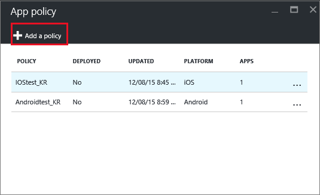
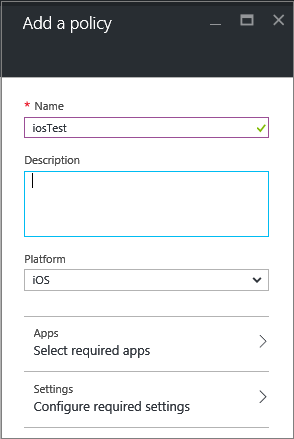
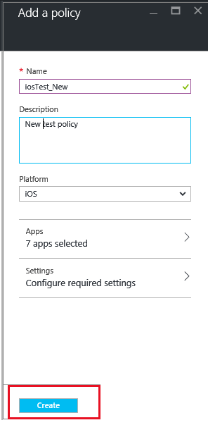
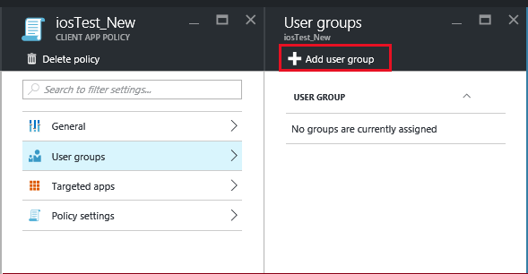
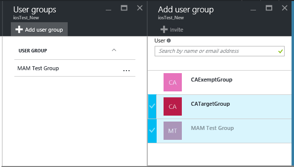

---
# required metadata

title: Create and deploy MAM policies | Microsoft Intune
description: Use the step-by-step instructions in this topic to create and deploy mobile app management policies.
keywords:
author: karthikaraman
manager: arob98
ms.date: 07/22/2016
ms.topic: article
ms.prod:
ms.service: microsoft-intune
ms.technology:
ms.assetid: c1b9a343-1737-4a65-a9c6-aca48acad11c

# optional metadata

#ROBOTS:
#audience:
#ms.devlang:
ms.reviewer: joglocke
ms.suite: ems
#ms.tgt_pltfrm:
#ms.custom:

---

# Create and deploy mobile app management policies with Microsoft Intune
Mobile app management (MAM) policies can be applied to apps running on devices that may or may not be managed by Intune. For a more detailed description of how MAM policies work and the scenarios supported by Intune MAM policies, read the [protect app data using mobile app management policies](protect-app-data-using-mobile-app-management-policies-with-microsoft-intune.md) topic.

This topic describes the process of creating a MAM policy in the **Azure portal**. The Azure portal is the new admin console for creating MAM policies, and we recommend that you use this portal to create MAM  policies. Azure portal supports the following MAM scenarios:
- Devices enrolled in Intune
- Devices managed by a third-party MDM solution
- Devices that are not managed by any MDM solution (BYOD).

>[!IMPORTANT]

> If you are currently using the **Intune admin console** to manage your devices, you can create a MAM policy that supports apps for devices enrolled in Intune using the [Intune admin console](configure-and-deploy-mobile-application-management-policies-in-the-microsoft-intune-console.md).
MAM policies created in the Intune admin console cannot be imported into the Azure portal.  The MAM policies must be recreated in the Azure portal.

> You may not see all MAM policy settings in the Intune admin console. The Azure portal is the new admin console for creating MAM policies. If you create MAM policies on both Intune admin console and Azure portal, the policy in the Azure portal is applied to the apps and deployed to users.

To see a list of policy settings supported for Android and iOS platforms, select one of the following:

> [!div class="op_single_selector"]
- [iOS policies](ios-mam-policy-settings.md)
- [Android policies](android-mam-policy-settings.md)

##  Create a MAM policy
Before creating a MAM policy, review the [pre-requisites and support](get-ready-to-configure-mobile-app-management-policies-with-microsoft-intune.md) information.
1.  Choose **Intune mobile application management &gt; Settings** to open the **Settings** blade.

    

    > [!TIP]
    > If this is the first time you are using the Azure portal, read [Azure portal for Microsoft Intune MAM policies](azure-portal-for-microsoft-intune-mam-policies.md) first to get familiar with the portal.

2.  In the **Settings** blade, choose **App policy**.  This opens the **App policy** blade where you'll create new policies and edit existing policies. Choose **Add a policy**.

    

3.  Type  a name for the policy, add  a brief description, and select the platform type to create a policy for iOS or Android.  You can create more than one policy for each platform.

    

4.  Choose **Apps** to open the **Apps blade** where a list of available apps is displayed. You can select one or more apps from the list that you want to associate with the policy that you are creating. One you have selected the apps, choose the **Select** button at the bottom of the **Apps** blade to save your selection.

    > [!IMPORTANT]
    > You must select at least one app to create a policy.

5.  On the **Add a policy blade**, choose **Configure required settings** to open the policy settings blade.

    There are two categories of policy settings,**Data relocation** and **Access**.  Data relocation policies are applicable to data movement in and out of the apps, while the access polices determine how the end user accesses the apps in a work context.
    To get you started the policy settings have default values.  You do not have to make any changes if the default values meet your requirements.

    > [!TIP]
    > These policy settings are enforced only when using apps in the work context.  When the end user uses the app to do a personal task, they will not be affected by these policies.

    

6.  Choose **OK** to save this configuration.  You are now back in the **Add a policy** blade. Choose **Create** to create the policy and save your settings.

    

When you finish creating a policy as described in the previous procedure, it is not deployed to any users.  Follow the steps described below to deploy the policy.

> [!IMPORTANT]
> If you create a MAM policy for an app using the Intune admin console and a MAM policy using the Azure portal, the policy you created using the Azure portal takes precedence. However, the reporting in the Intune or Configuration Manager console will report the policy settings created from the Azure  portal. For example:
>
> -   You created a mobile application management policy in the Intune admin console that blocks copy from an app.
> -   You created a mobile app management policy in the Azure console that allows copy from an app
> -   You associate both of these policies to the same app.
> -   The result is that the policy you created from the Azure console takes precedence and copy is allowed.
> -   However, status and reports in the Intune console will incorrectly indicate that copy is blocked.

## Deploy a policy to users

1.  In the **Policy** blade, choose  **User groups**, which opens the **User groups** blade. Choose **Add user group** in the **User groups** blade to open the **Add user group** blade.

    

2.  A list of user groups is displayed on the **Add user group** blade. This is a list of all the security groups in your **Azure Active Directory**.  You can select the user groups you want this policy to apply to and choose **Select**. Choosing **Select**, deploys the policy to users.

    

    You have now created a policy and deployed it to users.

Only users with [!INCLUDE[wit_nextref](../includes/wit_nextref_md.md)] licenses assigned to them will be affected by the policy.  Users who are in the security group that you selected that don’t have a [!INCLUDE[wit_nextref](../includes/wit_nextref_md.md)] license assigned to them are not affected.

>[!IMPORTANT]
> If you are using Intune with Configuration Manager to manage your iOS and Android devices, the policy is only applied to the users directly in the group that you selected.  Members of child groups  nested within the group you selected will not be affected.

The end users can download the apps from the App store or Google Play. For a detailed walkthrough of how MAM protects company data on the device see [end user experience with MAM enabled apps](end-user-experience-for-mam-enabled-apps-with-microsoft-intune.md) topic.

##  Change existing policies
You can edit an existing policy and apply it to the targeted users. However, when you change existing policies,  users who are already signed  in to the apps won’t see the changes for an 8-hour period.

To see the effect of the changes immediately the end user will have to log out of the app, and sign back in.

### To change the list of apps associated with the policy

1.  In  the **App policy** blade, choose the policy you want to change. This opens a blade specific to the policy you just selected.

    

2.  In the policy blade, choose **Targeted apps** to open the list of apps.

3.  Remove or add apps from the list and choose the **Save icon** to save your changes.

### To change the list of user groups

1.  In  the **App policy** blade, choose the policy you want to change. This opens the blade specific to the policy you selected.

2.  In the policy blade, choose **User groups** to open the **User group** blade that shows the list of current user groups who have this policy.

3.  To **add a new user group** to the policy, choose **Add user group**, and select the user group. Choose **Select** to deploy the policy to the group you selected.

    

4.  To **delete a user group**, highlight the user group you want to remove, choose the ellipses (…), then choose **Delete** to remove the user group.

    

### To change policy settings

1.  In the **App policy** blade, choose the policy you want to change. This opens a blade specific to the policy you just selected.

    

2.  Choose **Policy settings** to open the **Policy settings** blade.

3.  Change the settings, and choose the **Save icon** to save your changes.

    

## Policy settings
To see a full list of the policy setting for iOS and Android, select one of the following:

> [!div class="op_single_selector"]
- [iOS policies](ios-mam-policy-settings.md)
- [Android policies](android-mam-policy-settings.md)

## Next steps
[Monitor compliance and user status](monitor-mobile-app-management-policies-with-microsoft-intune.md)

### See also
[End user experience for MAM enabled apps](end-user-experience-for-mam-enabled-apps-with-microsoft-intune.md)
