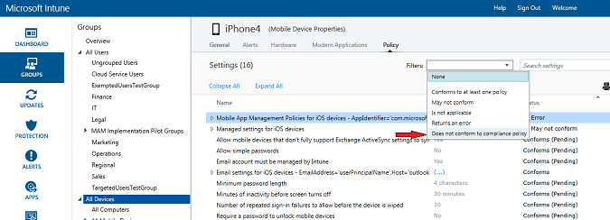

---
# required metadata

title: Deploy and monitor compliance policy in Microsoft Intune | Microsoft Intune
description:
keywords:
author: karthikaraman
manager: jeffgilb
ms.date: 04/28/2016
ms.topic: article
ms.prod:
ms.service:
ms.technology:
ms.assetid: e60e3714-5120-41e2-9878-83ac75107967

# optional metadata

#ROBOTS:
#audience:
#ms.devlang:
ms.reviewer: jeffgilb
ms.suite: ems
#ms.tgt_pltfrm:
#ms.custom:

---

# Deploy and monitor a compliance policy in Microsoft Intune
## Deploy a compliance policy
Deploy the compliance policy you [created](create-a-device-compliance-policy-in-microsoft-intune.md) to one or more groups of users or devices in your organization.

1.  In the **Policy** workspace, select the policy you want to deploy, then choose **Manage Deployment**.

2.  In the **Manage Deployment** dialog box, choose one or more groups to which you want to deploy the policy, then choose **Add > OK**.

You can deploy a compliance policy to users and/or devices. Use Active Directory groups that you have already created and synced to Intune, or create these groups manually in the Intune console. To learn more about how to deploy policies, see [deploy a configuration policy](use-policies-to-manage-computers-and-mobile-devices-with-microsoft-intune.md#deploy-a-configuration-policy).

Use the status summary and alerts on the **Overview** page of the **Policy** workspace to identify issues with the policy that require your attention. Additionally, a status summary appears in the **Dashboard** workspace.

> [!IMPORTANT]If you have not deployed a compliance policy and then enable an Exchange conditional access policy, all targeted devices will be allowed access.

## How Intune policy conflicts are resolved
Policy conflicts  can occur due when multiple Intune policies are applied to a device. If the policy settings overlap, Intune resolves any conflicts using the following rules:

-   If the conflicting settings are from an Intune configuration policy and a compliance policy, the settings in the compliance policy take precedence over the settings in the configuration policy, even if the settings in the configuration policy are more secure.

-   If you have deployed multiple compliance policies, the most secure of these policies will be used.

## Monitor the compliance policy

#### To view devices that do not conform to a compliance policy

1.  In the [Microsoft Intune administration console](https://manage.microsoft.com), choose **Groups > All Devices**.

2.  Double-click the name of a device in the list of devices.

3.  Choose the **Policy** tab to see a list of the policies for that device.

4.  From the **Filters** drop-down list, select **Does not conform to compliance policy**.

#### To view the Health Attestation Reports

1.  In the [Microsoft Intune administration console](https://manage.microsoft.com), choose **Reports**.

2.  In the **Health Attestation Report - Create a new report** page, you can view a report with all the Windows 10 health attestation data collected by Intune. You can also create a report with a subset of the data using filters. The filters can be based on the type of device, operating system, or only a subset of data points.

## Next steps
You can now use the compliance policy with conditional access policies to control access to services in your organization.

[Create conditional access policies for email](manage-email-access-with-microsoft-intune.md)

[Create conditional access policies for SharePoint Online](manage-sharepoint-online-access-with-microsoft-intune.md)

### See also
[Introduction to device compliance polices in Intune](introduction-to-device-compliance-policies-in-microsoft-intune.md)

[Manage access to email and O365 services](manage-access-to-email-and-O365-services-with-intune.md)
