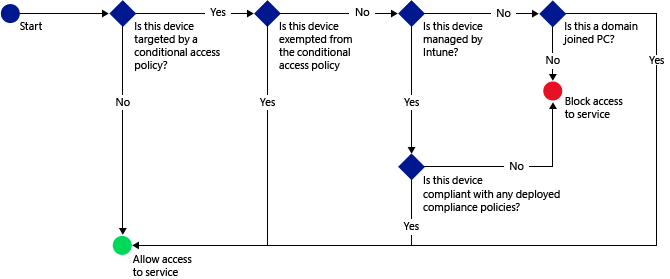

# Manage access to email and O365 services with Intune
You can restrict access to your company email and O365 services like SharePoint and Skype for Business.
Intune's conditional access capability allows you to make sure that only devices that are compliant with the rules that you set are allowed access to your company email and resources.

## How should I configure conditional access?
Use conditional access to manage access to Microsoft **Exchange On-premises**, **Exchange Online**, **Exchange Online Dedicated**,  **SharePoint Online** and **Skype for Business Online**.

To set up conditional access to restrict access to email and O365 services, configure a device compliance policy, and a conditional access policy.

The compliance policy has settings like passcode, encryption, whether or not a device is jailbroken that a device must comply with in order to be considered compliant.  

Conditional access policy lets you restrict access to services like Exchange and SharePoint Online based on the device compliance, the type of apps that should be used to access. Conditional access policy also lets you apply the policy to Azure Active Directory security user groups, and specify how to manage devices that are not supported by Microsoft Intune.  

## How does it work?
Compliancy policy settings are used to evaluate the compliant status of the device, and the conditional access policy settings allow you to specify the restrictions to email and O365 services like SharePoint Online, and Skype for Business. When conditional access policy is used with the compliance policy, only compliant devices will be allowed to access the service. The devices must have a compliance policy deployed to it, in order for it to be evaluated for compliance.
If no compliance policy is deployed to a device, then any applicable conditional access policies will treat the device as compliant, and no access restrictions will be applied.

Unlike other Intune policies, you do not deploy conditional access policies. Instead, you configure these once, and they apply to all targeted users.

When devices do not meet the conditions you configure, the user is guided though the process of enrolling the device and fixing the issue that prevents the device from being compliant.

A typical flow of conditional access might as follows:

## Next steps
[Create a compliance policy](create-a-device-compliance-policy-in-microsoft-intune.md)

[Create a conditional access policy for Exchange Online]()

[Create a conditional access policy for Exchange On-premises]()

[Create a conditional access policy for new Exchange Online Dedicated]()

[Create a conditional access policy for legacy Exchange Online Dedicated]()

[Create conditional access policy for SharePoint Online]()

[Create conditional access policy for Skype for Business Online]()
