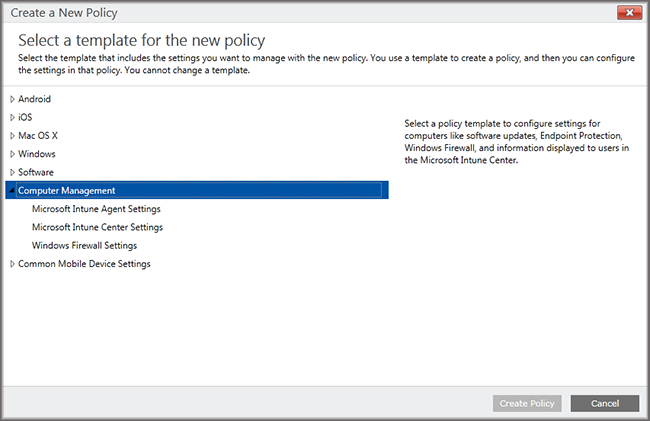

---
# required metadata

title: Manage PCs with client software | Microsoft Intune
description: Manage Windows PCs by installing the Intune client software.
keywords:
author: nathbarn
manager: angrobe
ms.date: 08/30/2016
ms.topic: article
ms.prod:
ms.service: microsoft-intune
ms.technology:
ms.assetid: 3b8d22fe-c318-4796-b760-44f1ccf34312

# optional metadata

#ROBOTS:
#audience:
#ms.devlang:
ms.reviewer: owenyen
ms.suite: ems
#ms.tgt_pltfrm:
#ms.custom:

---

# Manage Windows PCs with Intune PC client software
Instead of [enrolling Windows PCs as mobile devices](set-up-windows-device-management-with-microsoft-intune.md), you can enroll and manage Windows PCs by installing the Intune client software.

Intune manages Windows PCs by using policies similar to the way Windows Server Active Directory Domain Services (AD DS) and Group Policy Objects (GPOs) do. If you are managing Active Directory domain-joined computers with Intune, you should [be sure that Intune policies do not conflict with any GPOs](resolve-gpo-and-microsoft-intune-policy-conflicts.md) that are in place for your organization.

While the Intune software client supports [management capabilities that help protect PCs](policies-to-protect-windows-pcs-in-microsoft-intune.md) by managing software updates, Windows Firewall, and Endpoint Protection, PCs that are managed with the Intune software client cannot be targeted by other Intune policies, including those **Windows** policy settings that are specific to mobile device management.

> [!NOTE]
> Devices that are running Windows 8.1 or later can be managed with either the Intune client or as mobile devices. Installing the Intune client and enrolling in mobile device management is not supported.

## Requirements for Intune PC client management

**Hardware**:
Following are the minimum hardware requirements for the Intune client:

|Requirement|More information|
|---------------|--------------------|
|Network|The client requires the PC to have Internet connectivity.|
|Processor and memory|Refer to the processor and RAM requirements for the PC's operating system.|
|Disk space|200 MB available disk space is required before the client software is installed.|

**Software**:
The following are the software requirements for the Intune client:

|Requirement|More information|
|---------------|--------------------|
|Operating system | Windows devices that are running Windows Vista or later are required. Home edition versions are not supported.|
|Administrative permissions|The account that installs the client software must have local administrator permissions on that device.|
|Windows Installer 3.1|The PC must have, at a minimum, Windows Installer 3.1.  To view the version of Windows Installer on a PC:  -   On the PC, right-click **%windir%\System32\msiexec.exe**, and then click **Properties**.  You can download the latest version of Windows Installer from [Windows Installer Redistributables](http://go.microsoft.com/fwlink/?LinkID=234258) on the Microsoft Developer Network website.|
|Remove incompatible client software|Before you install the Intune client software, you must uninstall any Configuration Manager or System Management Server client software from that PC.|

## Computer management with the Intune computer client
After the Intune client software is installed, management capabilities include:
- [Application management](deploy-apps-in-microsoft-intune.md)
- [Real-time monitoring and Endpoint Protection](help-secure-windows-pcs-with-endpoint-protection-for-microsoft-intune.md)
- [Windows Firewall settings management](help-protect-windows-pcs-using-windows-firewall-policies-in-microsoft-intune.md)
- Hardware and software inventory
- Remote control (through remote assistance requests)
- [Software update settings](keep-windows-pcs-up-to-date-with-software-updates-in-microsoft-intune.md)
- Compliance settings reporting

Certain management options that are available to PCs that are managed as mobile devices are unavailable to PCs that are managed with the Intune software client, including:

-   Full wipe (selective wipe is available)
-   Conditional access
-   Windows policies other than **Computer management** policies

In addition to the Intune client agent actions that you perform locally on individual computers, you can also use the Intune admin console to perform other [common computer management tasks](common-windows-pc-management-tasks-with-the-microsoft-intune-computer-client.md) on Windows PCs that have the client installed. These include:

-   Viewing hardware and software inventory information about managed computers
-   Remotely restarting a computer
-   Retiring a computer to uninstall the client software and remove it from management with Intune
-   Linking users to specific managed computers
-   Responding to remote assistance requests

The Intune client agent usually runs quietly in the background without the need for much user interaction or troubleshooting. However, if you need help with computer management issues, there are several [resources available to help you solve them](/intune/troubleshoot/troubleshoot-client-setup-in-microsoft-intune).
