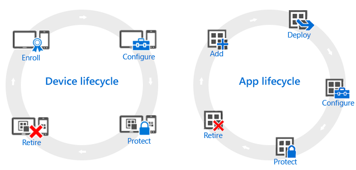

---
# required metadata

title: Overview of device and app lifecycles | Microsoft Intune
description: Overview of the device and app lifecycles with Intune.
keywords:
author: robstackmsft
manager: angrobe
ms.date: 07/19/2016
ms.topic: article
ms.prod:
ms.service: microsoft-intune
ms.technology:
ms.assetid: 38e08253-14a0-4cc4-87be-7b110c12a523

# optional metadata

#ROBOTS:
#audience:
#ms.devlang:
ms.reviewer: jeffgilb
ms.suite: ems
#ms.tgt_pltfrm:
#ms.custom:

---

# Overview of device and app lifecycles

Although the needs of individual organizations might differ, there are certain common steps that all organizations need to take on an ongoing basis, whatever their other operational needs. These can be grouped into two main categories, which are termed **lifecycles**. The deployment lifecycle you follow depends on the scenario you’re trying to enable. For example, you might need only the device lifecycle or the app lifecycle, or you might need both.

For management purposes, all devices have a lifecycle. It starts when you enroll the device and extends through its retirement. The [device management lifecycle](overview-of-device-lifecycle-in-microsoft-intune.md) walks you through how to enroll the device, how to configure and protect it, and then how to remove it from management.

Similarly, apps you work with have their own [app lifecycle](overview-of-app-lifecycle-in-microsoft-intune.md) that includes steps ranging from adding an app to Intune, all the way through to removing them when they are no longer required.
