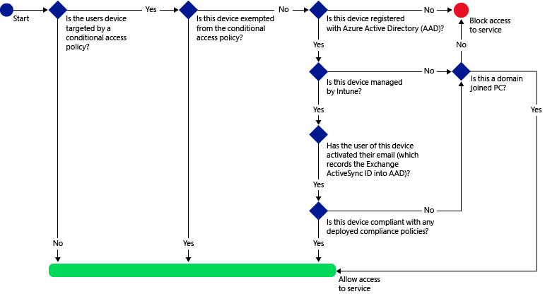
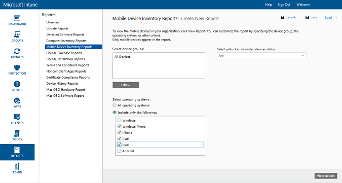
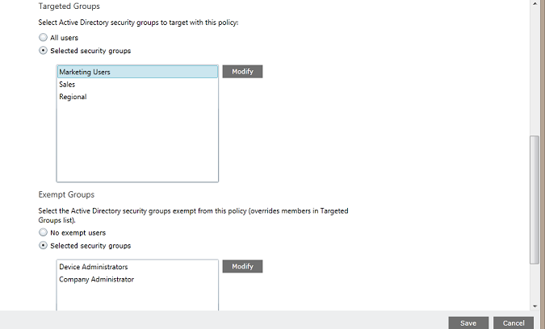

---
# required metadata

title: Restrict email access to Exchange Online | Microsoft Intune
description: Protect and control access to company email on Exchange Online with conditional access.
keywords:
author: karthikaraman
manager: angrobe
ms.date: 09/13/2016
ms.topic: article
ms.prod:
ms.service: microsoft-intune
ms.technology:
ms.assetid: 09c82f5d-531c-474d-add6-784c83f96d93

# optional metadata

#ROBOTS:
#audience:
#ms.devlang:
ms.reviewer: chrisgre
ms.suite: ems
#ms.tgt_pltfrm:
#ms.custom:

---

# Restrict email access to Exchange Online and new Exchange Online Dedicated with Intune

If you have an Exchange Online Dedicated environment and need to find out whether it is in the new or the legacy configuration, contact your account manager.

To control email access to Exchange Online or to your new Exchange Online Dedicated environment, configure conditional access for Exchange Online in Intune.
To learn more about how conditional access works, read the [restrict access to email, O365, and other services](restrict-access-to-email-and-o365-services-with-microsoft-intune.md) article.

**Before** you can configure conditional access, you must:

-   Have an **Office 365 subscription that includes Exchange Online (such as E3)** and users must be licensed for Exchange Online.

- Have an **Enterprise Mobility Suite + Security or an Azure Active Directory premium subscription**, and the users must be licensed for EMS or Azure AD. For more details, see the [Enterprise Mobility Suite pricing page](https://www.microsoft.com/en-us/cloud-platform/enterprise-mobility-pricing) or the [Azure Active Directory pricing page](https://azure.microsoft.com/en-us/pricing/details/active-directory/).

-  Consider configuring the optional **Microsoft Intune service-to-service connector**,  which connects [!INCLUDE[wit_nextref](../includes/wit_nextref_md.md)] to Microsoft Exchange Online and helps you manage device information through the [!INCLUDE[wit_nextref](../includes/wit_nextref_md.md)] console. You do not need to use the connector to use compliance policies or conditional access policies, but it is required to run reports that help evaluate the impact of conditional access.

   > [!NOTE]
   > Do not configure the service- to-service connector if you intend to use conditional access for both Exchange Online and Exchange On-premises

   For instructions on how to configure the connector, see [Intune service-to-service connector](intune-service-to-service-exchange-connector.md)

When conditional access policies are configured and targeted to a user, before a user can connect to their email, the **device** they use must be:

-   **Enrolled** with [!INCLUDE[wit_nextref](../includes/wit_nextref_md.md)] or is a domain joined PC.

-  **Registered in Azure Active Directory**. This happens automatically when the device is enrolled with [!INCLUDE[wit_nextref](../includes/wit_nextref_md.md)]. Additionally, the client Exchange ActiveSync ID must be registered with Azure Active Directory.

  AAD DRS will be activated automatically for Intune and Office 365 customers. Customers who have already deployed the ADFS Device Registration Service will not see registered devices in their on-premises Active Directory.

-   **Compliant** with any [!INCLUDE[wit_nextref](../includes/wit_nextref_md.md)] compliance policies deployed to that device, or domain joined to an on-premises domain.

If a conditional access policy is not met, the user is presented with one of the following messages when they log in:

- If the device is not enrolled with [!INCLUDE[wit_nextref](../includes/wit_nextref_md.md)], or is not registered in Azure Active Directory, a message is displayed with instructions about how to install the company portal app, enroll the device, and activate email. This process also associates the device’s Exchange ActiveSync ID with the record in Azure Active Directory.

-   If the device is evaluated as not compliant with the compliance policy rules, the end user is directed to the [!INCLUDE[wit_nextref](../includes/wit_nextref_md.md)] Company Portal website, or the Company Portal  app where they can find information about the problem and how to remediate it.

The diagram below illustrates the flow used by conditional access policies for Exchange Online.

## Support for mobile devices
You can restrict access to Exchange Online email from **Outlook** and other **apps that use modern authentication**:-

- Android 4.0 and later, Samsung Knox Standard 4.0 and later
- iOS 8.0 and later
- Windows Phone 8.1 and later

**Modern authentication** brings Active Directory Authentication Library (ADAL)-based sign in to Microsoft Office clients.

-   The ADAL based authentication enables Office clients to engage in browser-based authentication (also known as passive authentication).  To authenticate, the user is directed to a sign-in web page. This new sign-in method enables better security like **multi-factor authentication**, and **certificate-based authentication**.
This [article](https://support.office.com/en-US/article/How-modern-authentication-works-for-Office-2013-and-Office-2016-client-apps-e4c45989-4b1a-462e-a81b-2a13191cf517) has more detailed information on how modern authentication works.
Setup ADFS claims rules to block non-modern authentication protocols. Detailed instructions are provided in scenario 3 - [block all access to O365 except browser based applications](https://technet.microsoft.com/library/dn592182.aspx).

You can restrict access to **Outlook Web Access (OWA)** on Exchange Online when accessed from a browser on **iOS** and **Android** devices.  Access will only be allowed from only supported browsers on compliant devices:

* Safari (iOS)
* Chrome (Android)
* Managed Browser (iOS and Android)

**Unsupported browsers will be blocked**.

**The OWA app for iOS and Android can be modified not to use modern authentication, and is not supported.  Access from the OWA app must be blocked through ADFS claims rules.**

You can restrict access to Exchange email from the built-in **Exchange ActiveSync email client** on the following platforms:

- Android 4.0 and later, Samsung Knox Standard 4.0 and later

- iOS 8.0 and later

- Windows Phone 8.1 and later

## Support for PCs

You can setup conditional access for PCs that run Office desktop applications to access **Exchange Online** and **SharePoint Online** for PCs that meet the following requirements:

-   The PC must be running Windows 7.0,  Windows 8.1, or Windows 10.

  >[!NOTE]
  > To use conditional access with Windows 10 PCs, you must update those PCs with the Windows 10 Anniversary Update.

  The PC must either be domain joined or compliant with the compliance policy rules.

  In order to be considered compliant, the PC must be enrolled in [!INCLUDE[wit_nextref](../includes/wit_nextref_md.md)] and comply with the policies.

  For domain joined PCs, you must  set it up to [automatically register the device](https://azure.microsoft.com/documentation/articles/active-directory-conditional-access-automatic-device-registration/) with Azure Active Directory.

  >[!NOTE]
    >Conditional access is not supported on PCs running the Intune computer client.

-   [Office 365 modern authentication must be enabled](https://support.office.com/en-US/article/Using-Office-365-modern-authentication-with-Office-clients-776c0036-66fd-41cb-8928-5495c0f9168a), and have all the latest Office updates.

    Modern authentication brings Active Directory Authentication Library (ADAL) based sign-in to Office 2013 Windows clients and enables better security like **multi-factor authentication**, and **certificate-based authentication**.

-   Set up ADFS claims rules to block non-modern authentication protocols. Detailed instructions are provided in scenario 3 - [block all access to O365 except browser based applications](https://technet.microsoft.com/library/dn592182.aspx).

## Configure conditional access
### Step 1: Configure and deploy a compliance policy
Make sure you [create](create-a-device-compliance-policy-in-microsoft-intune.md) and [deploy](deploy-and-monitor-a-device-compliance-policy-in-microsoft-intune.md) a compliance policy to the user groups who will also get the conditional access policy.

> [!IMPORTANT]
> If you have not deployed a compliance policy, the devices will be considered compliant and will be allowed access to Exchange.

### Step 2: Evaluate the effect of the conditional access policy
You can use the **Mobile Device Inventory Reports** to identify the devices that might be blocked from accessing Exchange after you configure the conditional access policy.

To do this, configure a connection between [!INCLUDE[wit_nextref](../includes/wit_nextref_md.md)] and Exchange by using the [Microsoft Intune service-to-service connector](intune-service-to-service-exchange-connector.md).
1.  Navigate to **Reports -> Mobile Device Inventory Reports**.

2.  In the report parameters, select the [!INCLUDE[wit_nextref](../includes/wit_nextref_md.md)] group you want to evaluate and, if required, the device platforms to which the policy will apply.
3.  Once you’ve selected the criteria that meets your organization’s needs, choose **View Report**.
The Report Viewer opens in a new window.

After you run the report, examine these four columns to determine whether a user will be blocked:

-   **Management Channel** – Indicates whether the device is managed by Intune, Exchange ActiveSync, or both.

-   **AAD Registered** – Indicates whether the device is registered with Azure Active Directory (known as Workplace Join).

-   **Compliant** – Indicates whether the device is compliant with any compliance policies you deployed.

-   **Exchange ActiveSync ID** – iOS and Android devices are required to have their Exchange ActiveSync ID associated with the device registration record in Azure Active Directory. This happens when the user chooses the **Activate Email** link in the quarantine email.

    > [!NOTE]
    > Windows Phone devices always display a value in this column.

Devices that are part of a targeted group will be blocked from accessing Exchange unless the column values match those listed in the following table:

--------------------------
|Management channel|AAD registered|Compliant|Exchange ActiveSync ID|Resulting action|
|----------------------|------------------|-------------|--------------------------|--------------------|
|**Managed by Microsoft Intune and Exchange ActiveSync**|Yes|Yes|A value is displayed|Email access allowed|
|Any other value|No|No|No value is displayed|Email access blocked|
----------------------
You can export the contents of the report and use the **Email Address** column to tell your users that they will be blocked.

### Step 3: Configure user groups for the conditional access policy
Conditional access policies are targeted to different Azure Active Directory security groups of users. You can also exempt certain user groups from this policy.  When a user is targeted by a policy, each device they use must be compliant in order to access email.

You can configure these groups in the **Office 365 admin center**, or the **Intune account portal**.

You can specify two group types in each policy:

-   **Targeted groups** – User groups to which the policy is applied.

-   **Exempted groups** – User groups that are exempt from the policy (optional)

If a user is in both groups, they will be exempt from the policy.

Only the groups which are targeted by the conditional access policy are evaluated.

### Step 4: Configure the conditional access policy

>[!NOTE]
> You can also create conditional access policy in the Azure AD management console. Azure AD management console allows you to create the Intune device conditional access policies (referred to as the **device-based conditional access policy** in Azure AD) in addition to other conditional access policies like multi-factor authentication.  You can also set conditional access policies for third-party Enterprise apps like Salesforce and Box that Azure AD supports. For more details, see [How to set Azure Active Directory device-based conditional access policy for access control to Azure Active Directory connected applications](https://azure.microsoft.com/en-us/documentation/articles/active-directory-conditional-access-policy-connected-applications/).

1.  In the [Microsoft Intune administration console](https://manage.microsoft.com), choose **Policy** > **Conditional Access** > **Exchange Online Policy**.

2.  On the **Exchange Online Policy** page, select **Enable conditional access policy for Exchange Online**.

    > [!NOTE]
    > If you have not deployed a compliance policy, devices are treated as compliant.
    >
    > Regardless of the compliance state, all users who are targeted by the policy will be required to enroll their devices with [!INCLUDE[wit_nextref](../includes/wit_nextref_md.md)].

3.  Under **Application access**, for apps that use modern authentication, you have two ways of choosing which platforms the policy should apply. Supported platforms include Android, iOS, Windows, and Windows Phone.

    -   **All platforms**

        This will require that any device used to access **Exchange  Online**,  to be enrolled in Intune and compliant with the policies.  Any client application using **modern authentication** is subject to the conditional access policy, and if the platform is currently not supported by Intune, access to **Exchange Online** is blocked.

        Selecting the **All platforms** option means that Azure Active Directory will apply this policy to all authentication requests, regardless of the platform reported by the client application.  All platforms will be required to enrolled and become compliant, except for:
        *	Windows devices will be required to be enrolled and compliant, domain joined with on-premises Active Directory, or both
	    * Unsupported platforms like Mac OS.  However, apps using modern authentication coming from these platforms will be still be blocked.

    -   **Specific platforms**

         Conditional access policy will apply to any client app that is using **modern authentication** on the device platforms you specify.

4. Under **Outlook web access (OWA)**, you can choose to allow access to Exchange Online only through the supported browsers: Safari (iOS), and Chrome (Android). Access from other browsers will be blocked. The same platform restrictions you selected for Application access for Outlook also apply here.

  On **Android** devices, users must enable the browser access.  To do this the end-user must enable the “Enable Browser Access” option on the enrolled device as follows:
  1.	Launch the **Company Portal app**.
  2.	Go to the **Settings** page from the triple dots (…) or the hardware menu button.
  3.	Press the **Enable Browser Access** button.
  4.	In the Chrome browser, sign out of Office 365 and restart Chrome.

  On **iOS and Android** platforms, To identify the device that is used to access the service, Azure Active Directory will issue a Transport layer security ( TLS) certificate to the device.  The device displays the certificate with a prompt to the end-user to select the certificate as seen in the screenshots below. The end-user must select this certificate before they can continue to use the browser.

  **iOS**

  

  **Android**

  

5.  Under **Exchange ActiveSync apps**, you can choose to block noncompliant devices from accessing Exchange Online. You can also select whether to allow or block access to email when the device is not running a supported platform. Supported platforms include Android, iOS, Windows, and Windows Phone.

6.  Under **Targeted Groups**, select the Active Directory security groups of users to which the policy will apply. You can either choose to target all users or a selected list of user groups.

    > [!NOTE]
    > For users that are in the **Targeted groups**, the Intune polices will replace Exchange rules and policies.
    >
    > Exchange will only enforce  the Exchange allow, block and quarantine rules, and Exchange policies if:
    >
    > -   The user is not licensed for Intune.
    > -   The user is licensed for Intune, but the user does not belong to any security groups targeted in the conditional access policy.

6.  Under **Exempted Groups**, select the Active Directory security groups of users that are exempt from this policy. If a user  is in both the targeted and exempted groups, they will be exempt from the policy.

7.  When you are done, choose **Save**.

-   You do not have to deploy the conditional access policy, it takes effect immediately.

-   After a user creates an email account, the device is blocked immediately.

-   If a blocked user enrolls the device with [!INCLUDE[wit_nextref](../includes/wit_nextref_md.md)] and fixes any noncompliance issues, email access is unblocked within 2 minutes.

-   If the user un-enrolls their device, email is blocked after around 6 hours.

**To see some example scenarios of how you would configure conditional access policy to restrict device access, see [restrict email access example scenarios](restrict-email-access-example-scenarios.md).**

## Monitor the compliance and conditional access policies

#### To view devices that are blocked from Exchange

On the [!INCLUDE[wit_nextref](../includes/wit_nextref_md.md)] dashboard, choose the **Blocked Devices from Exchange** tile to show the number of blocked devices and links to more information.

## Next steps
[Restrict access to SharePoint Online](restrict-access-to-sharepoint-online-with-microsoft-intune.md)

[Restrict access to Skype for Business Online](restrict-access-to-skype-for-business-online-with-microsoft-intune.md)
