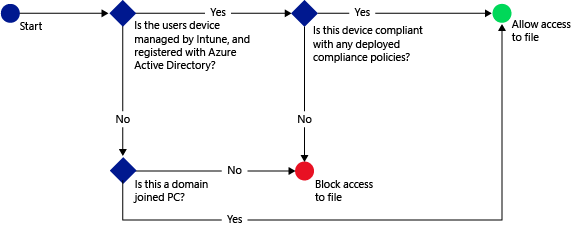

---
# required metadata

title: Restrict access to SharePoint Online | Microsoft Intune
description: Protect and control access to  company data on SharePoint Online with conditional access.
keywords:
author: karthikaraman
manager: angrobe
ms.date: 07/13/2016
ms.topic: article
ms.prod:
ms.service: microsoft-intune
ms.technology:
ms.assetid: b088e5a0-fd4a-4fe7-aa49-cb9c8cfb1585

# optional metadata

#ROBOTS:
#audience:
#ms.devlang:
ms.reviewer: chrisgre
ms.suite: ems
#ms.tgt_pltfrm:
#ms.custom:

---

# Restrict access to SharePoint Online with Microsoft Intune
Use the [!INCLUDE[wit_firstref](../includes/wit_firstref_md.md)] conditional access to control access to files located on SharePoint online.
Conditional access has two components:
- Device compliance policy that the device must comply with in order to be considered compliant.
- Conditional access policy where you specify the conditions that the device must meet in order to access the service.
To learn more about how conditional access works, read the [restrict access to email, O365, and other services](restrict-access-to-email-and-o365-services-with-microsoft-intune.md) topic.

The compliance and conditional access policies are deployed to the user. Any device that the user uses to access the services is checked for compliance with the policies.

When a user attempts to connect to a file using a supported app such as OneDrive on their device, the following evaluation occurs:

>[!IMPORTANT]
>Conditional access for PCs and Windows 10 Mobile devices with apps using modern authentication is not currently available to all Intune customers. If you are already using these features, you do not need to take any action. You can continue to use them.

>If you have not created conditional access policies for PCs or Windows 10 Mobile for apps using modern authentication, and would like to do so, you must to submit a request.  You can find out more information about known issues as well as how to get access to this feature at the [connect site](http://go.microsoft.com/fwlink/?LinkId=761472).

**Before** configuring a conditional access policy for SharePoint Online, you must:
- Have a **SharePoint Online subscription** and users must be licensed for SharePoint Online.
- Have a subscription for the **Enterprise Mobility Suite** or **Azure Active Directory Premium**.

  To connect to the required files, the device must:
-   Be **enrolled** with [!INCLUDE[wit_nextref](../includes/wit_nextref_md.md)] or a domain-joined PC.

-   **Register the device** in Azure Active Directory (this happens automatically when the device is enrolled with [!INCLUDE[wit_nextref](../includes/wit_nextref_md.md)]).

-   Be compliant with any deployed [!INCLUDE[wit_nextref](../includes/wit_nextref_md.md)] compliance policies

The device state is stored in Azure Active Directory which grants or blocks access to the files, based on the conditions you specify.

If a condition is not met, the user is presented with one of the following messages when they log in:

-   If the device is not enrolled with [!INCLUDE[wit_nextref](../includes/wit_nextref_md.md)], or is not registered in Azure Active Directory, a message is displayed with instructions about how to install the Company Portal  app and enroll.

-   If the device is not compliant, a message is displayed that directs the user to the [!INCLUDE[wit_nextref](../includes/wit_nextref_md.md)] Company Portal website where they can find information about the problem, and how to remediate it.

**Conditional access is enforced across all SharePoint sites and external sharing is blocked**

>[!NOTE]
>If you  enable conditional access for SharePoint Online, we recommend that you disable the domain on the list as described in the  [Remove-SPOTenantSyncClientRestriction](https://technet.microsoft.com/en-us/library/dn917451.aspx) topic.  
## Support for mobile devices
- iOS 7.1 and later
- Android 4.0 and later, Samsung Knox Standard 4.0 or later
- Windows Phone 8.1 and later

You can restrict access to SharePoint Online when accessed from a browser from **iOS** and **Android** devices.  Access will only be allowed from only supported browsers on compliant devices:
* Safari (iOS)
* Chrome (Android)
* Managed Browser (iOS and Android)

**Unsupported browsers will be blocked**.

## Support for PCs
- Windows 8.1 and later (when enrolled with Intune)
- Windows 7.0 or Windows 8.1 (when domain-joined)

  - Domain-joined PCs must be set up to [automatically register](https://azure.microsoft.com/en-us/documentation/articles/active-directory-conditional-access-automatic-device-registration/) with Azure Active Directory.
AAD DRS will be activated automatically for Intune and Office 365 customers. Customers who have already deployed the ADFS Device Registration Service will not see registered devices in their on-premises Active Directory.

  - If the policy is set to require domain join, and the PC is not domain-joined, a message is displayed to contact the IT admin.

  - If the policy is set to require domain-join or compliant, and the PC does not meet either requirement, a message is displayed with instructions about how to install the Company Portal  app and enroll.
-    [Office 365 modern authentication must be enabled](https://support.office.com/en-US/article/Using-Office-365-modern-authentication-with-Office-clients-776c0036-66fd-41cb-8928-5495c0f9168a), and have all the latest Office updates.

    Modern authentication brings Active Directory Authentication Library (ADAL) based sign-in to Office 2013 Windows clients and enables better security like **multi-factor authentication**, and **certificate-based authentication**.

## Configure conditional access for SharePoint Online

### Step 1: Configure Active Directory security groups
Before you start, configure Azure Active Directory security groups for the conditional access policy. You can configure these groups in the **Office 365 admin center**, or the **Intune account portal**. These groups will be used to target, or exempt users from the policy. When a user is targeted by a policy, each device they use must be compliant in order to access resources.

You can specify two group types in a SharePoint Online policy:

-   **Targeted groups** – Contains groups of users to which the policy will apply.

-   **Exempted groups** – Contains groups of users that are exempt from the policy.

If a user is in both groups, they will be exempt from the policy.

### Step 2: Configure and deploy a compliance policy
If you have not already done so, create and deploy a compliance policy to the users that the SharePoint Online policy will be targeted to.

> [!NOTE]
> While compliance policies are deployed to [!INCLUDE[wit_nextref](../includes/wit_nextref_md.md)] groups, conditional access policies are targeted to Azure Active Directory security groups.

For details about how to configure the compliance policy, see [create a  compliance policy](create-a-device-compliance-policy-in-microsoft-intune.md).

> [!IMPORTANT]
> If you have not deployed a compliance policy, the devices will be treated as compliant.

When you are ready, continue to **Step 3**.

### Step 3: Configure the SharePoint Online policy
Next, configure the policy to require that only managed and compliant devices can access SharePoint Online. This policy will be will be stored in Azure Active Directory.

#### 

1.  In the [Microsoft Intune administration console](https://manage.microsoft.com), choose **Policy** > **Conditional Access** > **SharePoint Online Policy**.

2.  Select **Enable conditional access policy for SharePoint Online**.

3.  Under **Application access**, you can choose to apply conditional access policy to:

    -   **All platforms**

        This will require that any device used to access **SharePoint Online**,  is enrolled in Intune and compliant with the policies.  Any client application using **modern authentication** is subject to the conditional access policy. If the platform is currently not supported by Intune, access to **SharePoint Online** is blocked.

        Selecting **All platforms** option means that Azure Active Directory will apply this policy to all authentication requests, regardless of the platform reported by the client application.  All platforms will be required to enrolled and become compliant, except for:
        *	Windows devices will be required to be enrolled and compliant, domain joined with on-premises Active Directory, or both
	    * Unsupported platforms like Mac.  However, apps using modern authentication coming from these platforms will be still be blocked.
        >[!TIP]
        >You may not see this option if you not already using conditional access for PCs.  Use the **Specific platforms** instead. Conditional access for PCs is not currently available to all Intune customers.   You can find out more information about known issues as well as how to get access to this feature at the [Microsoft Connect site](http://go.microsoft.com/fwlink/?LinkId=761472).

    -   **Specific platforms**

         Conditional access policy apply to any client app that is using modern authentication on the platforms you specify.

     For windows PCs, the PC must either be domain-joined, or enrolled with [!INCLUDE[wit_nextref](../includes/wit_nextref_md.md)] and compliant. You can set the following requirements:

     -   **Devices must be domain-joined or compliant.** Choose this option if you want the  PCs to either be domain-joined or compliant with the policies set in [!INCLUDE[wit_nextref](../includes/wit_nextref_md.md)]. If the PC does not meet either of these requirements, the user is prompted to enroll the device with [!INCLUDE[wit_nextref](../includes/wit_nextref_md.md)].

     -   **Devices must be domain-joined.** Choose this option to require that the PCs must be domain-joined to access Exchange Online. If the PC is not domain-joined access to email is blocked and the user is prompted to contact the IT admin.

     -   **Devices must be compliant.** Choose this option to require that the PCs must be enrolled in [!INCLUDE[wit_nextref](../includes/wit_nextref_md.md)] and compliant. If the PC is not enrolled, a message with instructions on how to enroll is displayed.

4.   Under **Browser access** to SharePoint Online and OneDrive for Business, you can choose to allow access to Exchange Online only through the supported browsers: Safari (iOS), and Chrome (Android). Access from other browsers will be blocked.  The same platform restrictions you selected for Application access for OneDrive also apply here.

  On **Android** devices, users must enable the browser access.  To do this the end-user must enable the “Enable Browser Access” option on the enrolled device as follows:
  1.	Launch the **Company Portal app**.
  2.	Go to the **Settings** page from the triple dots (…) or the hardware menu button.
  3.	Press the **Enable Browser Access** button.
  4.  In the Chrome browser, sign out of Office 365 and restart Chrome.

  On **iOS and Android** platforms, To identify the device that is used to access the service, Azure Active Directory will issue a Transport layer security ( TLS) certificate to the device.  The device displays the certificate with a prompt to the end-user to select the certificate as seen in the screenshots below. The end-user must select this certificate before they can continue to use the browser.

  **iOS**

  

  **Android**

  
5.  Under **Targeted Groups**, choose **Modify** to select the Azure Active Directory security groups to which the policy will apply. You can choose to target this to all users or just a select groups of users.

6.  Under **Exempted Groups**, optionally, choose **Modify** to select the Azure Active Directory security groups that are exempt from this policy.

6.  When you are done, choose **Save**.

You do not have to deploy the conditional access policy, it takes effect immediately.

### Step 4: Monitor the compliance and conditional access policies
In the **Groups** workspace, you can view the status of your devices.

Select any mobile device group and then, on the **Devices** tab, select one of the following **Filters**:

-   **Devices that are not registered with AAD** – These devices are blocked from SharePoint Online.

-   **Devices that are not compliant** – These devices are blocked from SharePoint Online.

-   **Devices that are registered with AAD and compliant** – These devices can access SharePoint Online.

### See also
[Restrict access to email and O365 services with Microsoft Intune](restrict-access-to-email-and-o365-services-with-microsoft-intune.md)
