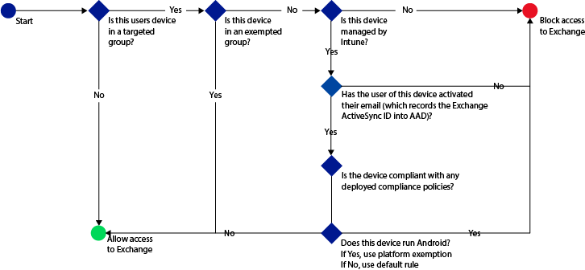

---
# required metadata

title: Restrict access to email example scenarios | Microsoft Intune
description: A few example scenarios and how they could be implemented with conditional access.
keywords:
author: karthikaraman
ms.author: karaman
manager: angrobe
ms.date: 11/14/2016
ms.topic: article
ms.prod:
ms.service: microsoft-intune
ms.technology:
ms.assetid: 454eab79-b620-42c9-b8e6-fada6e719fcd

# optional metadata

#ROBOTS:
#audience:
#ms.devlang:
ms.reviewer: chrisgre
ms.suite: ems
#ms.tgt_pltfrm:
#ms.custom:

---

# Restrict access to email with Microsoft Intune: Example scenarios

## Block users from using noncompliant devices to access Exchange Online
### Scenario requirements
- All users in the **Accounting** Azure Active Directory security group must be blocked from accessing Exchange Online if their device is not compliant with a compliance policy that you deployed.
- If any users exist in this group whose devices are not supported by [!INCLUDE[wit_nextref](../includes/wit_nextref_md.md)], they must be blocked from accessing Exchange Online on that device.
- Users in the **Finance** Azure Active Directory security group must be exempt from the policy, even if they are also in the **Accounting** security group.

To accomplish this, configure a conditional access policy for Exchange Online with the following settings:

- Choose **Enable conditional access policy**.

- Choose the platforms that you want to allow access from apps with modern authentication.
- For Exchange ActiveSync apps, choose **Block noncompliant devices on platforms supported by Microsoft Intune** and **Block all other devices on platforms not supported by Microsoft Intune.**
-   In the **Targeted group** section, under **Selected security groups**, choose the **Accounting** user group.

-   In the **Exempted group** section, under **Selected security groups**, choose the **Finance** user group.

The following flow is used in the scenario to decide which devices can access Exchange Online:

## All iOS devices that access Exchange on-premises must be managed by Intune
### Scenario requirements
- Only devices that run iOS should be allowed access to Exchange on-premises.
- The devices must also be enrolled in Intune and meet the compliance policy rules before they can be used to access Exchange.

To accomplish this, configure the following conditional access policy for Exchange on-premises with the following settings:

-   Choose the option **Block email apps from accessing Exchange on-premises if the device is noncompliant or not enrolled in Microsoft Intune**. By choosing this option, you enable the conditional access policy, which requires that all devices must be enrolled in Microsoft Intune and meet the compliancy policy rules before they can access Exchange.

-   For advanced Exchange Active Sync settings, create:

  -   A platform exception that allows devices that run iOS to access Exchange.   

  -   A default rule that specifies when a device isn't covered by the platform exception rule, it should be blocked from accessing Exchange. This rule makes sure that devices that aren't running iOS are blocked from accessing Exchange.

You use the following flow to decide which devices can access Exchange:

## No Android devices can access Exchange on-premises
### Scenario requirements
- All Android devices should be blocked from accessing Exchange.
- All other supported devices can access Exchange, as long as they're managed by [!INCLUDE[wit_nextref](../includes/wit_nextref_md.md)].

To accomplish this, configure a conditional access policy for Exchange on-premises with the following settings:

-   Choose the option **Block email apps from accessing Exchange on-premises if the device is noncompliant or not enrolled in Microsoft Intune**. By choosing this option, you require that any device must be enrolled in Intune and meet the compliance policy rules.

- For advanced Exchange Active Sync settings, create:
  -   A platform exception that blocks devices that run Android from accessing Exchange. This rule makes sure that Android devices can't be used to access Exchange.

  -   A default rule that specifies when a device isn't covered by other rules, it should be allowed to access Exchange. This default rule makes sure that devices that run platforms other than Android, but are supported by Microsoft Intune, can be used to access Exchange. They must, however, be enrolled in Intune and meet the compliance policy rules.

You use the following flow to decide which devices can access Exchange:

