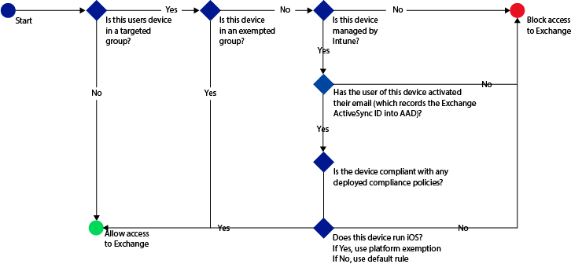

# Restrict email access with Microsoft Intune: Example scenarios

## All iOS devices that access Exchange On-premises must be managed by Intune
In this example, the organization only uses devices that run iOS and they require that all of these devices are managed by [!INCLUDE[wit_nextref](../Token/wit_nextref_md.md)] before they can access Exchange.

To accomplish this, in the conditional access policy, they configure the following:

-   Select the option **Enable conditional access policy for Exchange Online**.

-   For apps using modern authentication, select **iOS** for the platform

-   For Exchange ActiveSync apps, select **Require mobile devices to be compliant**  and block access to email on devices that are not supported by [!INCLUDE[wit_nextref](../Token/wit_nextref_md.md)].

-   A platform exception that allows devices that run iOS to access Exchange.

-   A default rule that specifies when a device is not covered by other rules, then it should be blocked.

The following flow is used to decide which devices can access Exchange:

## No Android devices can access Exchange On-premises. All other devices that access Exchange must be managed by Intune
In this example, the organization does not want to allow devices that run Android access to Exchange. All other supported devices can access Exchange as long as they are managed by [!INCLUDE[wit_nextref](../Token/wit_nextref_md.md)].

To accomplish this, in the conditional access policy, they configure the following:

-   Select the option **Enable conditional access policy for Exchange online**.

-   A platform exception that blocks devices that run Android from accessing Exchange.

-   A default rule that specifies when a device is not covered by other rules, then it should be allowed.

The following flow is used to decide which devices can access Exchange:

## Block users of noncompliant devices from Exchange Online in a specified Active Directory security group. Exempt devices in another security group
In this scenario, all users in the **Accounting** Active Directory security group must be blocked from accessing Exchange Online if their device is not compliant with a compliance policy you deployed. Additionally, any users in the **Finance** Active Directory security group must be exempt from the policy, even if they are also in the **Accounting** security group. Finally, if any users exist in this group whose devices are not supported by [!INCLUDE[wit_nextref](../Token/wit_nextref_md.md)], they must be blocked from accessing Exchange Online on that device.

To accomplish this, in the conditional access policy, they configure the following:

-   Select the option **Enable conditional access for Exchange Online.**.

-   Select **Accounting** under **Targeted Groups**.

-   Select **Finance** under **Exempted Groups**.

-   Under **Exchange ActiveSync mail apps**, select **Require mobile devices to be compliant**option.

The following flow is used to decide which devices can access Exchange:

