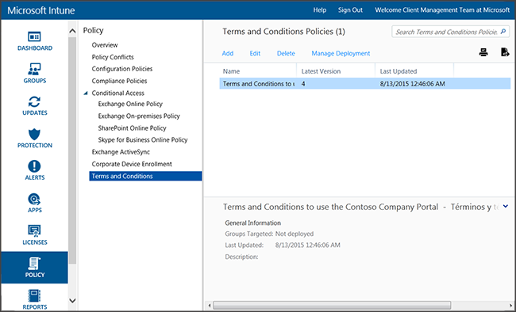

---
# required metadata

title: Terms and condition policy settings | Microsoft Intune
description: You can deploy Intune terms and conditions to user groups to explain how enrollment, access to work resources, and using the Company Portal app affect devices and users.
keywords:
author: NathBarn
manager: angrobe
ms.date: 07/11/2016
ms.topic: article
ms.prod:
ms.service: microsoft-intune
ms.technology:
ms.assetid: 6edf0ac1-4f46-4543-a9e5-f484ac37e9a5

# optional metadata

#ROBOTS:
#audience:
#ms.devlang:
ms.reviewer: heenamac
ms.suite: ems
#ms.tgt_pltfrm:
#ms.custom:

---

# Terms and condition policy settings in Microsoft Intune
You can deploy Intune terms and conditions to user groups to explain how enrollment, access to work resources, and the Company Portal app affect devices and users. Users must accept the terms and conditions before they can use the Company Portal to enroll and access their work.

You can create and deploy multiple policies containing different terms and conditions. You can also produce versions of the same terms and conditions in different languages and then deploy these to their appropriate groups.

## Create a terms and conditions policy

1.  In the [Microsoft Intune administration console](http://manage.microsoft.com) click **Policy** &gt; **Terms and Conditions**.

	

2.  Click **Add** to create a new terms and conditions policy.

    You can also **Edit** or **Delete** an existing policy.

3.  On the **Create Terms and Conditions** page, specify the following information:

    -   **Name**&mdash;A unique policy name displayed in the Intune console.

    -   **Description**&mdash;Details that help you identify the policy in the Intune console.

    -   **Title**&mdash;The title users see in the company portal.

    -   **Text to explain what it means if the user accepts**&mdash;The label users see regarding acceptance. For example, “I agree to the terms and conditions.”

4.  When you are finished, click **Save**. The new policy is displayed in the **Terms and Conditions** node of the **Policy** workspace.

## Deploy a terms and conditions policy

1.  In the [Microsoft Intune administration console](http://manage.microsoft.com), click **Policy** &gt; **Terms and Conditions**.

2.  In the **Terms and Conditions Policies** list, select the policy you want to deploy, and then click **Manage Deployment**.

3.  In the **Manage Deployment** dialog box, select the user groups you will deploy the policy to, and then click **OK**.

    When targeted users access the company portal, Intune displays the terms and conditions you deployed. Users must accept these terms before they can gain access to company resources.

## Monitor a terms and conditions policy

1.  In the [Microsoft Intune administration console](http://manage.microsoft.com), click **Policy** &gt; **Terms and Conditions**.

2.  In the **Create New Report** window, click **View Report**. The report will open detailing which users have accepted the terms and conditions you deployed.

### Updates and version control for terms and conditions
When you edit an existing terms and conditions policy, you can choose which behavior occurs when you deploy the policy. Use the following procedure to help you update existing terms and conditions policies.

## Work with multiple versions of terms and conditions

1.  In the [Microsoft Intune administration console](http://manage.microsoft.com), click **Policy** &gt; **Terms and Conditions**.

2.  Select the terms and conditions policy that you want to edit, and then click **Edit**.

3.  On the **Edit Terms and Conditions** page, make any required edits, and then specify whether this new version requires all users to accept the terms and conditions, or if only new users will see the new version.

    We recommend that you increase the version number and require acceptance any time you make significant changes to your terms and conditions policy. Keep the current version number if you are fixing typos or changing formatting, for example.

### See also
[Manage settings and features on your devices with Microsoft Intune policies](manage-settings-and-features-on-your-devices-with-microsoft-intune-policies.md)
