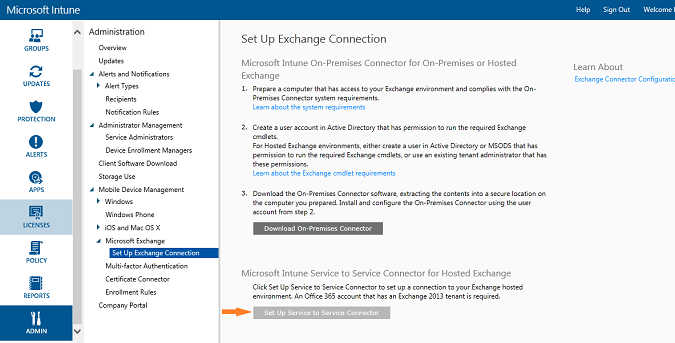

# Configure the Intune service to service connector

Use this information to connect Microsoft Intune and Office 365-hosted Exchange service without an on-premises infrastructure.

### Requirements for the Service to Service Connector
The Service to Service Connector supports only cloud-based Exchange and has no requirements for on-premises infrastructure.

However, to use this connector, the following must be true:

-   You have an Office 365 subscription that has an Exchange Server 2013 tenant. So long as the tenant is Exchange Server 2013, the connector supports Exchange Server 2010 in that same environment.

-   The user account that you use to install the On-Premises Connector must be a tenant administrator for Intune and be an administrator in the Exchange tenant with a license to use Exchange Server 2013.

## Set up the Service-to-Service Connector
> [!IMPORTANT]
> Before you being installing and configuring the service-to-service connector, ensure that you meet the [Exchange connector installation requirements](./intune-exchange-connector-requirements.md).

1.  Open the [Microsoft Intune administration console](http://manage.microsoft.com) with a user with Exchange admin rights. Microsoft Intune uses the email address of the currently logged in user to set up the connection.

2.  In the workspace shortcuts pane, choose **ADMIN**, then go **Mobile Device Management** > **Microsoft Exchange** > **Set Up Exchange Connection**.

4.  On the **Set Up Exchange Connection** page, choose **Set Up Service to Service Connector**.

The Service-to-Service Connector will automatically configure and synchronize with your Hosted Exchange environment.

## Validate your Exchange connection

After you have successfully configured the Exchange Connector, in the Intune admin console choose the **ADMIN** workspace and go **Mobile Device Management** > **Microsoft Exchange** and validate that the details you provided appear under **Exchange Connection Information**.

You can also check the time and date of the last successful synchronization attempt.
