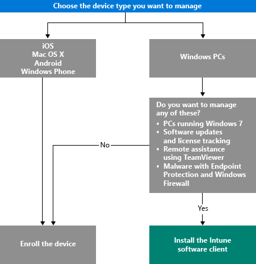

---
# required metadata

title: Choose how to manage devices | Microsoft Intune
description: Learn about the various ways you can enroll and manage devices.
keywords:
author: robstackmsft
ms.author: robstack
manager: angrobe
ms.date: 08/31/2016
ms.topic: article
ms.prod:
ms.service: microsoft-intune
ms.technology:
ms.assetid: 770aad50-fd7a-4cf1-a793-f95fe47fc3f8

# optional metadata

#ROBOTS:
#audience:
#ms.devlang:
ms.reviewer: angrobe
ms.suite: ems
#ms.tgt_pltfrm:
#ms.custom:

---

# Choose how to manage devices

To take advantage of the many feature that Intune offers such as app deployment, and control of device settings, your devices must be *managed*. How you manage devices depends on the Intune capabilities you want to use.
This topic will help you choose which method meets your needs.

To manage devices that run iOS, Mac OS X, Android, or Windows Phone, you must *enroll* them.

To manage Windows PCs, you have two choices:

1. Enroll the device **or**
2. Install the *Intune software client*.

## Decide which method to use
Use this decision flow to decide how to get your devices managed.

Enroll Windows PCs to get the most functionality. However, the Intune software client might be more suitable for your needs when:

- The PC is running Windows 7
- You want to manage Windows software updates and license usage
- You want to manage malware with Endpoint Protection and Windows Firewall
- You want to provide remote assistance to users using the TeamViewer software

For a detailed listing of the management capabilities you'll get with each method, see [Mobile device management capabilities](mobile-device-management-capabilities-in-microsoft-intune.md) and [Intune PC software client capabilities](windows-pc-management-capabilities-in-microsoft-intune.md).
For information about the devices and PCs that Intune supports, see [Supported mobile devices and computers](/intune/get-started/supported-mobile-devices-and-computers)

## Exchange ActiveSync management
In addition to enrolling a device or installing the Intune software client, you can also manage devices by [using Exchange ActiveSync](/intune/deploy-use/mobile-device-management-with-exchange-activesync-and-microsoft-intune). This method requires you to install the On-Premises Connector or use the built-in Service-to-Service Connector to connect to your Exchange Server.
Although this is a third option to manage devices, it provides a limited set of management capabilities when compared to the other methods.

## Next steps

- [Choose how to enroll mobile devices](/intune/get-started/choose-how-to-enroll-devices1)
- [Manage Windows PCs with Intune PC client software](/intune/deploy-use/manage-windows-pcs-with-microsoft-intune)

- [Exchange ActiveSync mobile device management with Microsoft Intune](/intune/deploy-use/mobile-device-management-with-exchange-activesync-and-microsoft-intune).

