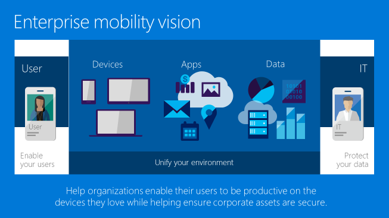

# Introduction to Intune
*Microsoft Intune is the "management arm" of the Microsoft Enterprise Mobility Suite (EMS).* Enterprise mobility is all about enabling your employees to be productive on all of their devices while keeping your organization's information protected.  

~~Microsoft offers~~ *EMS is* a complete integrated suite for enterprise mobility inclusive of productivity, identity, access control, management and data protection. ~~This integrated suite~~ *It* gives you the best possible way to deploy and operate a mobility solution in your organization.  

~~Microsoft provides its enterprise mobility suite from the cloud. This means you get the benefits the cloud brings including being continuously kept up to date and available, flexible deployment options, and lower costs of ownership.  All of the features and capabilities you need to implement a mobility solution are included in Office 365 and the Enterprise Mobility Suite (EMS). By using Office 365 with EMS, you get an integrated end-to-end system for providing enterprise mobility to your employees, partners, contractors and even your customers.~~

~~Microsoft Intune is the “management arm” of this integrated end-to-end system.~~ Intune gives you the ability to manage mobile devices and mobile apps. It integrates closely with Azure Active Directory (AD) for identity and access control and Azure Rights Management (RMS) for data protection.  

Some of the common business problems Intune helps solve include:

* Securing your on-premise email and collaboration infrastructure so that it can be accessed by mobile devices and apps on the Internet
* Securing your Office 365 infrastructure so that it can be safely accessed by mobile devices and apps on the Internet
* Enabling your organization to issue mobile phones to its employees
* Enabling your organization to provide limited-use “shared devices” for task workers
* Enabling your organization to implement a secure “Bring Your Own” or personal device strategy
* Enabling your organization to support employees accessing Office 365 from devices and apps that you don’t control such as a kiosk in the lobby of a trade show

Some of the primary tools that Intune offers include:
* **Mobile device management (MDM)**: the ability to enroll devices into Intune so that you can provision, configure, monitor, and take actions on those devices such as wiping them.
* **Mobile application management (MAM)**: the ability to publish, push, configure, secure, monitor and update mobile apps for your users.
* **Mobile application security**: as a part of managing mobile apps, Intune provides the ability to help secure mobile data by isolating personal data from corporate data and allowing the corporate data to be selectively wiped

These tools are used in different combinations to enable the common scenarios above. For example, shared device scenarios make heavy use of MDM. Bring-your-own (BYO) scenarios typically ~~make heavy use of~~ *rely on* MAM. And the corporate phone scenarios ~~make heavy use of~~ *build upon* both. Almost all scenarios make use of mobile application security.

Throughout this documentation, we’ll explain how to use the tools Intune provides to support your business scenarios.  We’ll also explain how to use these tools with Office 365, Azure AD, Azure RMS, and other parts of the Microsoft mobility suite. This will help give you a broad overview of the ways in which the technology is commonly used and how it might be useful in your environment *as well as procedures to implement them*. The technology itself is very flexible and can be adapted to all sorts of scenarios beyond the ones we describe here.
