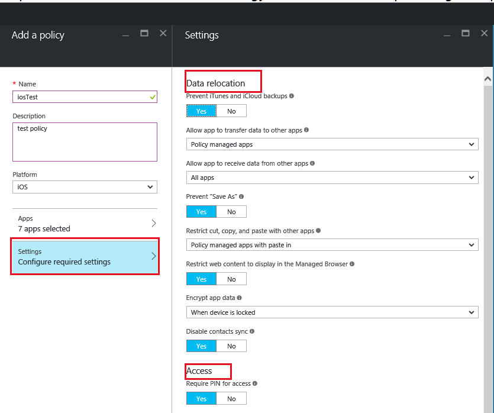
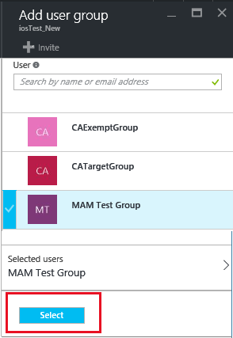
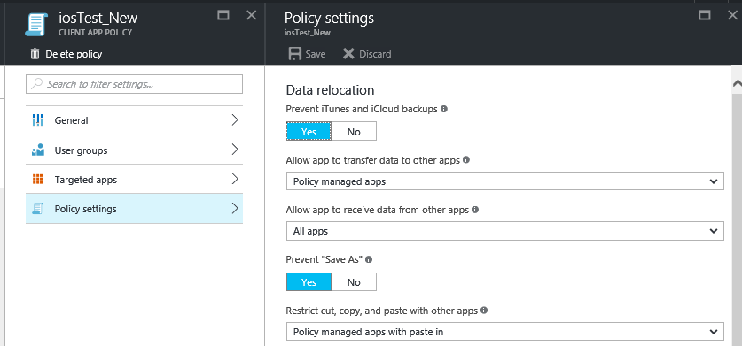

---
# required metadata

title: Create and deploy MAM policies | Microsoft Docs
description: Use the step-by-step instructions in this topic to create and deploy mobile app management policies.
keywords:
author: andredm7
ms.author: andredm
manager: angrobe
ms.date: 11/14/2016
ms.topic: article
ms.prod:
ms.service: microsoft-intune
ms.technology:
ms.assetid: c1b9a343-1737-4a65-a9c6-aca48acad11c

# optional metadata

#ROBOTS:
#audience:
#ms.devlang:
ms.reviewer: joglocke
ms.suite: ems
#ms.tgt_pltfrm:
ms.custom: intune-classic

---

# Create and deploy app protection policies with Microsoft Intune

[!INCLUDE[classic-portal](../includes/classic-portal.md)]

This topic describes the process of creating an app protection policy in the **Azure portal**. The Azure portal is the new admin console for creating app protection policies, and we recommend that you use this portal to create app protection policies. Azure portal supports the following MAM scenarios:

- Devices enrolled in Intune.
- Devices managed by a third-party MDM solution.
- Devices that are not managed by any MDM solution (BYOD).

>[!IMPORTANT]
Here are a few considerations if you're using the **Intune admin console** to manage your devices:

> * You can create an app protection policy that supports apps for devices enrolled in Intune using the [Intune admin console](configure-and-deploy-mobile-application-management-policies-in-the-microsoft-intune-console.md).
> * App protection policies created in the Intune admin console cannot be imported into the Azure portal.  The app protection policies must be re-created in the Azure portal.

> * You may not see all app protection policy settings in the Intune admin console. The Azure portal is the new admin console for creating app protection policies.

> * To deploy managed apps, you must create a app protection policy in the Intune admin console. In this case, you may want to create app protection policies in both the Intune admin console and the Azure portal: Intune admin console to make sure you have the ability to deploy managed apps, and the Azure portal because it is the new admin console that has all the app protection policy settings.

> * If you create app protection policies on both Intune admin console and Azure portal, the policy that is created in the Azure portal is applied to the apps.

To see a list of policy settings supported for Android and iOS platforms, select one of the following:

> [!div class="op_single_selector"]
- [iOS policies](ios-mam-policy-settings.md)
- [Android policies](android-mam-policy-settings.md)

- For a more detailed description of how app protection policies work and the scenarios supported by Intune app protection policies, see [protect app data using app protection policies](protect-app-data-using-mobile-app-management-policies-with-microsoft-intune.md).

##  Create an app protection policy
App protection policies are created at the Azure Portal. If this is the first time you are using the Azure portal, read [Azure portal for Microsoft Intune app protection policies](azure-portal-for-microsoft-intune-mam-policies.md) to get more familiar with the Azure Portal. Before creating an app protection policy, review the [pre-requisites and support](get-ready-to-configure-mobile-app-management-policies-with-microsoft-intune.md) information.

Follow the steps below to create app protection policies:

1. Go to the [Azure portal](https://portal.azure.com), and enter your credentials.

2. Choose **More Services**, and type "Intune".

3. Choose **Intune App Protection**.

4. Choose **Intune mobile application management &gt; Settings** to open the **All Settings** blade.

    

2.  In the **All Settings** blade, choose **App policy**. This opens the **App policy** blade, where you'll create new policies and edit existing policies. Choose **Add a policy**.

    

3.  Type a name for the policy, add a brief description, and select the platform type to create a policy for iOS or Android. You can create more than one policy for each platform.

    

4.  Choose **Apps** to open the **Apps blade**, where a list of available apps is displayed. Select one or more apps from the list that you want to associate with the policy that you are creating. Once you have selected the apps, choose **Select** at the bottom of the **Apps** blade to save your selection.

    > [!IMPORTANT]
    > You must select at least one app to create a policy.

5.  On the **Add a policy blade**, choose **Configure required settings** to open the policy settings blade.

    There are two categories of policy settings, **Data relocation** and **Access**.  Data relocation policies are applicable to data movement in and out of the apps, while the access polices determine how the end user accesses the apps in a work context.
    To get you started, the policy settings have default values. You do not have to make any changes if the default values meet your requirements.

    > [!TIP]
    > These policy settings are enforced only when using apps in the work context.  When the end user uses the app to do a personal task, they will not be affected by these policies.

    

6.  Choose **OK** to save this configuration. You are now back in the **Add a policy** blade. Choose **Create** to create the policy and save your settings.

    

When you finish creating a policy as described in the previous procedure, it is not deployed to any users. To deploy a policy, see the following section, "Deploy a policy to users."

> [!IMPORTANT]
> If you create an app protection policy for an app using the Intune admin console and an app protection policy using the Azure portal, the policy you created using the Azure portal takes precedence. However, the reporting in the Intune or Configuration Manager console will report the policy settings created from the Intune admin console. For example:
>
> -   You created an app protection policy in the Intune admin console that blocks copy from an app.
> -   You created an app protection policy in the Azure console that allows copy from an app.
> -   You associate both of these policies to the same app.
> -   The policy you created from the Azure console takes precedence, and copy is allowed.
> -   However, status and reports in the Intune console will incorrectly indicate that copy is blocked.

## Line of Business (LOB) apps (optional)

Beginning with Intune 1703 version, you have the option to generally add LOB apps into Intune when creating a new app protection policy. This gives you the option to define app protection policies for LOB apps using the MAM SDK without requiring full app deployment permissions.

> [!TIP]
> You can also add LOB apps into Intune when going through the [Intune App SDK](https://docs.microsoft.com/intune/develop/intune-app-sdk-get-started) work-flow.

> [!IMPORTANT]
> If users only have specific permissions for deploying MAM apps and not full app deployment permissions, which would allow them to deploy any apps in Intune, they won’t be able to go through the Intune SDK work-flow, but they can still add their LOB apps through the MAM app protection policy creation work-flow.

### To add LOB apps (iOS and Android)

1.  On the Add a policy blade, choose Configure **Apps** to open the Apps blade.

	

2.  Click **More apps**, then enter the **Bundle ID** (for iOS), **package ID** (for Android), then click Select to add your LOB apps.

	

### To add LOB apps (Windows)

> [!IMPORTANT]
> You need to select Windows 10 from the platform drop-down list when creating a new app protection policy.

1.  On the Add a policy blade, choose **Allowed apps** or **Exempt apps** to open the Allowed or Exempt apps blade.

	> [!NOTE]
	>
	- **Allowed apps**: These are the apps that need to adhere to this policy.
	- **Exempt apps**: These apps are exempt from this policy and can access corporate data without restrictions.
  
2. On Allowed or Exempt apps blade, click **Add apps**. You can add recommended Microsoft apps, add store or desktop apps.

    a.  **Recommended apps:** a pre-populated list of (mostly Office) apps that we let admins easily import into policy.

    b.  **Store apps:** Admin can add any app from the Windows store to policy.

    c.  **Windows desktop apps:** Admin can add any traditional Windows desktop apps to the policy (e.g. exe, dll, etc.)

## Deploy a policy to users

1.  In the **Policy** blade, choose  **User groups**, which opens the **User groups** blade. Choose **Add user group** in the **User groups** blade to open the **Add user group** blade.

    

2.  A list of user groups is displayed on the **Add user group** blade. This is a list of all the security groups in your **Azure Active Directory**. Select the user groups you want this policy to apply to, and then choose **Select**. Choosing **Select**, deploys the policy to users.

    

    You have now created a policy and deployed it to users.

Only users with Intune licenses assigned to them are affected by the policy. Users who are in the security group that you selected who don’t have a Intune license assigned to them are not affected.

>[!IMPORTANT]
> If you are using Intune with Configuration Manager to manage your iOS and Android devices, the policy is only applied to the users directly in the group that you selected. Members of child groups nested within the group you selected are not affected.

End users can download the apps from the App store or Google Play. For more information, see:
* [What to expect when your Android app is managed by app protection policies](user-experience-for-mam-enabled-android-apps-with-microsoft-intune.md)
* [What to expect when your iOS app is managed by app protection policies](user-experience-for-mam-enabled-ios-apps-with-microsoft-intune.md)

##  Change existing policies
You can edit an existing policy and apply it to the targeted users. However, when you change existing policies,  users who are already signed  in to the apps won’t see the changes for an 8-hour period.

To see the effect of the changes immediately, the end user will have to log out of the app, and sign back in.

### To change the list of apps associated with the policy

1.  In  the **App policy** blade, choose the policy you want to change. This opens a blade specific to the policy you just selected.

    

2.  In the policy blade, choose **Targeted apps** to open the list of apps.

3.  Remove or add apps from the list and choose the **Save** icon to save your changes.

### To change the list of user groups

1.  In  the **App policy** blade, choose the policy you want to change. This opens the blade specific to the policy you selected.

2.  In the policy blade, choose **User groups** to open the **User group** blade that shows the list of current user groups who have this policy.

3.  To add a new user group to the policy, choose **Add user group**, and select the user group. Choose **Select** to deploy the policy to the group you selected.

    

4.  To delete a user group, highlight the user group you want to remove. Then choose the ellipses (…), and choose **Delete** to remove the user group.

    

### To change policy settings

1.  In the **App policy** blade, choose the policy you want to change. This opens a blade specific to the policy you just selected.

    

2.  Choose **Policy settings** to open the **Policy settings** blade.

3.  Change the settings, and choose the **Save** icon to save your changes.

    

## Policy settings
To see a full list of the policy settings for iOS and Android, select one of the following:

> [!div class="op_single_selector"]
- [iOS policies](ios-mam-policy-settings.md)
- [Android policies](android-mam-policy-settings.md)

## Next steps
[Monitor compliance and user status](monitor-mobile-app-management-policies-with-microsoft-intune.md)

### See also
* [What to expect when your Android app is managed by app protection policies](user-experience-for-mam-enabled-android-apps-with-microsoft-intune.md)
* [What to expect when your iOS app is managed by app protection policies](user-experience-for-mam-enabled-ios-apps-with-microsoft-intune.md)
