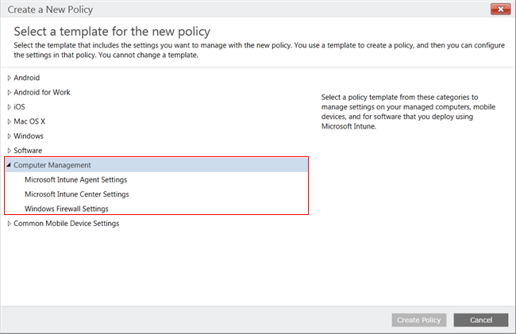
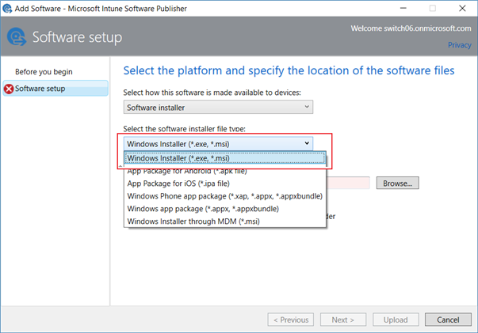

---
# required metadata

title: Manage PCs with client software | Microsoft Docs
description: Manage Windows PCs by installing the Intune client software.
keywords:
author: nathbarn
ms.author: nathbarn
manager: angrobe
ms.date: 03/28/2017
ms.topic: article
ms.prod:
ms.service: microsoft-intune
ms.technology:
ms.assetid: 3b8d22fe-c318-4796-b760-44f1ccf34312

# optional metadata

#ROBOTS:
#audience:
#ms.devlang:
ms.reviewer: owenyen
ms.suite: ems
#ms.tgt_pltfrm:
ms.custom: intune-classic

---

# Manage Windows PCs with Intune PC client software
[Enrolling Windows PCs as mobile devices](set-up-windows-device-management-with-microsoft-intune.md) is the preferred method of enrolling Windows PCs into Intune, but as an IT administrator you can alternatively choose to enroll and manage Windows PCs by installing the Intune client software, as described in this topic. The Intune software client is not supported with the enrollment as a mobile device.

Intune manages Windows PCs using policies, similar to the way that Windows Server Active Directory Domain Services (AD DS) Group Policy Objects (GPOs) do. If you will be managing Active Directory domain-joined computers with Intune, [be sure that Intune policies do not conflict with any GPOs](resolve-gpo-and-microsoft-intune-policy-conflicts.md) that are in place for your organization. You can read more about [GPOs](https://technet.microsoft.com/library/hh147307.aspx).

## Policies and app deployments for the Intune software client

While the Intune client software supports [management capabilities that help protect PCs](policies-to-protect-windows-pcs-in-microsoft-intune.md) by managing software updates, Windows firewall, and Endpoint Protection, PCs managed with the Intune client software cannot be targeted with other Intune policies, including those **Windows** policy settings that are specific to mobile device management.

When you use the Intune client software to manage Windows PCs, you can use only the policies shown under the **Computer Management** section.

  

For detailed descriptions of the policies that you can set, see:

- [Use policies to help protect Windows PCs that run the Intune client software](https://docs.microsoft.com/intune/deploy-use/policies-to-protect-windows-pcs-in-microsoft-intune)
- [Keep Windows PCs up to date with software updates in Microsoft Intune](https://docs.microsoft.com/intune/deploy-use/keep-windows-pcs-up-to-date-with-software-updates-in-microsoft-intune)
- [Help protect Windows PCs using Windows Firewall policies in Microsoft Intune](https://docs.microsoft.com/intune/deploy-use/help-protect-windows-pcs-using-windows-firewall-policies-in-microsoft-intune)
- [Help secure Windows PCs with Endpoint Protection for Microsoft Intune](https://docs.microsoft.com/intune/deploy-use/help-secure-windows-pcs-with-endpoint-protection-for-microsoft-intune)

In addition, when deploying apps, you can use only the Windows Installer (.exe, .msi).

  

> [!NOTE]
> You can manage Windows 8.1 or later devices either as PCs, by using the Intune client software, or as mobile devices by using the mobile device management (MDM) functionality. You cannot use both methods together, so carefully consider your decision before deciding to manage PCs by using the Intune client software. This topic applies only to managing devices as PCs by running the Intune client software.

## Requirements for Intune PC client management

**Hardware**:
The following are minimum hardware requirements for installing the Intune client software:

|Requirement|More information|
|---------------|--------------------|
|Network|The client requires the PC to have Internet connectivity.|
|Processor and Memory|Refer to the processor and RAM requirements for the PC's operating system.|
|Disk space|200 MB available disk space before the client software is installed.|

**Software**:
The following are software requirements for installing the client software:

|Requirement|More information|
|---------------|--------------------|
|Operating system | Windows device running Windows Vista or later.   **Home edition versions are not supported.**|
|Administrative permissions|The account that installs the client software must have local administrator permissions on that device.|
|Windows Installer 3.1|The PC must have, at a minimum, Windows Installer 3.1.  To view the version of Windows Installer on a PC:    On the PC, right-click **%windir%\System32\msiexec.exe**, and then click **Properties**.  You can download the latest version of Windows Installer from [Windows Installer Redistributables](http://go.microsoft.com/fwlink/?LinkID=234258) on the Microsoft Developer Network website.|
|Remove incompatible client software|Before you install the Intune client software, uninstall any Configuration Manager, Operations Manager, Operations Management Suite, and Service Manager client software from that PC.|

## Computer management capabilities with the Intune client software

After the Intune client software is installed, management capabilities include:

- [Application management](deploy-apps-in-microsoft-intune.md)

- [Real-time monitoring and Endpoint Protection](help-secure-windows-pcs-with-endpoint-protection-for-microsoft-intune.md) - Endpoint Protection is the same thing as Windows Defender. Endpoint Protection applies to Windows 7 and Windows 8. For Windows 10 and later, the product name changed to Windows Defender.

- [Windows Firewall settings management](help-protect-windows-pcs-using-windows-firewall-policies-in-microsoft-intune.md), hardware and software inventory, remote control (through remote assistance requests)

- [Software update settings](keep-windows-pcs-up-to-date-with-software-updates-in-microsoft-intune.md)

- Compliance settings reporting

In the Intune admin console, certain sections, such as "Updates," "Protection," and "Licenses" appear only if you have enrolled devices using the Intune client software.

  

You can also use the Intune admin console to perform other common computer management tasks on Windows PCs that have the client installed:

-   View hardware and software inventory information about managed computers
-   Remotely restart a computer
-   Retire a computer to uninstall the client software and remove it from management with Intune
-   Link users to specific managed computers
-   Respond to remote assistance requests

For more information about the above tasks, see [common computer management tasks](common-windows-pc-management-tasks-with-the-microsoft-intune-computer-client.md).

## Management limitations of the Intune client software

Some management options, which can be used to manage PCs as mobile devices, cannot not used for PCs that are managed with the Intune client software:

-   Full wipe (selective wipe is available)

-   Conditional access

## Help with troubleshooting

The Intune client software usually runs quietly in the background without the need for much user interaction or troubleshooting. If you need to resolve PC management issues, you can check the logs. The Intune client software and corresponding logs are installed under the %Program Files%\Microsoft\OnlineManagement directory.

You can also review [Troubleshoot client setup in Microsoft Intune](/intune/troubleshoot/troubleshoot-client-setup-in-microsoft-intune) to check for issues that might occur, and any resolutions or workarounds.
