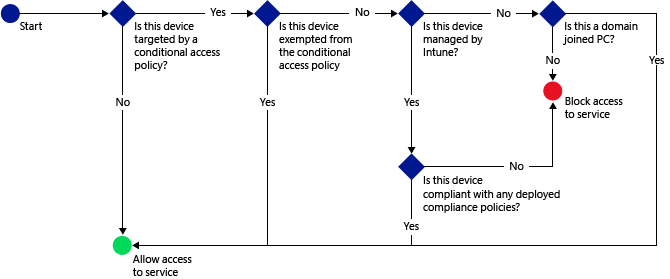

---
# required metadata

title: Protect email and Office 365 | Microsoft Docs
description: This topic describes how you can use conditional access to allow only compliant devices to access company email and company data on SharePoint Online and other services.
keywords:
author: andredm7
ms.author: andredm
manager: angrobe
ms.date: 01/03/2017
ms.topic: article
ms.prod:
ms.service: microsoft-intune
ms.technology:
ms.assetid: c564d292-b83b-440d-bf08-3f5b299b7a5e

# optional metadata

#ROBOTS:
#audience:
#ms.devlang:
ms.reviewer: chrisgre
ms.suite: ems
#ms.tgt_pltfrm:
#ms.custom:

---

# Protect access to email, Office 365, and other services with Microsoft Intune

[!INCLUDE[classic-portal](../includes/classic-portal.md)]

You can protect access to your company email, Office 365 services like **Exchange On-premises**, **Exchange Online**, **Exchange Online Dedicated**,  **SharePoint Online**, **Skype for Business Online**, and other services by using Enterprise Mobility + Security (EMS) Conditional Access. This capability allows you to make sure that access to your company email and Office 365 services is restricted to devices that are compliant with the conditional access rules that you set either in the Intune admin console, or Azure classic portal.
## How does conditional access work?
You can use compliance policy settings to evaluate the compliance of a device. A conditional access policy uses the evaluation to restrict or allow access to a specific service. When you use a conditional access policy in combination with a device compliance policy, only compliant devices are allowed to access the service. The compliance policy and the conditional access policy are deployed to the user. Any device that the user uses to access the services is checked for compliance with the policies.

Keep in mind that the user who is using the device must have a compliance policy that is deployed to them in order for the device to be evaluated for compliance.
If no compliance policy is deployed to the user, the device is treated as compliant, and no access restrictions are applied.

When devices don't meet the conditions that are set in the policies, the end user is guided though the process of enrolling the device and fixing the issue that prevents the device from being compliant.

A typical flow of conditional access:

## Setup considerations

### Licensing

Microsoft Intune and Azure Active Directory (Azure AD) Premium work seamlessly together to provide multiple layers of control through EMS conditional access, if you want to deploy conditional access policies using Intune, you're required to have license for both products.

**Azure AD Premium licenses** can be purchased as a standalone service or can be purchased (along with Intune) as part of the Enterprise agreement. If you have deployed conditional access policies with Intune, please ensure that you have obtained the proper Azure AD Premium or **EMS licenses**.

- Learn more about [Enterprise Mobility pricing page](https://www.microsoft.com/en-us/cloud-platform/enterprise-mobility-pricing) or the [Azure Active Directory pricing page](https://azure.microsoft.com/en-us/pricing/details/active-directory/).

Additionally, make sure the users you plan to apply conditional access policies are [assigned with the Azure AD Premium or EMS licenses](/Intune/get-started/start-with-a-paid-subscription-to-microsoft-intune-step-4.md).

### Device compliance settings

To set up conditional access, configure a device compliance policy and a conditional access policy. The compliance policy includes settings like passcode, encryption, and whether or not a device is jailbroken. The device must meet these rules in order to be considered compliant.

- Learn more about [device compliance policy and how it works](introduction-to-device-compliance-policies-in-microsoft-intune.md).

### Conditional access policy

You can set a conditional access policy to protect access based on:
- The device compliance status.
- The platform that is running on the device.
- The type of apps that are used to access the services.

Unlike other Intune policies, you don't deploy conditional access policies. Instead, after you configure the policy and select the users that should have the policy, the policy is applied to all targeted users. When a user is targeted by a policy, each device they use must be compliant in order for them to access resources.

## Next steps

2. [Create a device compliance policy](create-a-device-compliance-policy-in-microsoft-intune.md).

2.  Create a conditional access policy for one of the following Microsoft cloud services/product:
> [!div class="op_single_selector"]
  - [Create a conditional access policy for Exchange Online](restrict-access-to-exchange-online-with-microsoft-intune.md)
  - [Create a conditional access policy for Exchange On-premises](restrict-access-to-exchange-onpremises-with-microsoft-intune.md)
  - [Create a conditional access policy for new Exchange Online Dedicated](restrict-access-to-exchange-online-with-microsoft-intune.md)
  - [Create a conditional access policy for legacy Exchange Online Dedicated](restrict-access-to-exchange-onpremises-with-microsoft-intune.md)
  - [Create a conditional access policy for SharePoint Online](restrict-access-to-sharepoint-online-with-microsoft-intune.md)
  - [Create a conditional access policy for Skype for Business Online](restrict-access-to-skype-for-business-online-with-microsoft-intune.md)
  - [Create a conditional access policy for Dynamics CRM Online](restrict-access-to-dynamics-crm-online-with-microsoft-intune.md)
