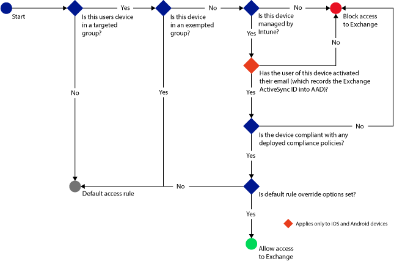
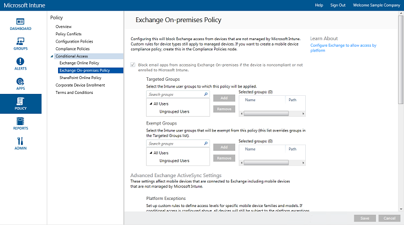

---
# required metadata

title: Protect email to Exchange On-prem | Microsoft Docs
description: Protect and control access to company email on Exchange On-premises with conditional access.
keywords:
author: andredm7
ms.author: andredm
manager: angrobe
ms.date: 01/03/2017
ms.topic: article
ms.prod:
ms.service: microsoft-intune
ms.technology:
ms.assetid: a55071f5-101e-4829-908d-07d3414011fc

# optional metadata

#ROBOTS:
#audience:
#ms.devlang:
ms.reviewer: chrisgre
ms.suite: ems
#ms.tgt_pltfrm:
#ms.custom:

---

# Protect email access to Exchange on-premises and legacy Exchange Online Dedicated with Intune

[!INCLUDE[classic-portal](../includes/classic-portal.md)]

> [!NOTE]
> If you have an Exchange Online Dedicated environment and need to find out whether it's in the new or the legacy configuration, contact your account manager.

To control email access to Exchange on-premises or to your legacy Exchange Online Dedicated environment, you can configure conditional access to Exchange on-premises by using Microsoft Intune.
To learn more about how conditional access works, read the [Protect access to email and O365 services](restrict-access-to-email-and-o365-services-with-microsoft-intune.md) article.

**Before** you can configure conditional access, verify the following:

-   Your Exchange version must be **Exchange 2010 or later**. Exchange Server Client Access Server (CAS) arrays are supported.

-   You must use the **on-premises Exchange connector**, which connects [!INCLUDE[wit_nextref](../includes/wit_nextref_md.md)] to Exchange on-premises. This lets you manage devices through the [!INCLUDE[wit_nextref](../includes/wit_nextref_md.md)] console. For details on the connector, see [Intune on-premises Exchange connector](intune-on-premises-exchange-connector.md).

    -   The on-premises Exchange connector that is available to you in the Intune console is specific to your Intune tenant and can't be used with any other tenant. We recommend that you also ensure that the Exchange connector for your tenant is installed **on only one machine**.

        You can download the connector from the Intune admin console. For a walkthrough on how to configure the on-premises Exchange connector, see [configure Exchange on-premises connector for on-premises or hosted Exchange](intune-on-premises-exchange-connector.md).

    -   You can install the connector on any machine as long as that machine can communicate with the Exchange server.

    -   The connector supports the **Exchange CAS environment**. You can technically install the connector on the Exchange CAS server directly if you want to. However, we don't recommend it because it increases the load on the server. When you configure the connector, you must set it up to communicate with one of the Exchange CAS servers.

-   You must configure **Exchange ActiveSync** with certificate-based authentication or user credential entry.

When you configure conditional access policies and target them to a user, before a user can connect to their email, the **device** they use must be:

-  Either a domain-joined PC or **enrolled** with [!INCLUDE[wit_nextref](../includes/wit_nextref_md.md)].

-  **Registered in Azure Active Directory**. Additionally, the client Exchange ActiveSync ID must be registered with Azure Active Directory.

  The Azure Active Directory Device Registration service is activated automatically for Intune and Office 365 customers. Customers who have already deployed the ADFS Device Registration service will not see registered devices in on-premises Active Directory. **This does not apply to Windows PCs and Windows Phone devices**.

-   **Compliant** with any [!INCLUDE[wit_nextref](../includes/wit_nextref_md.md)] compliance policies that are deployed to that device.

The following diagram illustrates the flow that conditional access policies for Exchange on-premises use to evaluate whether to allow or block devices.

If a conditional access policy isn't met, the user sees one of the following messages when they sign in:

- If the device isn't enrolled with [!INCLUDE[wit_nextref](../includes/wit_nextref_md.md)] or isn't registered in Azure Active Directory, a message is displayed with instructions about how to install the Company Portal app, enroll the device, and activate email. This process also associates the device’s Exchange ActiveSync ID with the device record in Azure Active Directory.

-   If the device isn't compliant, a message is displayed that directs the user to the [!INCLUDE[wit_nextref](../includes/wit_nextref_md.md)] Company Portal website or the Company Portal app, where they can find information about the problem and how to remediate it.

## Support for mobile devices
The following are supported:
-   Windows Phone 8.1 and later.

-   The native email app on iOS.

-   Exchange ActiveSync mail clients, such as Gmail on Android 4 or later.
- Exchange ActiveSync mail clients on **Android for Work devices**: Only **Gmail** and **Nine Work** apps in the **work profile** are supported on Android for Work devices. For conditional access to work with Android for Work, you must deploy an email profile for the Gmail or Nine Work app, and also deploy those apps as a required installation. 

[!INCLUDE[wit_nextref](../includes/afw_rollout_disclaimer.md)]

> [!NOTE]
> The Microsoft Outlook app for Android and iOS isn't supported.

## Support for PCs
The following is supported:
-   The **Mail** application on Windows 8.1 and later (when the PC is enrolled with [!INCLUDE[wit_nextref](../includes/wit_nextref_md.md)]).

##  Configure a conditional access policy

1.  In the [Microsoft Intune administration console](https://manage.microsoft.com), choose **Policy** > **Conditional Access** > **Exchange on-premises policy**.

2.  Configure the policy with the settings that you require:

  - **Block email apps from accessing Exchange on-premises if the device isn't compliant or isn't enrolled with Microsoft Intune**: When you select this option, devices that aren't managed by [!INCLUDE[wit_nextref](../includes/wit_nextref_md.md)] or aren't compliant with a compliance policy are blocked from accessing Exchange services.

  - **Default rule override - Always allow enrolled and compliant devices to access Exchange**: When you select this option, devices that are enrolled in Intune and are compliant with the compliance policies are allowed to access Exchange.
  This rule overrides the **Default Rule**, which means that even if you set the **Default Rule** to quarantine or block access, enrolled and compliant devices are still able to access Exchange.

  - **Targeted Groups**: Select the [!INCLUDE[wit_nextref](../includes/wit_nextref_md.md)] user groups that must enroll their device with [!INCLUDE[wit_nextref](../includes/wit_nextref_md.md)] before they can access Exchange.

  - **Exempted Groups**: Select the [!INCLUDE[wit_nextref](../includes/wit_nextref_md.md)] user groups that are exempt from the conditional access policy. Users in this list are exempt even if they're also in the **Targeted Groups** list.

  - **Platform Exceptions**: Choose **Add Rule** to configure a rule that defines access levels for specified mobile device families and models. Because these devices can be of any type, you can also configure device types that aren't supported by [!INCLUDE[wit_nextref](../includes/wit_nextref_md.md)].

  - **Default Rule**: For a device that isn't covered by any of the other rules, you can choose to allow it to access Exchange, block it, or quarantine it. When you set the rule to allow access, for devices that are enrolled and compliant, email access is granted automatically for iOS, Windows, and Samsung KNOX devices. The user doesn't have to go through any process to get their email.

        On Android devices that don't run Samsung KNOX, users get a quarantine email, which includes a guided walkthrough to verify enrollment and compliance before they can access email. If you set the rule to block access or quarantine devices, all devices are blocked from getting access to Exchange, regardless of whether they're already enrolled in Intune or not. To prevent enrolled and compliant devices from being affected by this rule, check the **Default Rule Override** box.
>[!TIP]
>If your intention is to first block all devices before granting access to email, choose the Block access rule or the Quarantine rule. The default rule applies to all device types—so device types that you configure as platform exceptions that aren't supported by [!INCLUDE[wit_nextref](../includes/wit_nextref_md.md)] are also affected.

  - **User Notification**: In addition to the notification email that Exchange sends, Intune sends an email that contains steps to unblock the device. You can edit the default message to customize it to your needs. In the event that the user’s device is blocked before they receive the Intune notification email that contains remediation instructions (this email is delivered to the user’s Exchange mailbox), they can use an unblocked device or another method to access Exchange and view the message.

        This is especially true when the **Default Rule** is set to block or quarantine. In this case, the user has to go to their app store, download the Microsoft Company Portal app, and enroll their device. This is applicable to iOS, Windows, and Samsung KNOX devices. For devices that don't run Samsung KNOX, you need to send the quarantine email to an alternate email account. The user has to copy the email to their blocked device to complete the enrollment and compliance process.
  > [!NOTE]
  > In order for Exchange to be able to send the notification email, you must specify the account that is used to send the notification email.
  >
  > For details, see [Configure Exchange on-premises connector for on-premises or hosted Exchange](intune-on-premises-exchange-connector.md).

3.  When you're done, choose **Save**.

-   You don't have to deploy the conditional access policy—it takes effect immediately.

-   After a user sets up an Exchange ActiveSync profile, it might take from one to three hours for the device to be blocked (if it isn't managed by [!INCLUDE[wit_nextref](../includes/wit_nextref_md.md)]).

-   If a blocked user then enrolls the device with [!INCLUDE[wit_nextref](../includes/wit_nextref_md.md)] and remediates noncompliance, email access will be unblocked within two minutes.

-   If the user unenrolls from [!INCLUDE[wit_nextref](../includes/wit_nextref_md.md)], it might take from one to three hours for the device to be blocked.

**To see some example scenarios of how you would configure a conditional access policy to protect device access, see [Protect email access example scenarios](restrict-email-access-example-scenarios.md).**

## Next steps
-   [Protect access to SharePoint Online](restrict-access-to-sharepoint-online-with-microsoft-intune.md)

-   [Protect access to Skype for Business Online](restrict-access-to-skype-for-business-online-with-microsoft-intune.md)
