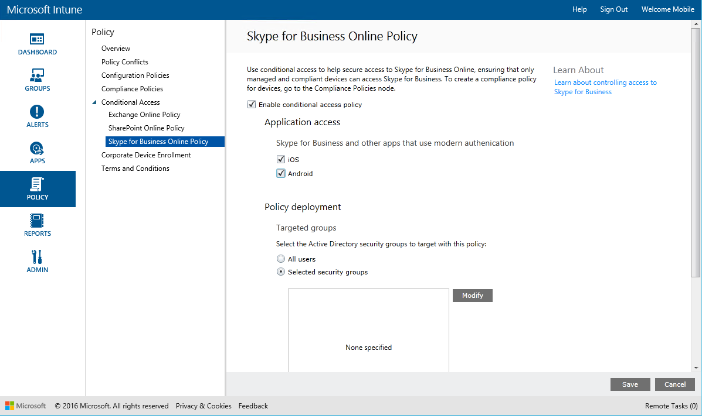

---
# required metadata

title: Protect Skype for Business Online | Microsoft Docs
description: Protect and control access to Skype for Business Online by using conditional access.
keywords:
author: andredm7
ms.author: andredm
manager: angrobe
ms.date: 01/03/2017
ms.topic: article
ms.prod:
ms.service: microsoft-intune
ms.technology:
ms.assetid: 1b2d7125-f63f-43cf-ac1e-94fbedf2a7e8

# optional metadata

#ROBOTS:
#audience:
#ms.devlang:
ms.reviewer: chrisgre
ms.suite: ems
#ms.tgt_pltfrm:
ms.custom: intune-classic

---

# Protect access to Skype for Business Online with Microsoft Intune

[!INCLUDE[classic-portal](../includes/classic-portal.md)]

You can use a conditional access policy for **Skype for Business Online** to control access to Skype for Business Online.
Conditional access has two components:
- A device compliance policy that the device must comply with in order to be considered compliant.
- A conditional access policy where you specify the conditions that the device must meet in order for you to access the service.
To learn more about how conditional access works, read the [Protect access to email and O365 services](restrict-access-to-email-and-o365-services-with-microsoft-intune.md) article.

When a targeted user attempts to use Skype for Business Online on their device, the following evaluation occurs:

**Before** configuring a conditional access policy for Skype for Business Online, you must:
- Have a **Skype for Business Online subscription** and assign the Skype for Business Online license to users.
- Have an **Enterprise Mobility + Security (EMS) subscription** or an **Azure Active Directory (Azure AD) Premium subscription**, and have users be licensed for EMS or Azure AD. For more details, see [Enterprise Mobility pricing](https://www.microsoft.comcloud-platform/enterprise-mobility-pricing) or [Azure Active Directory pricing](https://azure.microsoft.com/en-us/pricing/details/active-directory/).

-   [Enable modern authentication](https://docs.microsoft.com/intune/deploy-use/restrict-access-to-skype-for-business-online-with-microsoft-intune) for Skype for Business Online.
-  Have all your users using **Skype for Business Online**. If you have a deployment with both Skype for Business Online and Skype for Business on-premises, the conditional access policy will not be applied to users.

The device that needs access to Skype for Business Online must:

-   Be an **Android** or **iOS** device.

-   Be **enrolled** with [!INCLUDE[wit_nextref](../includes/wit_nextref_md.md)].

-   Be **compliant** with any deployed [!INCLUDE[wit_nextref](../includes/wit_nextref_md.md)] compliance policies.

The device state is stored in Azure Active Directory, which grants or blocks access based on the conditions that you specify.

If a condition is not met, the user is presented with one of the following messages when they sign in:

-   If the device is not enrolled with [!INCLUDE[wit_nextref](../includes/wit_nextref_md.md)] or is not registered in Azure Active Directory, a message is displayed with instructions about how to install the Company Portal app and enroll.

-   If the device is not compliant, a message is displayed that directs the user to the [!INCLUDE[wit_nextref](../includes/wit_nextref_md.md)] Company Portal website or Company Portal app, where they can find information about the problem and how to fix it.

## Configure conditional access for Skype for Business Online

### Step 1: Configure Azure Active Directory security groups
Before you start, configure Azure Active Directory security groups for the conditional access policy. You can configure these groups in the **Office 365 admin center**. These groups will be used to target or exempt users from the policy. When a user is targeted by the policy, each device they use must be compliant in order to access resources.

You can specify two group types to use for the Skype for Business policy:

-   **Targeted groups**: Contains groups of users that the policy applies to.

-   **Exempted groups**: Contains groups of users that are exempt from the policy.

If a user is in both groups, they will be exempt from the policy.

### Step 2: Configure and deploy a compliance policy
[Create](create-a-device-compliance-policy-in-microsoft-intune.md) and [deploy](deploy-and-monitor-a-device-compliance-policy-in-microsoft-intune.md) a compliance policy to all devices that will be affected by the policy. These will be all the devices that are used by the users in the **Targeted groups**.

> [!NOTE]
> While compliance policies are deployed to [!INCLUDE[wit_nextref](../includes/wit_nextref_md.md)] groups, conditional access policies are targeted to Azure Active Directory security groups.

> [!IMPORTANT]
> If you haven't deployed a compliance policy, the devices will be treated as compliant.

When you're ready, continue to **Step 3**.

### Step 3: Configure the Skype for Business Online policy
Next, configure the policy to require that only managed and compliant devices can access Skype for Business Online. This policy will be stored in Azure Active Directory.

1.  In the [Microsoft Intune administration console](https://manage.microsoft.com), choose **Policy** > **Conditional Access** > **Skype for Business Online Policy**.

  

2.  Choose **Enable conditional access policy**.

3.  Under **Application access**, you can choose to apply conditional access policy to:

    -   **iOS**

    -   **Android**

4.  Under **Targeted Groups**, choose **Modify** to select the Azure Active Directory security groups that the policy will apply to. You can choose to target this to all users or just a select group of users.

5.  Under **Exempted Groups**, optionally, choose **Modify** to select the Azure Active Directory security groups that are exempt from this policy.

6.  When you're done, choose **Save**.

You have now configured conditional access for Skype for Business Online. You don't have to deploy the conditional access policy—it takes effect immediately.

## Monitor the compliance and conditional access policies
In the **Groups** workspace, you can view the conditional access status of your devices.

Select any mobile device group. Then, on the **Devices** tab, choose one of the following **Filters**:

* **Devices that are not registered with AAD**: These devices are blocked from Skype for Business Online.

* **Devices that are not compliant**: These devices are blocked from Skype for Business Online.

* **Devices that are registered with AAD and compliant**: These devices can access Skype for Business Online.
