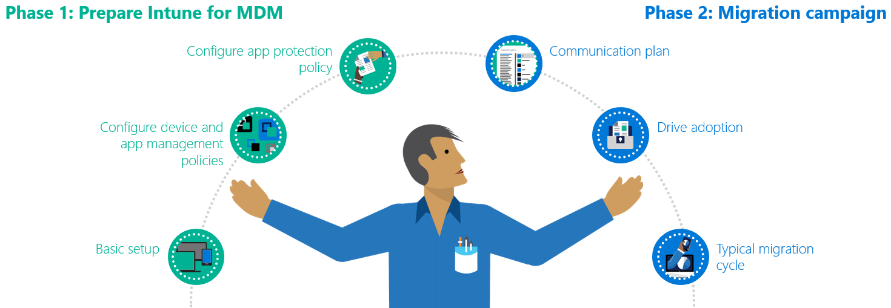

---
# required metadata

title: Intune mobile device management (MDM) Migration Guide | Microsoft Docs
description: The purpose of this guide is to step customers through the various details involved in migrating from a third-party MDM provider to Microsoft Intune.
keywords:
author: andredm7
ms.author: andredm
manager: angrobe
ms.date: 03/24/2017
ms.topic: article
ms.prod:
ms.service: microsoft-intune
ms.technology:
ms.assetid: dcfc21f9-1bcd-4371-a46d-f2e18154ec50

# optional metadata

#ROBOTS:
#audience:
#ms.devlang:
ms.reviewer: dagerrit
ms.suite: ems
#ms.tgt_pltfrm:
ms.custom: intune-classic

---

# Intune migration guide

[!INCLUDE[note for both-portals](../includes/note-for-both-portals.md)]

A successful migration to Intune starts with a solid plan that factors in the current MDM environment, business goals and technical requirements. Additionally, you need to have the key stakeholders whose will support and collaborate with your migration plan.

The purpose of this guide is to step you through the various details involved in migrating from a third-party MDM provider to Intune.

## What’s included in this guide?

This guide includes two phases, both of which include tasks, strategies, and tactical guidance that will help you step through the end to end process of migrating to Intune MDM.

-   [Phase 1: Prepare Intune for Mobile device management (MDM)](https://docs.microsoft.com/intune/plan-design/migration-phase1-prepare-intune-for-mobile-device-management)

    -   [Assess your MDM migration requirements](https://docs.microsoft.com/intune/plan-design/migration-phase1-prepare-intune-for-mobile-device-management#assess-mdm-requirements)

    -   [Basic setup](https://docs.microsoft.com/intune/plan-design/migration-phase1-basic-setup)

    -   [Configure device and app management policies](https://docs.microsoft.com/intune/plan-design/migration-phase1-configure-device-and-app-management-policies)

    -   [Configure app protection policies (optional)](https://docs.microsoft.com/intune/plan-design/migration-phase1-configure-app-protection-policies)

    -   [Special migration considerations](https://docs.microsoft.com/intune/plan-design/migration-phase1-special-migration-considerations)

-   [Phase 2: Migration campaign](https://docs.microsoft.com/intune/plan-design/migration-phase2-migration-campaign)

    -   [Communication Plan](https://docs.microsoft.com/intune/plan-design/migration-phase2-communication-plan)

    -   [Drive end-user adoption with conditional access](https://docs.microsoft.com/intune/plan-design/migration-phase2-drive-end-user-adoption-with-conditional-access)
    
    -   [Typical Migration Cycle](https://docs.microsoft.com/intune/plan-design/migration-phase2-typical-migration-cycle)
	    -   [Monitoring migration](https://docs.microsoft.com/intune/plan-design/migration-phase2-typical-migration-cycle#monitoring-migration)
	    -   [Post migration](https://docs.microsoft.com/intune/plan-design/migration-phase2-typical-migration-cycle#post-migration)

## Assumptions

-   You've already evaluated Intune in a proof of concept (PoC) environment, and have decided to use it as the MDM solution in your organization.

-   You are already familiar with Intune and its features. 

> [!NOTE]
> Check out the [Intune evaluation guide](https://docs.microsoft.com/intune/understand-explore/sign-up-for-30-day-trial-microsoft-intune), if you want to get more familiar with Intune before you migrate.

## Before you begin

It's important to recognize that your new Intune deployment might be different from your old MDM deployment. Unlike traditional MDM services, Intune centers on identity-driven access control, and so does not require a network proxy appliance to control access to corporate data from mobile devices outside the organization's network perimeter. Microsoft offers solutions to secure data services within the cloud itself via a suite of tightly integrated cloud services, collectively referred to as the Enterprise Client + Security offering.

-   Review the [common ways to use Intune](https://docs.microsoft.com/intune/understand-explore/common-ways-to-use-intune), and begin compiling answers to the questions under the [Phase 1: Assess MDM requirements](https://docs.microsoft.com/intune/plan-design/migration-phase1-prepare-intune-for-mobile-device-management#assess-mdm-requirements).

## Next steps

[Phase 1: Prepare Intune for mobile device management (MDM)](https://docs.microsoft.com/intune/plan-design/migration-phase1-prepare-intune-for-mobile-device-management)
