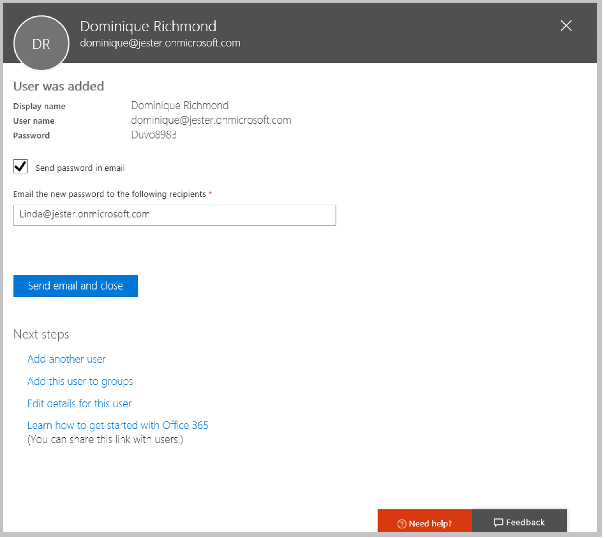
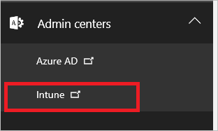

---
# required metadata

title: Sign up for a 30-day free trial of Microsoft Intune | Microsoft Docs
description: Sign up and set up a free, 30-day evaluation of Microsoft Intune.
keywords:
author: lindavr
ms.author: lindavr
manager: angrobe
ms.date: 11/29/2016
ms.topic: get-started-article
ms.prod:
ms.service: microsoft-intune
ms.technology:
ms.assetid: 619a1d11-3d22-4635-8f70-770eba3e1712

# optional metadata

#ROBOTS:
#audience:
#ms.devlang:
#ms.reviewer:
ms.suite: ems
#ms.tgt_pltfrm:
#ms.custom:

---

# Sign up for a Microsoft Intune free trial
This article walks you through a sign-up for an Intune trial and prepares your trial with some users so that you can then follow the associated evaluation guide to see how Intune manages mobile devices. <!---or app data when devices are not enrolled in Intune.--->

>[!Note]
> Starting in December 2016, Microsoft Intune is moving to the Azure portal, and some free trial sign ups will be in Intune in the Azure portal and some will be in classic Intune. If your trial is in the Azure portal, you will find [Intune Azure preview content](https://docs.microsoft.com/en-us/intune-azure/introduction/what-is-microsoft-intune) more useful after you complete the steps in this article.

## Assumptions
This sign-up article and the evaluation guide assume you are using the trial for evaluation purposes only and intend to start with a clean environment when you subscribe.

To make it easy for you to get started with the trial, we are setting up a very simple environment that uses only Intune and assumes it will be your sole method of managing devices (known as the mobile device management authority). However, throughout the guide we will point you to deeper technical content if you want to explore farther.

You can do everything in the trial version that you can do in a subscription version; the only difference is you are limited to 100 user accounts in the trial.

## Sign up for your trial
Visit the [Intune Sign up](https://portal.office.com/Signup/Signup.aspx?OfferId=40BE278A-DFD1-470a-9EF7-9F2596EA7FF9&dl=INTUNE_A&ali=1#0%20) page and fill out the form to sign up for a trial subscription.

If you have a work or school account and want to use that for your Intune trial, follow [these sign-in instructions](https://docs.microsoft.com/en-us/intune/get-started/start-with-a-paid-subscription-to-microsoft-intune-step-1) instead. However, this article and its evaluation guides assume that you are not using such an account.

> [!TIP]
> If most of your IT operations and users are in a different locale than you, you may want to set that locale for your trial to test performance.

### Post sign-up considerations
When you sign up for a trial, you'll receive an email message that contains your account information at the email address that you provided during the sign-up process. This email confirms your trial is active.

After completing the sign-up process, you will be directed to a page used to add users and assign them licenses using the Office 365 Admin center. The next time you sign in to **classic Intune** (https://manage.microsoft.com), you'll automatically be directed to the Intune administration console.

If your trial is in the **Azure portal**, go to https://portal.azure.com and sign in with your Intune trial credentials.

## Add users
Before you leave the Office 365 Admin center for Intune, you need to add some users to your trial account.

In the Office 365 Admin center, you can add users individually or in bulk by uploading a .csv file. We will do both to set up your trial. However, in your production environment, you will probably want to take advantage of your Azure Active Directory user accounts, which you can learn more about in our [Getting Started guide](https://docs.microsoft.com/en-us/intune/get-started/start-with-a-paid-subscription-to-microsoft-intune-step-3) and in the [Next steps](#Next-steps) section of this article.

### Add an individual user
1. Choose either of the options to add a use to open a form that allows you to create a user. Only the items starred with an asterisk (\*) are required.

2.  When you add the user, the final step will be to send the user an email with their temporary Intune password. For the purposes of this evaluation, use your own work email address so you will receive the log-on information and see the email your users will get. You can then use these user identities to enroll test devices. 

 

3. If you want to assign a user an admin role after you create it, you can edit the role in the Office 365 Admin center by selecting the user name from your list of users, and then choosing **Edit** in the Role line to see the list of user roles you can select from and assign to that user.

 

### Import multiple users
1. You will find the wizard for importing multiple users in the **More** list.

 

2. To help you set up your .csv file correctly, you can download a template file to populate with your user data. Download the .csv file that contains headers and sample user information to see exactly the kind of data is needed for each field.

 

3. After you’ve created and saved your .csv file, choose **Browse** to select the file. Verify, and choose **Next**. Your users will be uploaded and added to your list of active users.

> [!NOTE]
> Your users won't show up in Intune until they've enrolled a device to be managed.

Now it’s time to head over to Intune to start managing your users, their devices, and their apps.

## Keeping the admin experiences straight
### Classic Intune
There are two portals you will use for classic Intune: 
- The Office 365 Admin center ([portal.office.com](https://portal.office.com))
- The Intune administration console ([manage.microsoft.com](https://manage.microsoft.com))

Normally, you’ll do your work in the Intune administration console, shown below. This is the site where you set up and manage your groups, policies, devices, and apps.

However, you will use the Office 365 Admin center, shown below, to add and manage your users and other aspects of your account, including billing and support.

You can navigate from the Office 365 Admin center to the Intune admin console. The admin centers are under the last item in the left navigation pane. Choose **Intune** to open the Intune admin console in a new tab.

To get from Intune back to the Office 365 Admin center, choose the **Add Users** task on the Groups Overview page.

### Intune Azure preview
There are two portals you will use for the Intune Azure preview:
- The Office 365 Admin center ([portal.office.com](https://portal.office.com))
- The Intune dashboard in Azure ([portal.azure.com](https://portal.azure.com))
<!--- - The classic Intune admin center--->

The first time you sign on to Intune in Azure, you may not see it on your Azure dashboard. To add the Intune service to your Azure dashboard:
1. Choose **More services >** in the list of Azure services to the left of the dashboard, and enter Intune in the search box.
2. Choose **Intune** from the list, and select the star to add the service to the list of services.  
3. Choose **Intune** in the list of services to open the Intune dashboard.

Normally, you’ll do your work in the Intune dashboard, shown below. This is the site where you set up and manage your groups, policies, devices, and apps.

 

 <!---You can navigate to the log on page for the classic Intune admin center from the dashboard.--->

However, you will use the Office 365 Admin center, shown below, to add and manage your users and other aspects of your account, including billing and support.

To navigate from the Office 365 Admin center to the Intune dashboard, enter https://portal.azure.com in your browser address bar. If you are already logged into Office 365, you will be taken directly to the Intune service on Azure.

To get from Intune back to the Office 365 Admin center, enter https://portal.office.com in your browser address bar. If you are already logged into Intune, you will be taken directly to the Office 365 Admin Center.

## Next steps
### Classic Intune
Evaluation scenario: [Evaluate mobile device management in Microsoft Intune](mobile-device-management-trial-guide-microsoft-intune.md)

### Intune Azure preview
Learn more about [Intune in the Azure portal preview](https://docs.microsoft.com/en-us/intune-azure/introduction/what-is-microsoft-intune)

### Integration with other products
Learn more about using your Azure Active Directory user accounts with Intune:
- [Identity requirements](https://docs.microsoft.com/en-us/active-directory/active-directory-hybrid-identity-design-considerations-overview#design-considerations-overview)
- [Directory synchronization requirements](https://docs.microsoft.com/en-us/active-directory/active-directory-hybrid-identity-design-considerations-directory-sync-requirements)
- [Multi-factor authentication requirements](https://docs.microsoft.com/en-us/active-directory/active-directory-hybrid-identity-design-considerations-multifactor-auth-requirements)

Learn more about using [Intune with System Center Configuration Manager](https://docs.microsoft.com/en-us/sccm/mdm/understand/hybrid-mobile-device-management)
