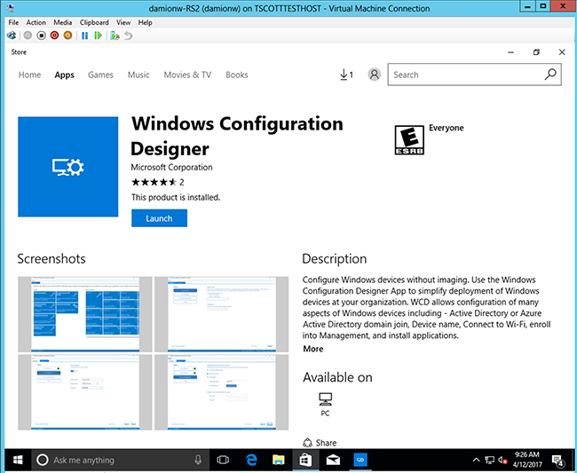
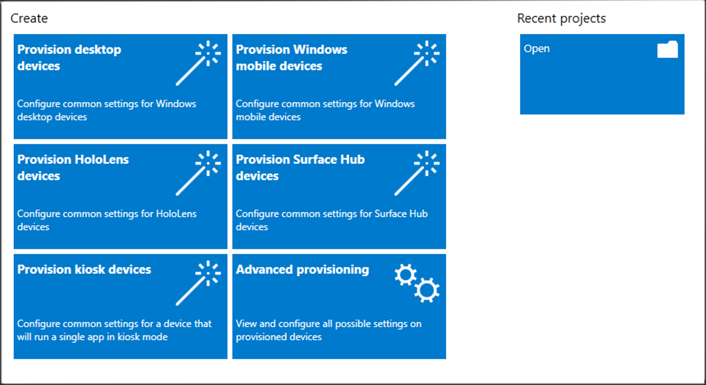
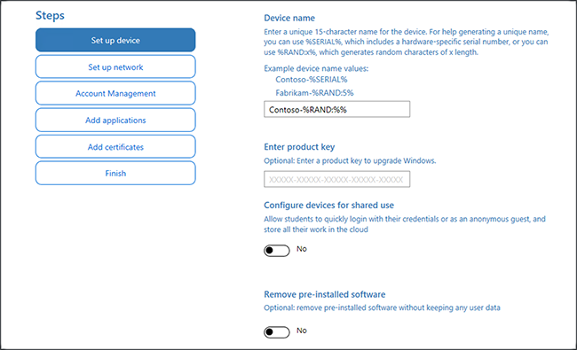
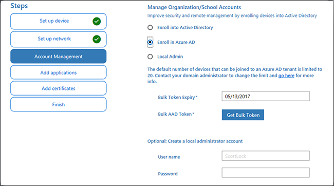
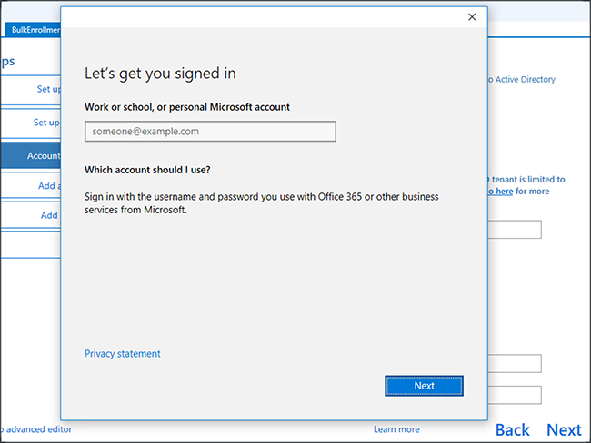
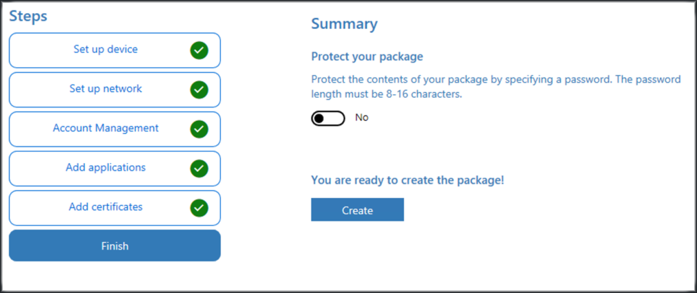
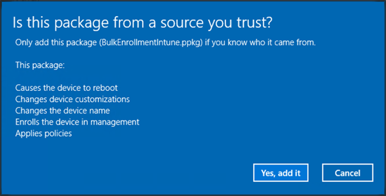

# Bulk enrollment for Windows devices

[!INCLUDE[azure_preview](../includes/azure_preview.md)]

As an administrator, you can join large numbers of new Windows devices to Azure Active Directory and Intune. To bulk enroll devices for your Azure AD tenant, you create a provisioning package with the Windows Configuration Designer (WCD) app. Applying the provisioning package to corporate-owned devices joins the devices to your Azure AD tenant and enrolls them for Intune management. Once the package is applied, it's ready for your Azure AD users to log on.

Azure AD users are standard users on these devices and receive assigned Intune policies and required apps. Self-service and Company Portal scenarios are not supported at this time.

## Prerequisites for Windows devices bulk enrollment

Bulk enrollment for Window devices requires the following:

- Devices running Windows 10 Creator update or later
- [Windows automatic enrollment](https://docs.microsoft.com/intune/deploy-use/set-up-windows-device-management-with-microsoft-intune#enable-windows-10-automatic-enrollment)

## Create a provisioning package

1. Download [Windows Configuration Designer (WCD)](https://www.microsoft.com/store/apps/9nblggh4tx22) from the Windows Store.

2. Open the **Windows Configuration Designer** app and select **Provision desktop devices**.

3. A **New project** window opens where you specify the following:
  - **Name** - A name for your project
  - **Project folder** - Where your project will be saved
  - **Description** - An optional description of the project

4.	Enter a unique name for your devices. Names can include a serial number (%%SERIAL%%) or a random set of characters. Optionally, you can also enter a product key if you are upgrading the edition of Windows, configure the device for shared use, and remove pre-installed software.

5.	Optionally, you can configure the Wi-Fi network devices connect to when they first start.  If this isn’t configured, a wired network connection is required when the device is first started.

6.	Select **Enroll in Azure AD**, enter a **Bulk Token Expiry** date, and then select **Get Bulk Token**.

7. Provide your Azure AD credentials to get a bulk token.

8.	Click **Next** when **Bulk Token** is fetched successfully.

9. Optionally, you can **Add applications** and **Add certificates**. These apps and certificates are provisioned on the device.

10. Optionally, you can password protect your provisioning package.  Click **Create**.

## Provision devices

1. Access the provisioning package in the location specified in **Project folder** specified in the app.

2. Choose how you’re going to apply the provisioning package to the device.  A provisioning package can be applied to a device one of the following ways:
 - Place the provisioning package on a USB drive, insert the USB drive into the device you’d like to bulk enroll, and apply it during initial setup
 - Place the provisioning package on a network folder, and apply it insert on the device you’d like to bulk enroll after initial setup

 For step-by-step instruction on applying a provisioning package, see [Apply a provisioning package](https://technet.microsoft.com/itpro/windows/configure/provisioning-apply-package).

3. After you apply the package, the device will automatically restart in 1 minute.
 

4. When the device restarts, it connects to the Azure Active Directory and enrolls in Microsoft Intune.

## Troubleshooting Windows bulk enrollment

Provisioning is intended to be used on new Windows devices. Provisioning failures might require a factory reset of the device or device recovery from a boot image. These examples describe some reasons for provisioning failures:

- A provisioning package that attempts to join an Active Directory domain or Azure Active Directory tenant that does not create a local account could make the device unreachable if the domain-join process fails due to lack of network connectivity.
- Scripts run by the provisioning package are run in system context, and are able to make arbitrary changes to the device file system and configurations. A malicious or bad script could put the device in a state that can only be recovered by reimaging or factory resetting the device.
