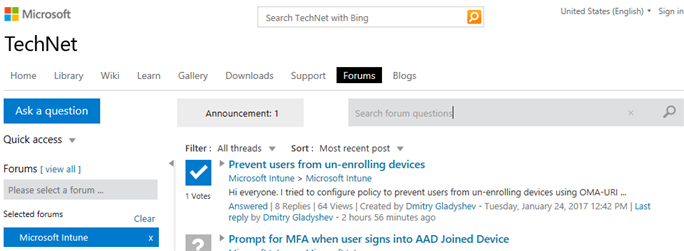
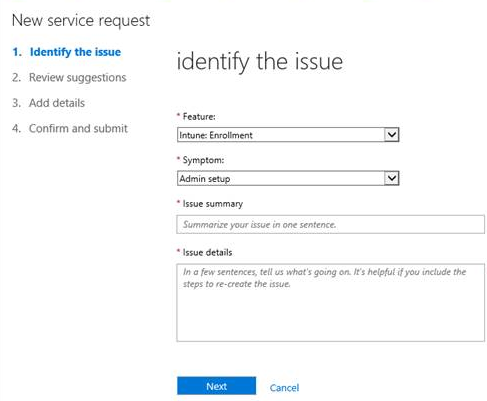
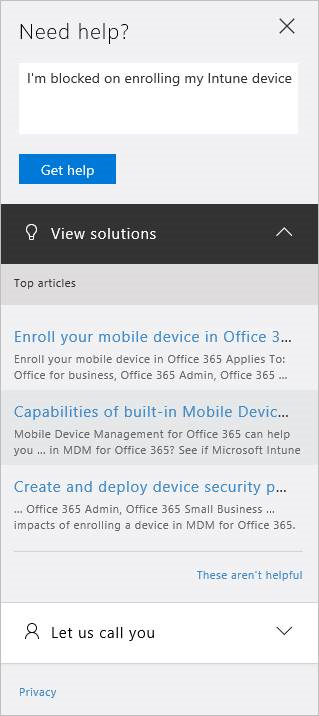

---
# required metadata

title: How to get support for Microsoft Intune
titleSuffix: "Intune Azure preview"
description: "Intune Azure preview: Support is available both online and by telephone for paid and trial subscriptions."
keywords:
author: robstackmsft
ms.author: robstack
manager: angrobe
ms.date: 04/12/2017
ms.topic: article
ms.prod:
ms.service: microsoft-intune
ms.technology:
ms.assetid: 7fc95d17-098e-4da5-8a09-a96476569dd9

# optional metadata

#ROBOTS:
#audience:
#ms.devlang:
ms.reviewer: cacamp
ms.suite: ems
#ms.tgt_pltfrm:
ms.custom: intune-classic

---

# How to get support for Microsoft Intune

[!INCLUDE[azure_preview](./includes/azure_preview.md)]

Microsoft provides global technical, pre-sales, billing, and subscription support for Microsoft Intune. Support is available both online and by phone for paid and trial subscriptions. Online technical support is available in English and Japanese. Phone support and online billing support are available in additional languages.

Support for Intune, and for Intune when used with Configuration Manager, is free of charge. Premier Support customers incur charges for procedure questions (for example, how to go about configuring an Intune feature).

>[!IMPORTANT]
> For technical support with products that work with Intune, and are not made by Microsoft, for example SaaSwedo, Cisco, or Lookout, contact the supplier of that product first to ensure you have configured it correctly before you open a case with Intune support.

## Find help without opening a support ticket

Before creating a support ticket, check out the following resources for answers and information. You might also want to review [general troubleshooting tips for Microsoft Intune](https://docs.microsoft.com/intune/troubleshoot/general-troubleshooting-tips-for-microsoft-intune).

### Microsoft Intune TechNet forums

Ask a question or start a discussion with Microsoft technical experts! We provide answers and insights on the searchable [Microsoft Intune TechNet Forum](https://social.technet.microsoft.com/Forums/home).

### Get started with the forum

1. On the forums page, enter Microsoft Intune in the Forums box, then select it from the list. 

2. You'll now see Microsoft Intune in your list of selected forums. 

### Microsoft Intune UserVoice product feedback site

Do you have feedback about how Microsoft can make Intune even better? Please let us know by adding your ideas on the Microsoft Intune [UserVoice](https://microsoftintune.uservoice.com/forums/291681-ideas) feedback site. You can also vote on ideas that others have added to UserVoice. 

## Create an online support ticket

If you are unable to find answers by using the self-help resources, you can create an online support ticket.

**Please limit each support ticket to a single issue** to help us serve you better. Here's why:

- Support engineers who provide assistance are likely to specialize in specific areas, and it's easier to identify the right subject matter experts to help with your issue.
- Engineering teams can prioritize their work in product areas where the most incidents are being generated.
- It's easier to escalate challenging issues to the correct resource.

Please review the [definition of a support incident](#definition-of-a-support-incident) before creating a support ticket.

**To create an online support ticket**:

1.  Sign in to the [Office 365 admin center](https://portal.office.com) with your Intune credentials.
	>[!NOTE]
	>
	>Premier Support customers can open an Intune support ticket on the [Premier support page](https://support.microsoft.com/en-us/premier/contacts).

2.  Choose the **Admin** tile.
3.  On the left, under **Support**, choose **Support** to open a ticket.

	

	>[!NOTE]
	>  Customers who have, or have had, an O365 account with 100 or fewer licenses, will see this message. If you see it, refer to [Create a support ticket with alternate methods](#create-a-support-ticket-with-alternate-methods).

	> 

    -   For billing, licensing, and account issues, select **Billing and product info**.

    -   For all other Intune issues, select **Mobile device management**.

    > [!NOTE]
    > You might have to choose **more** at the bottom of the list to see all of the categories.

3.  Follow the instructions to open your request.

### Create a support ticket with alternate methods

Follow this procedure if your support page looks like this:

1. Choose **Need help**.
2. In the text box, provide a description of your issue, and then choose **Get help**.

	

3. Review the suggested online resources, or choose **Let us call you** to receive a call from Microsoft Support.

## Get phone support
See [Contact assisted phone support for Microsoft Intune](phone-support-contact.md) for a list of support phone numbers by country and region, support hours, and supported languages for each region.

## Track your support requests
1.  Sign in to the [Office 365 admin center](https://portal.office.com) with your Intune credentials.
2.  Choose the **Admin** tile.
3.  On the left, under **Support**, choose **Service requests**. Then you can review your requests.

Our initial responses to support requests depend on the severity of the issue. For the most severe issues, our first response for Professional customers is within two hours. For Premier Support customers, the response varies according to your support agreement. These are cases where:

- One or more services aren’t accessible or are unusable.
- Production, operations, or deployment deadlines are severely affected, or there will be a severe impact on production or profitability.
- Multiple users or services are affected.

For moderately severe issues, our first response for Professional customers is within four hours. For Premier Support customers, the response varies according to your support agreement.  These are cases where:

- The service is usable but is not functioning as well as usual.
- The situation has moderate business impact and can be dealt with during business hours.
- A single user, customer, or service is partially affected.

For other issues, our first response for Professional customers  is within eight hours. For Premier Support customers, the response varies according to your support agreement.  These are cases where:

- The situation has minimal business impact.
- The issue is important but does not have an immediate, significant service or productivity impact for the customer.
- A single user is experiencing partial disruption, but an acceptable workaround exists.

> [!NOTE]
> **If you use Microsoft System Center Configuration Manager** or **Microsoft System Center Endpoint Protection:** For technical support with Configuration Manager or Endpoint Protection, contact your partner or visit the [Microsoft System Center Configuration Manager and System Center Endpoint Protection Solution Center](http://www.microsoft.com/en-us/server-cloud/products/system-center-2012-r2/resources.aspx) to find rich self-help material. It also offers the option of opening a support request online or over the phone.
>
> Technical support for System Center Configuration Manager or System Center Endpoint Protection requires either payment or is decremented from your existing licensing or Premier Support agreements.

## Find support for volume licensing
If you have already purchased licenses from Microsoft under a volume licensing program, use the following resources for support:

-   For support related to licenses and locating keys, see [Volume Licensing Service Center](http://go.microsoft.com/fwlink/p/?LinkID=282016).

-   For billing questions, see [Billing and subscription management support](http://support.microsoft.com/oas/default.aspx?prid=15371).

-   For general information about volume licensing, see [Volume licensing](http://go.microsoft.com/fwlink/p/?LinkID=282015).

## Definition of a support incident

A support incident is defined as a single support issue and the work needed to resolve it. A single support issue cannot be broken down into subordinate problems. If you can identify subordinate problems, each subordinate problem is considered as a separate incident. Multiple contacts and off-line research may be needed to resolve a given issue. The time spent in delivering these solutions is independent of the amount you will be charged.

"Break-fix" support is included with subscriptions to Microsoft Intune and Mobile Device Management for Office 365, so opening additional support incidents never incurs additional charges.

If a support engineer asks that you open additional support incidents for additional issues, please understand that it’s in the best interests of everyone. Thank you for your understanding and partnering with us to provide world-class support experiences!

For prices per incident and levels of severity, see [Professional Support Options](https://support.microsoft.com/gp/offerprophone).
