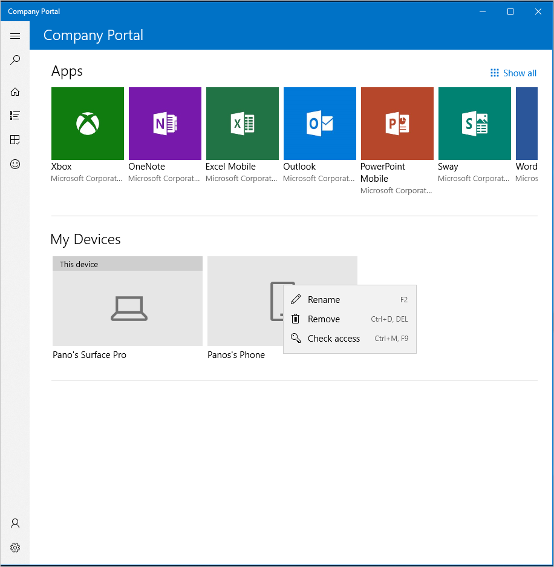

---
# required metadata

title: Check device access | Microsoft Docs
description: Check device access to find out if your device is compliant and able to access work or school resources.
keywords:
author: lenewsad
ms.author: lanewsad
manager: dougeby
ms.date: 10/02/2018
ms.topic: article
ms.prod:
ms.service: microsoft-intune
ms.technology:
ms.assetid: 
searchScope:
 - User help

# optional metadata

ROBOTS:  
#audience:
#ms.devlang:
ms.reviewer: 
ms.suite: ems
#ms.tgt_pltfrm:
ms.custom: intune-enduser

---

# Check access from Company Portal app for Windows

Verify that your device has access to work or school resources. 

Organizations enforce requirements&ndash;such as encryption, password, and secure startup&ndash; to make sure that only secure, trusted devices access their data. Managed devices must meet and maintain these requirements to access an organization's resources.

When your device loses access, the Company Portal app's **Device details*** page alerts you to the settings you need to adjust. It also provides information to help you resolve them. After you resolve these settings, you can **Check access** to confirm your device's status.

## Check access from Device details page  
1. Open the Company Portal app for Windows.
2. Select a device to check.
3. On the **Device details** page, select **Check access**. The app syncs your device with your organization's current requirements and checks to make sure your device matches. This check can take a few minutes.
4. The status updates to show either of the following messages:  
    a. Can access <organization> resources  
    b. Cannot access <organization> resources  
5. If your device can't access resources:
    a. Review the message and list of affected devices at the top of the page.  
    b. Click **More** for more details.  
    c. If you need help resolving the setting on your device, click **How to resolve this**. This link opens the relevant article on Docs.Microsoft.com.  

## Check access from device context menu
1. Open the Company Portal app for Windows.
2. Right-click or press and hold the device you want to check.
3. Select **Check access**. The app syncs your device with your organization's current requirements and checks to make sure your device matches. This check can take a few minutes.  
   
4. The status updates to show either:
    a. Can access <organization> resources
    b. Can't access <organization> resources
6. If your device can't access resources, select the device.
7. On the **Device details** page:  
    a. Review the message and list of affected settings.  
    b. Click **More** for more details.  
    c. If you need help resolving the setting on your device, click **How to resolve this**. This link opens the relevant article on Docs.Microsoft.com.   
8. After you've configured the settings, check access again to confirm the device's status.  

Need more help? Find your company support's contact information on the [Company Portal website](https://go.microsoft.com/fwlink/?linkid=2010980).
