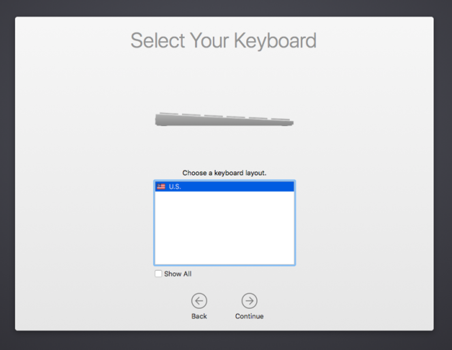
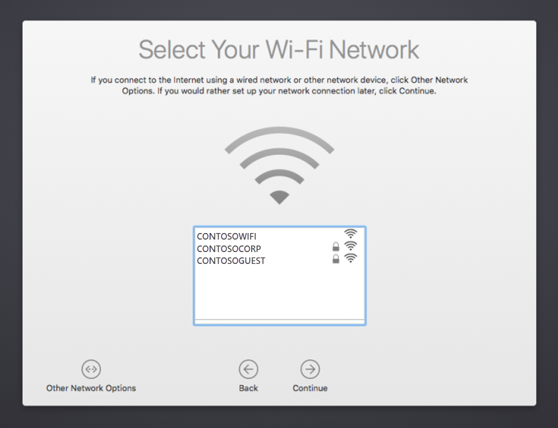
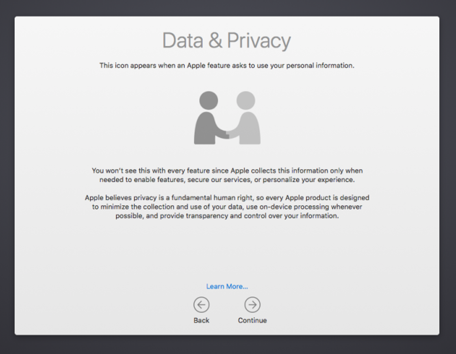

---
# required metadata

title: Enroll your organization-provided macOS device in management | Microsoft Docs
description: Describes how to enroll an macOS device in Intune that was purchased and provided by your organization.
keywords:
author: lenewsad
ms.author: lanewsad
manager: dougeby
ms.date: 08/29/2018
ms.topic: article
ms.prod:
ms.service: microsoft-intune
ms.technology:
ms.assetid: 
searchScope:
 - User help

# optional metadata

ROBOTS:  
#audience:
#ms.devlang:
ms.reviewer: japoehlm
ms.suite: ems
#ms.tgt_pltfrm:
ms.custom: intune-enduser
ms.collection: M365-identity-device-management
---  

# Enroll your organization-provided macOS device in management

Learn how to get your new macOS device managed in Intune.  

Devices that are provided by your work or school are often preconfigured before you receive them. Your organization will send these preconfigured settings to your device after you turn it on and sign in for the first time. After your device completes setup, you'll receive access to your work or school resources. 

To begin management setup, power on your device and sign in with your work or school credentials. The rest of this article describes the steps and screens you'll see as you walk through Setup Assistant.   

## What is Apple DEP?
Your organization might have purchased their devices through something called the *Apple Device Enrollment Program* (DEP). Apple DEP lets organizations buy large amounts of iOS or macOS devices. Organizations can then configure and manage those devices within their preferred mobile device management provider, such as Intune. If you're an administrator and want more information about Apple DEP, see [Automatically enroll macOS devices with Apple's Device Enrollment Program](https://docs.microsoft.com/intune/device-enrollment-program-enroll-macos).  

## Get your device managed 
Complete the following steps to enroll your macOS device in management. If you're using your own device, rather than an org-provided device, follow the steps for [personal and bring-your-own devices](enroll-your-device-in-intune-macos-cp.md).  

1. Power on your macOS device. 
2. Choose your country and click **Continue**.  

      
3. Choose a keyboard layout. The list shows one or more options based off your selected country. To see all layout options, regardless of your selected country, click **Show All**. When you're done, click **Continue.**  

     
4. Select your Wi-Fi network. You must have an internet connection to continue setup. If you do not see your network, or if you need to connect over a wired network, click **Other Network Options**. When you're done, click **Continue**.  

     
5. After you're connected to Wi-Fi, the **Remote Management** screen appears. Remote management enables your organization's administrator to remotely configure your device with company-required accounts, settings, apps, and networks. Read through the remote management explanation to help you understand how your device is managed. Then click **Continue**.  

     
6. When prompted, sign in with your work or school account. After you're authenticated, your device will install a management profile. The profile configures and enables your access to your organization's resources.  
7. Read about the Apple data & privacy icon so that you can later identify when personal information is being collected. Then click **Continue**.  

     
8. After your device is enrolled, you might have additional steps to complete. The steps you see depend on how your organization customized the setup experience. It could require you to:
    * Sign in to an Apple account
    * Agree to the Terms and conditions
    * Create a computer account
    * Walk through an express setup
    * Set up your Mac  
## Get the Company Portal app      
Download the Intune Company Portal app for macOS on your device. The app lets you monitor, sync, add, and remove your device from management, and install apps. These steps also describe how to register your device with Company Portal.  
1. On your macOS device, go to https://portal.manage.microsoft.com/EnrollmentRedirect.aspx.
2. Sign in to the Company Portal website with your work or school account. 
3. Click **Get the App** to download the Company Portal installer for macOS.
4. When prompted, open the .pkg file and complete the installation steps.
4. Open the Company Portal app and sign in with your work or school account.
5. Find your device and click **Register**.
6. Click **Continue** > **Done**. Your device should now appear in the Company Portal app as a corporate and compliant device.

Still need help? Contact your company support. For contact information, check the [Company Portal website](https://go.microsoft.com/fwlink/?linkid=2010980).
