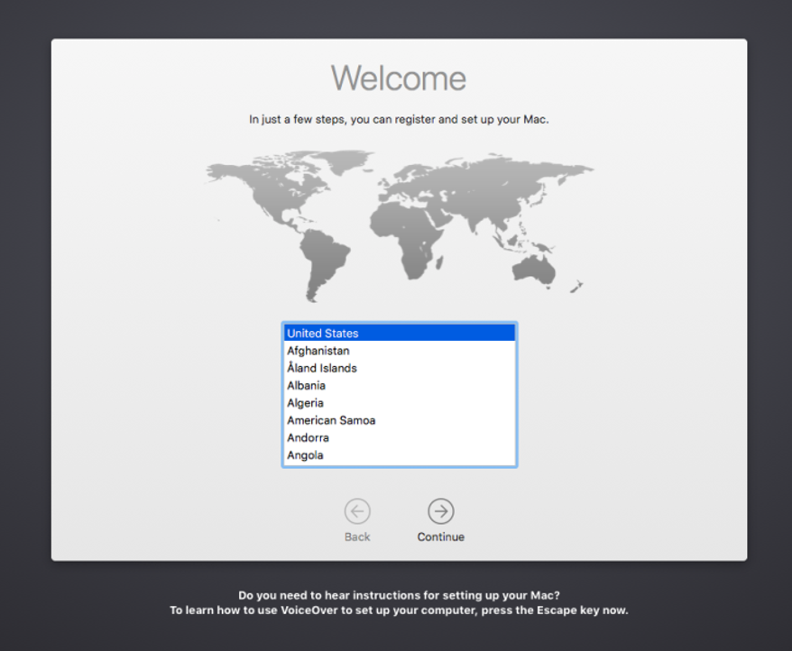
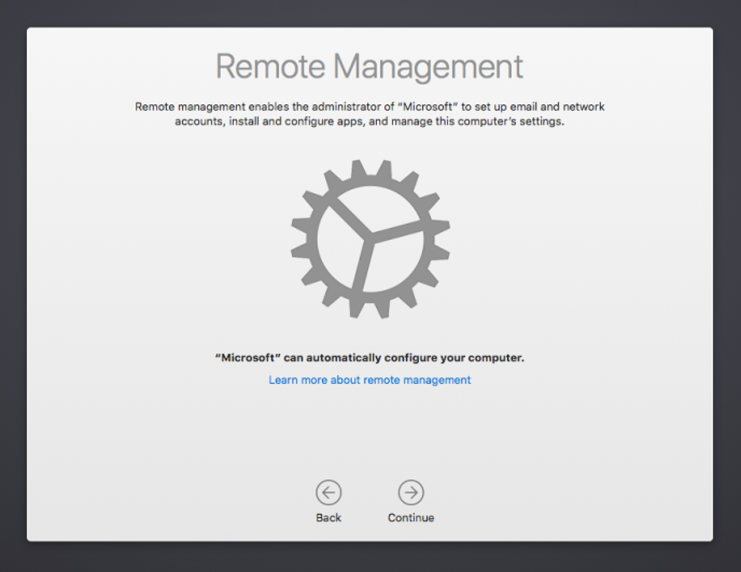

---
# required metadata

title: Enroll your company owned or provided macOS device in management | Microsoft Docs
description: Describes how to enroll an macOS device in Intune that was purchased and provided by your organization.
keywords:
author: lenewsad
ms.author: lanewsad
manager: dougeby
ms.date: 08/24/2018
ms.topic: article
ms.prod:
ms.service: microsoft-intune
ms.technology:
ms.assetid: 
searchScope:
 - User help

# optional metadata

ROBOTS:  
#audience:
#ms.devlang:
ms.reviewer: japoehlm
ms.suite: ems
#ms.tgt_pltfrm:
ms.custom: intune-enduser

---  

# Get your company-owned macOS device managed

Learn how to get your new macOS device automatically managed in Intune. 

Work and school-owned devices are often preconfigured before you receive them. When you turn on your device and sign in for the first time, your organization will remotely send these preconfigurations (referred to as a *management profile*) directly to your device. The management profile automatically configures and enrolls your device so that you can access your work or school resources right away.  

To begin, power on your device and sign in with your work or school credentials. The rest of this article describes the steps and screens you'll see as you walk through Setup Assistant.   

## What is Apple DEP?
If you have a company-owned device, it might have been purchased from the Apple Device Enrollment Program (DEP). Some organizations buy large amounts of iOS or macOS devices through Apple DEP. Devices can then be integrated, configured, and managed within the organization's preferred mobile device management provider, like Intune. If you're an administrator and want more more information about Apple DEP, see [Automatically enroll macOS devices with Apple's Device Enrollment Program](https://docs.microsoft.com/intune/device-enrollment-program-enroll-macos).  

## Set up your macOS device  
Complete the following steps to enroll your macOS device in management. If you're using your own device, rather than a company-owned device, follow the steps for [personal and bring-your-own devices](enroll-your-device-in-intune-macos-cp.md). 

1. Power on your macOS device. 
2. Choose your **Language** and click **Continue**.
      
3. Choose a keyboard layout. The list shows one or more options based off your selected language. To see all layout options, regardless of your selected language, click **Show All**. When you're done, click **Continue.**
     
4. Select your Wi-Fi network. You must have an internet connection to continue setup. If you do not see your network, or if you need to connect over a wired network, click **Other Network Options**. When you're done, click **Continue**.
     
5. After you're connected to Wi-Fi, the **Remote Management** screen appears. Remote management enables your organization's administrator to remotely configure your device with company-required accounts, settings, apps, and networks. Before proceeding, read over the documentation to help you understand how your device is managed. Then click **Continue**.
     
6. When prompted, sign in with your work or school account. After your authenticated, your device will install a management profile. The profile configures and enables your access to your organization's resources.  
7. Read about the Apple data & privacy icon so that you can later identify when personal information is being collected. Then click **Continue**.
     
8. After your device is enrolled, you might have additional steps to complete. The steps you see depend on how your organization customized the setup experience. It could require you to:
    * Sign in to an Apple account
    * Agree to the Terms and conditions
    * Create a computer account
    * Walk through an express setup
    * Set up your Mac  
## Get the Company Portal app      
Go to the App Store to get the Intune Company Portal app on your device. The app lets you monitor, sync, add, and remove your device from management, and install apps.

Still need help? Contact your company support. For contact information, check the [Company Portal website](https://portal.manage.microsoft.com#HelpDeskDialog).
