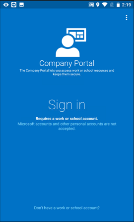
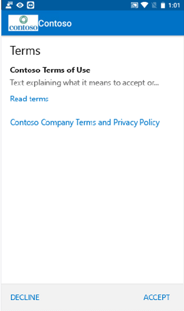
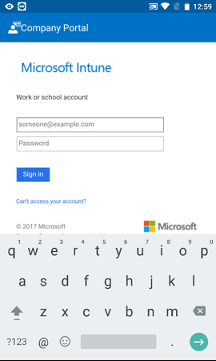
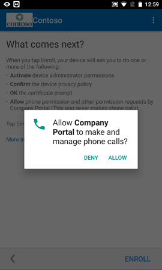
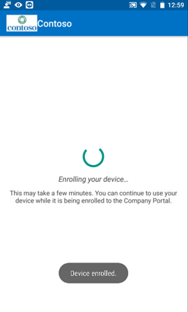
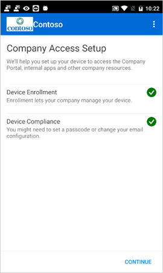

---
# required metadata

title: Enroll Android device with Intune Company Portal | Microsoft Docs
description: Describes how to enroll an Android device with Intune Company Portal
keywords:
author: lenewsad
ms.author: lanewsad
manager: dougeby
ms.date: 04/19/2019
ms.topic: article
ms.prod:
ms.service: microsoft-intune
ms.technology:
ms.assetid: 0ed3a002-7533-4001-ae24-e10b64b66620
searchScope:
 - User help

# optional metadata

ROBOTS:  
#audience:
#ms.devlang:
ms.reviewer: esmich
ms.suite: ems
#ms.tgt_pltfrm:
ms.custom: intune-enduser
ms.collection: M365-identity-device-management
---

# Enroll your device with Company Portal  
Enroll your personal or corporate-owned Android device to get secure access to company email, apps, and data. Company Portal supports Android devices, including Samsung Knox, running Android 4.4 and later.  
 
> [!VIDEO https://www.youtube.com/embed/k0Q_sGLSx6o]

> [!NOTE]
> Samsung Knox is a type of security that certain Samsung devices use for additional 
> protection outside of what native Android provides. To check if you have a Samsung Knox device,> go to **Settings** > **About device**. If you don't see **Knox version** listed there, you have a native Android device.

## Enroll device  
Make sure to [install the free Intune Company Portal app from Google Play](https://play.google.com/store/apps/details?id=com.microsoft.windowsintune.companyportal). 

During enrollment, you might be asked to choose a category that best describes how you use your device. Your company support uses your answer to check the apps that you have access to.  

1. Open the Company Portal app.  

3. On the Company Portal **Welcome** screen, tap **Sign in**, and then sign in with your work or school account.

      

4. If prompted to accept your organization's terms and conditions, tap **ACCEPT**. This screen might be slightly different from the example screenshot below. 

   

5. Sign in to the Company Portal app using your work or school account and password, and then tap **Sign in**.

   

6. On the **Company Access Setup** screen, tap **CONTINUE**.

   

   > [!NOTE]
   > The yellow triangles don't mean you've already got an error. Those icons indicate that there are still steps to be completed in the enrollment process.

7. Review a list of what your company support can and can't see on your device, and then tap **CONTINUE**.

   

8. On the **What's next?** screen, read about what happens during enrollment, and then tap **ENROLL**.

   

9. If you're using Android 6.0 or later, do this step. Otherwise, go to the next step.

   If your company support has set up certain policies, you may see the following messages:
   - **Allow Company Portal to make and manage phone calls?**

     

   If you see this message, tap **ALLOW**. It is safe to tap ALLOW because **Microsoft never makes or manages your phone calls**! Google controls the message text, and Microsoft cannot change it. When you allow access, all you're doing is letting your device send your device's international mobile station equipment identity (IMEI) number to Intune. The IMEI number is like a serial number that uniquely identifies a mobile device.

   If you deny access, the message will appear again the next time you sign in to the Company Portal. To turn off future messages, select **Never ask again**. To reverse the access permission, go to **Settings** > **Apps** > **Company Portal** > **Permissions** > **Phone**, and then turn on the permission.  

   - **Allow Company Portal to access your contacts?**

     

     If you see this message, tap **ALLOW**. It is safe to tap ALLOW because **Microsoft never accesses your contacts!** Google controls the message text, and Microsoft cannot change it. When you allow access, it only lets the Company Portal app create, use, and manage your work account.

     If you deny access, the message will appear again the next time you sign in to the Company Portal, but you can turn off future messages by tapping the **Never ask again** box. If you later decide to allow access, go to **Settings** &gt; **Apps** &gt; **Company Portal** &gt; **Permissions** &gt; **Phone**, and then turn on the permission.

10. On the **Activate device administrator** screen, tap **Activate**.

    

    The device administrator role is one that the Company Portal needs to manage your device. It allows your admin to see certain things - like how many times you've attempted to unlock your screen - and to take some actions.    

    Microsoft does not control this message, and we understand that its phrasing can seem somewhat drastic. There's not a way for the Company Portal to display just the restrictions and access that are relevant to your organization. All of them are granted at once on this screen. Contact your company support for more information using the contact information in the [Company Portal website](https://go.microsoft.com/fwlink/?linkid=2010980) if you have questions specific to your individual organization's use.  

11. Follow the prompts to enter a PIN or password. If you already set up a PIN or password on this device, you won't see this screen or be required to enter a new PIN or password.  

    

12. If you are using a Samsung Knox device, tap **Confirm**, and you’ll see a message that your device is being enrolled. If you are using a native Android device, just notice the following screen that shows that your device is being enrolled.

    

    This screen shows that your device is being enrolled.

    

13. When the **Company Access Setup** screen appears, tap **CONTINUE**. If a message indicates that your device is out of compliance, follow the instructions to fix the issue, and then tap **CONTINUE**.

    

    

    You can find out more about the issues by tapping on them.

    

      

14. On the **Company Access Setup complete** screen, tap **DONE**. Your device is now enrolled.

    

## Next steps  

Before you try to install company apps, go to **Settings** > **Security**, and turn on **Unknown sources**. If you don't turn on this option before you try to install apps, you'll see the following message: "Install blocked. For security reasons, your device is set to block installations of apps obtained from unknown sources." You can tap **Settings** on the error dialog box to go to the **Unknown sources** option.  

> [!Note]
> If your organization is using telecom expense management software, you will have an additional few steps to complete before your device is fully enrolled. Find out more [here](enroll-your-device-with-telecom-expense-management-android.md).

If you get an error while you try to enroll your device in Intune, you can [email your company support](send-logs-to-your-it-admin-by-email-android.md).  

Still need help? Contact your company support (check the [Company Portal website](https://go.microsoft.com/fwlink/?linkid=2010980) for contact information), or write the <a href="mailto:wintunedroidfbk@microsoft.com?subject=I'm having trouble with enrolling my Android device&body=Describe the issue you're experiencing here.">Microsoft Android team</a>.
