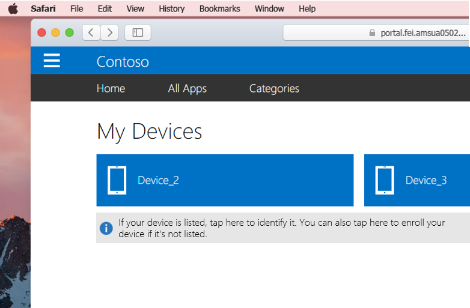
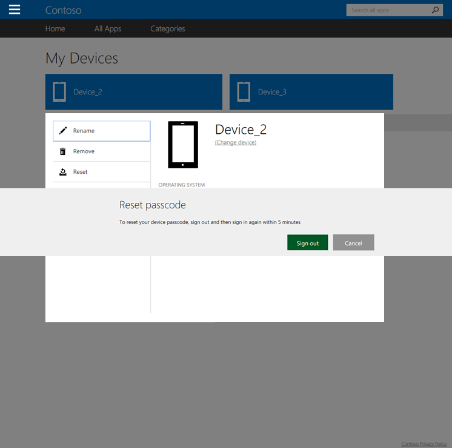

---
# required metadata

title: How to reset your passcode from the Company Portal website | Microsoft Docs
description:
keywords:
author: lenewsad
ms.author: lanewsad
manager: dougeby
ms.date: 06/23/2017
ms.topic: article
ms.prod:
ms.service: microsoft-intune
ms.technology:
ms.assetid: 4fa3255b-9d1e-42d5-bd8b-70963dcf2d86
searchScope:
 - User help

# optional metadata

ROBOTS:  
#audience:
#ms.devlang:
ms.reviewer: jieyang
ms.suite: ems
#ms.tgt_pltfrm:
ms.custom: intune-enduser

---

# How to reset your device passcode from the Company Portal website

If you lose your device PIN or password for a device that you have enrolled in Intune, you can use the [Company Portal website](https://portal.manage.microsoft.com#HelpDeskDialog) to reset it. You can use the Company Portal website to manage computers and devices that you have enrolled in Intune and to do most of the same tasks that you can do when you use your Company Portal app.

> [!NOTE]
> It's possible that you won't see the Reset Passcode button on the Company Portal website if you use a corporate enrolled device. If you do not, you need to contact your company support to reset the passcode for you.

To reset your passcode:

1.	On the [Company Portal website](https://portal.manage.microsoft.com#HelpDeskDialog), tap the __menu__ button , then select __My Devices__.

2. On the __My Devices__ page, select the name of the device whose passcode you want to reset.

  

3.	The device will open in a popup window. Select the **Reset Passcode** button.

	

4.  A banner will appear asking you to confirm that you want to reset your passcode, and that your device will sign you out after it does this. You will then need to wait 5 minutes before signing in again.

  

5.  Select **Sign out**, and you will receive one final message letting you know about the removal of the passcode from the device. If you do not have the device with you, do not remove the passcode, as whomever has physical access to the device will be able to access most of the information on it - personal or corporate. 

  

  Different devices have different types of passcodes.

  **Android**: Removes the existing passcode and creates a temporary passcode with both letters and numbers 
  
  > [!NOTE]
  > You cannot reset the passcode for devices with Android 7.0 and later. You must reset these devices to factory settings if you forget your passcode.

  **iOS**: Removes the existing passcode and does not create a temporary passcode. If you're using the Touch ID fingerprint 		scanner for opening your device or making purchases, you need to set it up again.

  **Windows 10 Mobile**: Removes the existing passcode and creates a temporary passcode with both letters and numbers. If you're 		using Windows Hello facial recognition to log in, it will still be supported.
	
  **Windows Phone 8.1**: Removes the existing passcode and creates a temporary passcode with numbers

  For Android and Windows devices, the temporary password will appear in the **Device Details**. 

6.  Unlock your device and set a new passcode, or change the temporary passcode by going to your device **Settings**.

To see a notification confirming that your password was reset successfully, click the notification flag at the top right of the Company Portal website.

Still need help? Contact your company support. For contact information, check the [Company Portal website](https://portal.manage.microsoft.com#HelpDeskDialog).
