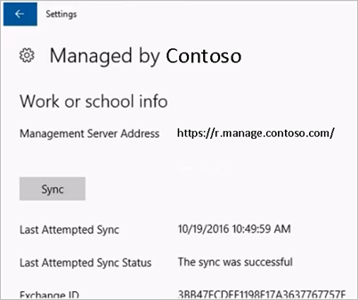
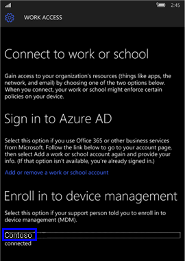
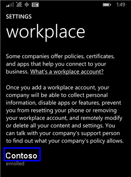
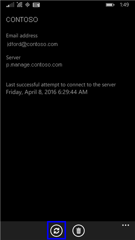

---
# required metadata

title: Manually sync your Windows device | Microsoft Docs
description:
keywords:
author: lenewsad
ms.author: lanewsad
manager: dougeby
ms.date: 05/19/2017
ms.topic: article
ms.prod:
ms.service: microsoft-intune
ms.technology:
ms.assetid: 443c6de7-5187-4dc4-b844-6085a0c659bd
searchScope:
 - User help

# optional metadata

ROBOTS:  
#audience:
#ms.devlang:
ms.reviewer: priyar
ms.suite: ems
#ms.tgt_pltfrm:
ms.custom: intune-enduser

---

# Sync your Windows device manually

Sometimes trying to install an app on your Windows device may take longer than you think it should. If this happens, you can try to manually sync your Windows device. Syncing may help speed up the installation.

> [!Note]
> Apps could take awhile to install if you are on a network with slower speeds or higher amounts of devices downloading content at the same time.

The following versions of Windows can sync manually. Unfortunately, if your device is using a different version of Windows, you can't start a manual sync.

* [Sync Windows 10 desktop](#windows-10-desktop)
* [Sync Windows 10 Mobile](#windows-10-mobile)
* [Sync Windows Phone 8.1](#windows-phone-81)

## Windows 10 desktop
There is more than one version of Windows 10, so there are two sets of steps. To figure out which steps to use, look at the screenshots, and then follow the steps that look like what you see on your device.

1. Choose the **Start** button, and then choose **Settings**.

    

2. On the **Settings** page, choose **Accounts**.

    

3. Look at the next two screens, and find the one that looks like the one you see on your device. Follow the steps that go with the screen that you see on your device.

	If you see this screen, which shows "Access work or school," follow the instructions in [Steps to follow if you see Access work or school](#steps-to-follow-if-you-see-access-work-or-school).

	

	If you see this screen, which shows "Work access," follow the steps in [Steps to follow if you see Work access](#steps-to-follow-if-you-see-work-access).

	

### Steps to follow if you see Access work or school

1. On the **Accounts** page, choose **Access work or school**.

    

2. Choose your work or school account. Depending on how your company support has set things up, you might see two accounts that look similar to the example shown below. One account has a briefcase next to it, and the other has the Microsoft logo next to it.

	- If you see the account with the briefcase, select it, and look for an **Info** button under it.
	- If you see only the account with the Microsoft logo, select the account, and look for an **Info** button under it.

    

3. Choose the **Info** button. A dialog opens that looks similar to the example below.

    

4. Choose the **Sync** button. Your device will be synced with Intune.

### Steps to follow if you see Work access

1. On the **Accounts** page, choose **Work access**.

    

2. Under the section **Enroll in to device management**, choose the name of your company.

    

3. Choose the **Sync** button.

    

   The button becomes grayed out until the sync is finished.

### Windows 10 Mobile
To manually sync your Windows 10 Mobile device to speed up a slow app installation:

   1. Go to **All apps** > **Settings** > **Accounts**.

       

   2. Choose **Work access**.

       

   3. Under **Enroll in to device management**, choose your company name.

       

   4. Choose the **Sync** icon.

       

       The message “We’re synching your account” appears at the top of the screen. The **Sync** button is grayed out until your device finishes syncing.

## Windows Phone 8.1
To manually sync your Windows Phone 8.1 device to speed up a slow app installation:

1. Go to **All apps** > **Settings** > **workplace**.

    

2. Choose the name of your company.

    

3. Choose the **Sync** icon.

    

   The message “We’re synching your account” appears at the top of the screen until your device finishes syncing.

Still need help? Contact your company support. For contact information, check the [Company Portal website](https://portal.manage.microsoft.com#HelpDeskDialog).
