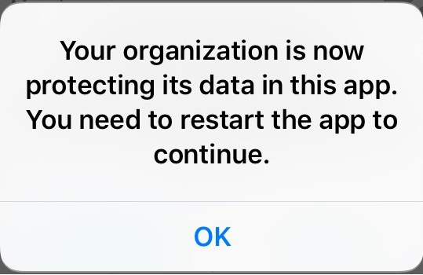

---
# required metadata

title: Use managed apps on your iOS device | Microsoft Docs
description:
keywords:
author: lenewsad
ms.author: lanewsad
manager: dougeby
ms.date: 01/09/2019
ms.topic: article
ms.prod:
ms.service: microsoft-intune
ms.technology:
ms.assetid: 3232c5c1-cb9f-45ca-806f-7e74eeb3533e
searchScope:
 - User help

# optional metadata

ROBOTS:  
#audience:
#ms.devlang:
ms.reviewer: maxles
ms.suite: ems
#ms.tgt_pltfrm:
ms.custom: intune-enduser

---

# Use managed apps on your iOS device

Managed apps are apps that your company support can set up to help protect company data that you can access in that app. When you access company data in a managed app on your iOS device, you may notice that the app works a little differently than what you expect. For example, you might not be able to copy and paste protected company data, or you might not be able to save that data to certain locations.

Different managed apps can also work together on your device to allow you to do your daily tasks, while keeping corporate data protected. For example, if you open a company file in one managed app, and another managed app is required to view that file, the managed app that allows you to view the file opens automatically. If a required app is not available, certain actions, like opening a document or accessing a web link from within a managed document, might not be available.

When you access company data in a managed app, you see a message like the one below, which lets you know that the app you are opening is managed.

### How do I get managed apps?
You get managed apps in a couple of different ways:

-   When your device is enrolled in Microsoft Intune, you either install the app from your Company Portal app or Company Portal website, or your company support might install it on your device. To learn about enrolling, see [Enroll your iOS device in Intune](enroll-your-device-in-intune-ios.md) or [Enroll your macOS device in Intune](enroll-your-device-in-intune-macos.md).

-   You install an app from the App Store, and then sign in with your corporate user account that is managed by Intune.

Your company support might sometimes purchase multiple licenses for an app you install. If you see a message asking you to accept the Apple Volume Purchase Program agreement, this is normal, and you can accept it. If you don’t accept it, you won’t be able to install the app.

# Available apps   
 Your organization selects apps that are appropriate and useful for you at work or school. These apps are the only ones you'll find in the Company Portal.   

 Apps are also made available to you based on your device type. For example, if you're using the Company Portal app for iOS, you'll have access to iOS apps, but not Android apps.   

 ## Request an app for work or school   
 If there's an app you need, but don't see in Company Portal, you can request it. Find contact details for your **Helpdesk** in the Company Portal app, in the **Support** tab. You'll find the same contact information on the [Company Portal website](https://go.microsoft.com/fwlink/?linkid=2010980).   
 

### What can my company support manage in an app?
Here are some examples of options that your company support can manage in an app, and that can affect your interactions with company data on your device:

-   Access to specific websites

-   Transfers of data between apps

-   Saving files

-   Copy and paste operations

-   PIN access requirements

-   Your sign in, using company credentials

-   Ability to back up to the cloud

-   Ability to take screenshots

-   Data encryption requirements

Contact your company support for more information about the managed apps on your device. For contact information, check the [Company Portal website](https://go.microsoft.com/fwlink/?linkid=2010980).
