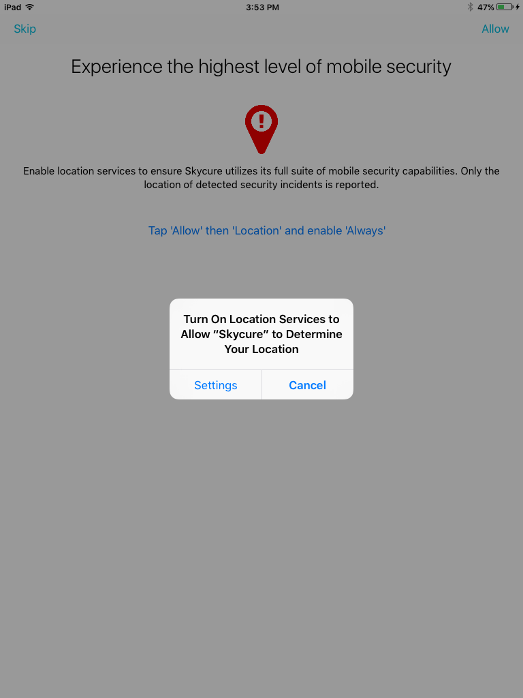
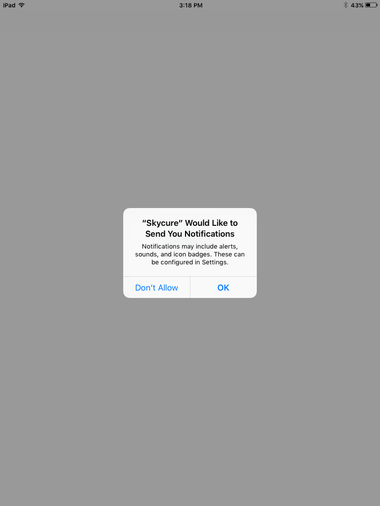
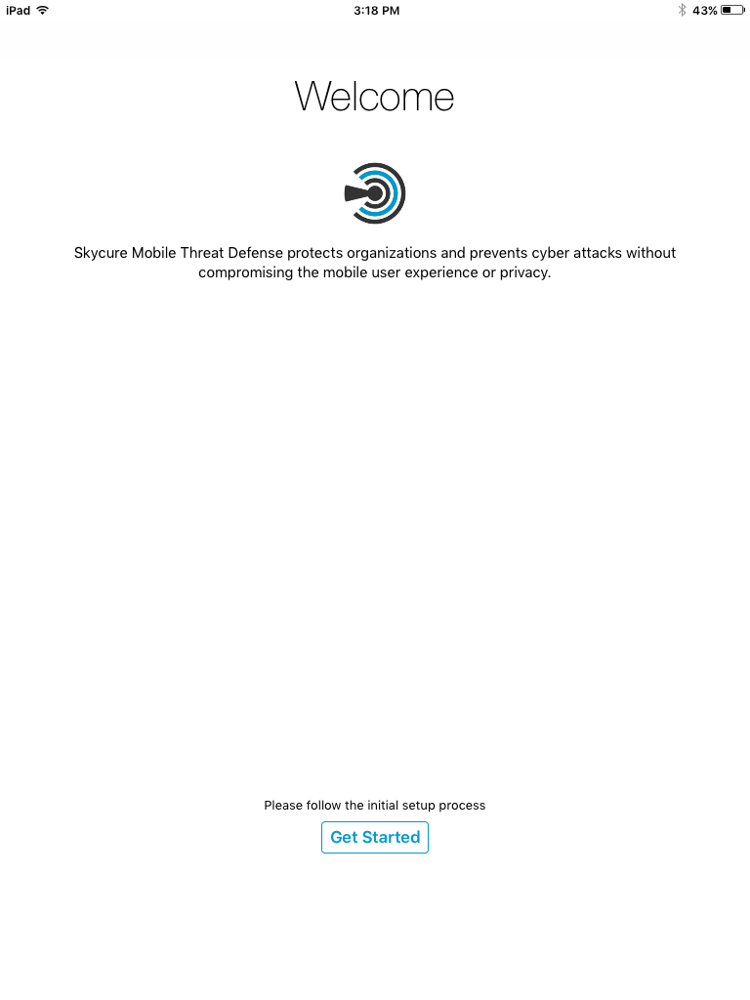
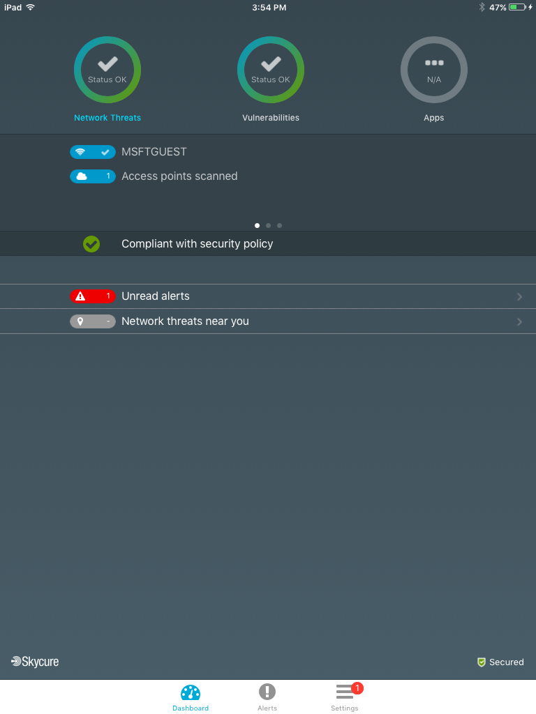

---
# required metadata

title: You need to install Skycure on your iOS device | Microsoft Docs
description:
keywords:
author: barlanmsft
ms.author: barlan
manager: angrobe
ms.date: 03/28/2017
ms.topic: article
ms.prod:
ms.service: microsoft-intune
ms.technology:
ms.assetid: 7394ff8f-3a21-414d-be4a-4626ec370720
searchScope:
 - User help

# optional metadata

ROBOTS:  
#audience:
#ms.devlang:
#ms.reviewer: heenamac
#ms.suite: ems
#ms.tgt_pltfrm:
ms.custom: intune-enduser

---

# You need to install Skycure on your iOS device

Before you can access your work, your IT administrator needs you to install the Skycure app, which helps to protect your device by finding potential security threats. You might see different prompts on your device, depending on how your IT admin set up Skycure.

**What you need to do:**

1.	If you see the following prompt, tap **Install** to allow Skycure to be installed on your device.

	

2. When you see the following message, tap **Settings**, turn on **Location Services**, and then tap **Continue**.

	

3. Review the permissions that Skycure needs, and tap **Continue**.

4. At the prompt asking you to allow Skycure to send you notifications, tap **Allow**.

  

5. Skycure finishes installing and shows you the welcome screen.

  

6. Once you've completed setup, you see the following screen if no security threats are found on your device.

  

If Skycure finds a security threat on your device, you will see instructions on how to fix the issue.

**If the installation doesn't work**

Sometimes installations can fail due to technical issues beyond your control. If this happens, contact your IT administrator. For contact information, check the [Company Portal website](http://portal.manage.microsoft.com).
