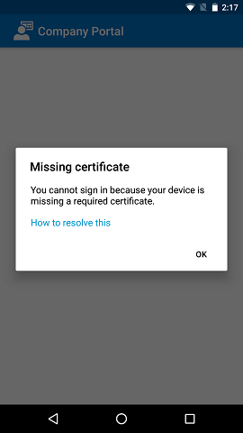

---
# required metadata

title: Your device is missing a certificate | Microsoft Docs
description:
keywords:
author: lenewsad
ms.author: lanewsad
manager: dougeby
ms.date: 07/29/2019
ms.topic: article
ms.prod:
ms.service: microsoft-intune
ms.technology:
ms.assetid: f0ba4cbb-ef0a-4335-86bf-f1d006867fa2
searchScope:
 - User help

# optional metadata

ROBOTS:  
#audience:
#ms.devlang:
ms.reviewer: arnab
ms.suite: ems
#ms.tgt_pltfrm:
ms.custom: intune-enduser
ms.collection: M365-identity-device-management
---

# Install missing certificate required by your organization  

If your device isn’t enrolled in Intune, and it’s missing a certain certificate that is required by your company support, you won’t be able to sign in to the Company Portal app. When you try to sign in, you'll see the following message:

There are two options you can try to download the required certificate and get your device enrolled. 

- Enable browser access in Company Portal app.
- Identify the missing certificate on a company or school PC. Then search the internet to download the missing certificate. 

Complete the steps for enabling browser access first. After that, if you still can't enroll your device, follow the steps to locate the certificate on the internet. 

## Enable browser access
Complete these steps to enable browser access. After you've enabled access, Company Portal will install the appropriate certificate and continue enrollment.    

1. In the Company Portal app, go to the right-hand corner and select the menu.  
2. Select **Settings**.  
3. Next to **Enable Browser Access** select **Enable**.  
4. On the Device Administrator screen, select **ACTIVATE**. 

## Identify and download the missing certificate through web search
Complete these steps to manually identify and install the certificate on your device.  

1. On a PC, open Internet Explorer. If you don't have a PC to use for this purpose, contact your company support. For your company support's contact information, check the [Company Portal website](https://go.microsoft.com/fwlink/?linkid=2010980).

2. Go to the [Company Portal website](https://go.microsoft.com/fwlink/?linkid=2010980), and sign in using your work or school credentials.

3. At the far right of the browser's address bar, choose the symbol that looks like a padlock, as shown in the following screenshot.

    

    If you don't see the padlock symbol, stop and contact your company support. The lock means that you are securely signed in, so you should not proceed unless you see that symbol.

4. Choose **View certificates**.

    

5. Choose the **Certification path** tab, and then identify the certificate that you need to get from the Internet. The name of the certificate that you need will be in the same position as the one that is highlighted in the previous example screenshot.

6. Using a search engine like Bing or Google, search for the name of the missing certificate that you identified in the previous section. The certificate may end in different "extensions," like ".crt" or ".pem", etc.

7. Download the root certificate from the website.

8. After the certificate downloads, drag down from the top of your device to open your notifications, and then tap the name of the certificate in the list of notifications.

4. In the **Name the Certificate** dialog box shown in the following screenshot, accept the default certificate name.

5. Ensure that **Credential Use** is set to **Used for VPN and apps**, and then tap **OK**.

    

6. Close the Company Portal app.

7. Reopen the Company Portal app. You should now be able to sign in to the Company Portal app. If you need help, contact your company support.

If you see the same "missing certificate" message as the one shown previously, and you have already followed the procedure, there is probably still another certificate that your company support will need to help you install. Contact your company support for help using contact information available at the [Company Portal website](https://go.microsoft.com/fwlink/?linkid=2010980).
