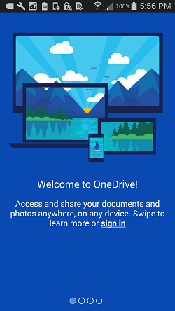
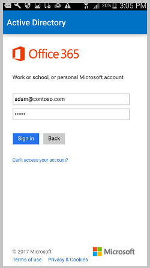
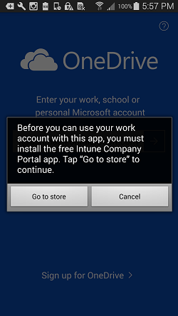
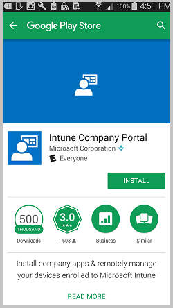
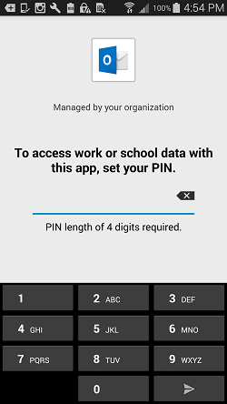

---
# required metadata

title: Data management of Office 365 apps in Microsoft Intune
titlesuffix: 
description: Learn about data management and protection of Office 365 apps in Microsoft Intune.
keywords:
author: Erikre
ms.author: erikre
manager: dougeby
ms.date: 01/06/2019
ms.topic: article
ms.prod:
ms.service: microsoft-intune
ms.technology:
ms.assetid: 852612ac-f146-4372-a900-3f6fdebd05ad

# optional metadata

ROBOTS: NOINDEX,NOFOLLOW
#audience:
#ms.devlang:
ms.reviewer: ayesham
ms.suite: ems
search.appverid: MET150
#ms.tgt_pltfrm:
ms.custom: intune-azure

---

# How your users will experience basic protection on managed Office 365 apps in Microsoft Intune

The **Manage Office 365 apps** wizard creates an app protection policy for each device platform.

The wizard turns on the following policies:

**iOS**
* Encrypt app data

**Android**
* Encrypt app data
* Require simple PIN for access

These policies ensure that you can manage the Office 365 apps, giving you the ability to wipe work data from the Office apps when you need to. They also ensure basic protection in case a device gets lost or stolen by ensuring that your work data is encrypted and that a PIN must be entered to view the data in the Office 365 apps.

This article uses OneDrive for Business as the example to demonstrate the user’s experience on an application managed by Intune.

>[!NOTE]
>On a personal device, typically the end user would download the app. If the device is managed by a mobile device management (MDM) solution, you can deploy the app to the device.

## User experience on an iOS device

1. Start the OneDrive for Business app to open the sign-in page.  
2. Type your work account user name. You are redirected to the Office 365 authentication page to enter your work credentials. 
3. After your credentials are successfully authenticated by Azure Active Directory, the app protection polices are applied, and you will be asked to restart the OneDrive for Business app. 

   > [!NOTE]
   > The restart required message is displayed only on devices that are not enrolled in Intune.

4. Re-start the OneDrive for Business app. The app starts with the app protection policies turned on and you are prompted to set a PIN for the device (if you do not have a PIN configured for the device yet).  

   > [!NOTE]
   > Most of your users won't see this prompt. Only users who haven't enabled a PIN on their iOS device will see this prompt.

5. Once you set the PIN and confirm it, return to the OneDrive for Business app. You will see a one-time notice that your IT administrator is now protecting work data in OneDrive. 
6. Click past this notice to access the files on your OneDrive for Business. 

>[!NOTE]
>When you change a deployed policy, the changes will be applied next time you open the app.

## User experience on an Android device

1. Start the OneDrive for Business app to open the sign-in page.    
2. Type your work account user name. You are redirected to the Office 365 authentication page to enter your work credentials.   
3. After your credentials are successfully authenticated by Azure Active Directory, you will see a message instructing you to install the Company Portal app, if it is not already installed on the device. Tap on **Go to store** to proceed.     If you already have the Company Portal app installed on your phone, the OneDrive for Business app will automatically start and you can skip to the end note.   

   > [!IMPORTANT]
   > On Android, once you set up Office apps to be managed by an app protection policy, the device user **must** install the Company Portal app to access work emails and documents, even though the end user doesn't need to open or sign into the app to actually read emails or documents.

4. You are now in the Google Play store where you can download and install the Company Portal app. The app helps keep the data secure and protected.   
5. After you have completed the app installation, choose **Accept** to accept the terms. The OneDrive for Business app will automatically start.

>[!NOTE]
>The next time you open OneDrive for Business, you may be asked to set a PIN if your IT requires one. After you set and confirm the PIN, you can continue on to OneDrive for Business.

<!--- Original steps: 6. The next time you open OneDrive for Business, you may be asked to set a PIN, if your IT requires one to use the OneDrive for Business app. ART 7. After you set and confirm the PIN, you can continue on to OneDrive for Business. -->

## What policies does this wizard set?

**Name**: Manage Office 365 apps 
**Description**: Created by Manage Office 365 apps wizard

| Setting name | iOS policy value | Android policy value |
|------------------------------------------------------------------------|-----------------------|----------------------|
| Prevent iTunes and iCloud backups | No | N/A |
| Prevent Android backups | N/A | No |
| Allow app to transfer data to other apps | All apps | All apps |
| Allow app to receive data from other apps | All apps | All apps |
| Prevent "Save As" | No | No |
| Restrict cut, copy, and paste with other apps | Any app | Any app |
| Restrict web content to display in a corporate managed browser | No | No |
| Encrypt app data | When device is locked | Yes |
| Disable contacts sync | No | No |
| Disable printing | No | No |
| Require PIN for access | No | Yes |
| Number of attempts before PIN reset | N/A | 5 |
| Allow simple PIN | N/A | Yes |
| PIN length | N/A | 4 |
| Allow fingerprint instead of PIN | N/A | Yes |
| Require corporate credentials for access | No | No |
| Block managed apps from running on jailbroken or rooted devices | No | No |
| Recheck the access requirements after (minutes) - Timeout | 30 | 30 |
| Recheck the access requirements after (minutes) - Offline grace period | 720 | 720 |
| Offline interval (days) before app data is wiped | 90 | 90 |
| Block screen capture (Android devices only) | N/A | No |

### Why is an app PIN policy only configured for Android devices?
Encryption works differently on iOS and Android.

On iOS, for apps that are associated with an Intune app protection policy, data is encrypted at rest through device-level encryption provided by the operating system. So, when you turn on the app encryption policy, you are automatically also requiring the user to have and enter a device PIN to access work data. Users who do not already have a device PIN configured on the device will be prompted to create a device PIN.

On Android, for apps that are associated with an Intune app protection policy, data is encrypted synchronously during file I/O tasks. Content on the device storage is always encrypted. On devices that are not MDM-managed, app protection policy cannot force the requirement of a device PIN. To ensure that users are required to use some PIN To access work data, the wizard enables the app PIN policy.

You can always edit these policy settings to meet your organization's requirements.

### How can I view and edit the policies created by the wizard?
To see or update these policies, or any policies you create in the Intune Azure portal, from the dashboard, choose **Manage apps** > **App Protection Policies**. The list of policies will open to the right. Choose the policy you want to view to see and edit the settings.  

## Next steps
- Learn more about [app protection polices](app-protection-policy.md).
