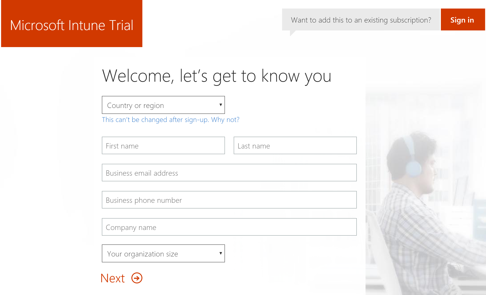

---
# required metadata

title: Sign up or sign in to Microsoft Intune
description: How to sign up for an Microsoft Intune subscription or sign in to start with your subscription.
keywords:
author: ErikjeMS
ms.author: erikje
manager: dougeby
ms.date: 01/02/2018
ms.topic: conceptual
ms.prod:
ms.service: microsoft-intune
ms.localizationpriority: high
ms.technology:
ms.assetid: 0f3ce07a-b718-42a9-bace-f99a8b8abd94

# optional metadata

#ROBOTS:
#audience:
#ms.devlang:
ms.reviewer: angerobe
ms.suite: ems
search.appverid: MET150
#ms.tgt_pltfrm:
ms.custom: intune-classic
ms.collection: M365-identity-device-management
---

# Sign up or sign in to Microsoft Intune

[!INCLUDE [both-portals](./includes/note-for-both-portals.md)]

This topic tells system administrators how you can sign up for an Intune account.

Before you sign up for Intune, determine whether you already have a Microsoft Online Services account, Enterprise Agreement, or equivalent volume licensing agreement. A Microsoft volume licensing agreement or other Microsoft cloud services subscription like Office 365 usually includes a work or school account.

If you already have a work or school account, **sign in** with that account and add Intune to your subscription. Otherwise, you can **sign up** for a new account to use Intune for your organization.

>[!WARNING]
>You can't combine an existing work or school account after you sign up for a new account.

## How to sign up or sign in to Intune

1. Visit the [Intune Sign-up page](https://admin.microsoft.com/Signup/Signup.aspx?OfferId=40BE278A-DFD1-470a-9EF7-9F2596EA7FF9&dl=INTUNE_A&ali=1#0%20).

   

2. On the Sign-up page, sign in or sign up to manage a new subscription of Intune.

## Post sign up considerations
After you sign up for a new subscription, you receive an email message that contains your account information at the email address that you provided during the sign-up process. This email confirms your subscription is active.

After completing the sign-up process you are directed to the Microsoft 365 admin center, used to add users and assign them licenses. If you only have cloud-based accounts using your default onmicrosoft.com domain name, then you can go ahead and add users and assign licenses at this point. However, if you plan to use your organization's [custom domain name](custom-domain-name-configure.md) or [synchronize user account information](users-add.md#sync-active-directory-and-add-users-to-intune) from on-premises Active Directory, then you can close that browser window.
