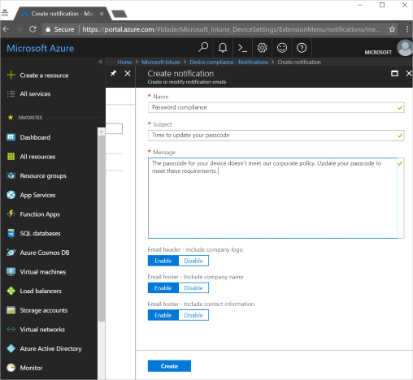

---
# required metadata

title: Noncompliant message and actions with Microsoft Intune - Azure | Microsoft Docs
description: Create a notification email to send to non-compliant devices. Add actions after a device is  marked as non-compliant, such as add a grace period to get compliant, or create a schedule to block access until the device is compliant. Do this using Microsoft Intune in Azure.
keywords:
author: MandiOhlinger
ms.author: mandia
manager: dougeby
ms.date: 05/01/2019
ms.topic: conceptual
ms.service: microsoft-intune
ms.localizationpriority: high
ms.technology:

# optional metadata

#ROBOTS:
#audience:
#ms.devlang:
ms.suite: ems
search.appverid: MET150
#ms.tgt_pltfrm:
ms.custom: intune-azure
ms.collection: M365-identity-device-management
---

# Automate email and add actions for noncompliant devices in Intune

For devices that don't meet your compliance policies or rules, you can add **Actions for noncompliance**. This feature configures a time-ordered sequence of actions, such as emailing the end user, and more.

## Overview

By default, when Intune detects a device that isn't compliant, Intune immediately marks the device as noncompliant. Azure Active Directory (AD) [Conditional Access](https://docs.microsoft.com/azure/active-directory/active-directory-conditional-access-azure-portal) then blocks the device. When a device isn't compliant, **action for noncompliance** also gives you flexibility to decide what to do. For example, don't block the device immediately, and give the user a grace period to be compliant.

There are several types of actions:

- **Send email to end user**: Customize an email notification before sending it to the end user. You can customize the recipients, subject, and message body, including company logo, and contact information.

    Additionally, Intune includes details about the noncompliant device in the email notification.

- **Remotely lock the noncompliant device**: For devices that are noncompliant, you can issue a remote lock. The user is then prompted for a PIN or password to unlock the device. More on the [Remote Lock](device-remote-lock.md) feature. 

- **Mark device non-compliant**: Create a schedule (in number of days) after the device is marked not compliant. You can configure the action to take effect immediately, or give the user a grace period to be compliant.

This article shows you how to:

- Create a message notification template
- Create an action for noncompliance, such as send an email or remotely lock a device

## Before you begin

- To set up actions for non-compliance, you need at least one device compliance policy. To create a device compliance policy, see the following platforms:

  - [Android](compliance-policy-create-android.md)
  - [Android work profiles](compliance-policy-create-android-for-work.md)
  - [iOS](compliance-policy-create-ios.md)
  - [macOS](compliance-policy-create-mac-os.md)
  - [Windows](compliance-policy-create-windows.md)

- When using device compliance policies to block devices from corporate resources, Azure AD Conditional Access must be set up. See [Conditional Access in Azure Active Directory](https://docs.microsoft.com/azure/active-directory/active-directory-conditional-access-azure-portal) or [common ways to use Conditional Access with Intune](conditional-access-intune-common-ways-use.md) for guidance.

## Create a notification message template

To send email to your users, create a notification message template. When a device is noncompliant, the details you enter in the template is shown in the email sent to your users.

1. Sign in to [Intune](https://go.microsoft.com/fwlink/?linkid=2090973).
2. Select **Device compliance** > **Notifications**.
3. Select **Create notification**. Enter the following information:

   - **Name**
   - **Subject**
   - **Message**
   - **Email header – Include company logo**
   - **Email footer – Include company name**
   - **Email footer – Include contact information**

   

4. Once you're done adding the information, choose **Create**. The Notification message template is ready to use. The logo you upload as part of the Company Portal branding is used for email templates. For more information about Company Portal branding, see [Company identity branding customization](company-portal-app.md#company-identity-branding-customization).

> [!NOTE]
> You can also change or update an existing notification template you previously created.

## Add actions for noncompliance

When you create a device compliance policy, Intune automatically creates an action for noncompliance. If a device isn't meeting your compliance policy, this action marks the device as not compliant. You can customize how long the device is marked as not compliant. This action can't be removed.

You can also add another action when you create a compliance policy, or update an existing policy. 

1. Sign in to [Intune](https://go.microsoft.com/fwlink/?linkid=2090973) and select **Device compliance**.
2. Select **Policies**, choose one of your policies, and then select **Properties**. 

    Don't have a policy yet? Create an [Android](compliance-policy-create-android.md), [iOS](compliance-policy-create-ios.md), [Windows](compliance-policy-create-windows.md), or other platform policy.
  
    > [!NOTE]
    > JAMF devices and devices targeted with device groups cannot receive compliance actions at this time.

3. Select **Actions for noncompliance** > **Add**.
4. Select your **Action**: 

    - **Send email to end users**: When the device is noncompliant, choose to email the user. Also: 
    
         - Choose the **Message template** you previously created
         - Enter any **Additional recipients** by selecting groups
    
    - **Remotely lock the noncompliant device**: When the device is noncompliant, lock the device. This action forces the user to enter a PIN or passcode to unlock the device. 
    
5. Configure a **Schedule**: Enter the number of days (0 to 365) after noncompliance to trigger the action on users' devices. After this grace period, you can enforce a Conditional Access policy. If you enter **0** (zero) number of days, then Conditional Access takes effect **immediately**. For example, you can block access to corporate resources immediately if a device is noncompliant.

6. When finished, select **Add** > **OK** to save your changes.

## Next steps

[Monitor your policies](compliance-policy-monitor.md).
