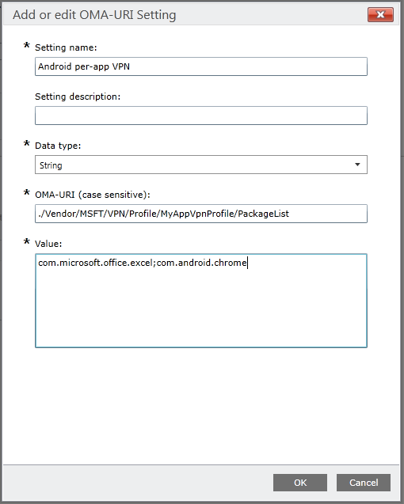

---
# required metadata

title: Per-app VPN profile for Android - Pulse Secure
titlesuffix: Microsoft Intune
description: Learn how to create a per-app VPN profile for Android devices managed by Microsoft Intune.
keywords:
author: vhorne
ms.author: victorh
manager: dougeby
ms.date: 03/05/2018
ms.topic: article
ms.prod:
ms.service: microsoft-intune
ms.technology:
ms.assetid: d035ebf5-85f4-4001-a249-75d24325061a

# optional metadata

#ROBOTS:
#audience:
#ms.devlang:
ms.reviewer: chrisbal
ms.suite: ems
#ms.tgt_pltfrm:
ms.custom: intune-azure

---

# Use a Microsoft Intune custom profile to create a per-app VPN profile for Android devices

[!INCLUDE[azure_portal](./includes/azure_portal.md)]

You can create a per-app VPN profile for Android 5.0 and later devices that are managed by Intune. First, create a VPN profile that uses the Pulse Secure connection type. Then, create a custom configuration policy that associates the VPN profile with specific apps.

After you assign the policy to your Android device or user groups, users should start the PulseSecure VPN. PulseSecure then allows only traffic from the specified apps to use the open VPN connection.

> [!NOTE]
>
> Only the Pulse Secure connection type is supported for this profile.

## Step 1: Create a VPN profile

1. Sign into the [Azure portal](https://portal.azure.com).
2. Choose **All services** > **Intune**. Intune is located in the **Monitoring + Management** section.
3. On the **Intune** pane, choose **Device configuration**.
2. On the **Device configuration** pane under the **Manage** section, choose **Profiles**.
2. On the list of profiles pane, choose **Create profile**.
3. On the **Create profile** pane, enter a **Name** and optional **Description** for the VPN profile.
4. From the **Platform** drop-down list, choose **Android**.
5. From the **Profile type** drop-down list, choose **VPN**.
3. Choose **Settings** > **Configure** and then configure the VPN profile as per the settings in [How to configure VPN settings](vpn-settings-configure.md) and [Intune VPN settings for Android devices](vpn-settings-android.md).

Take note of the **Connection Name** value you specify when creating the VPN profile. This name will be needed in the next step. For example, **MyAppVpnProfile**.

## Step 2: Create a custom configuration policy

1. Sign into the [Azure portal](https://portal.azure.com).
2. Choose **All services** > **Intune**. Intune is located in the **Monitoring + Management** section.
3. On the **Intune** pane, choose **Device configuration**.
2. On the **Device configuration** pane under the **Manage** section, choose **Profiles**.
3. On the profiles pane, click **Create Profile**.
4. On the **Create Profile** pane, enter a **Name** and **Description** for the custom profile.
5. From the **Platform** drop-down list, choose **Android**.
6. From the **Profile type** drop-down list, choose **Custom**.
7. Choose **Settings** > **Configure**.
3. On the **Custom OMA-URI Settings** pane, choose **Add**.
	- Enter a setting name.
	- For **OMA-URI**, specify this string: **./Vendor/MSFT/VPN/Profile/*Name*/PackageList**, where *Name* is the VPN profile name you noted in Step 1. In this example, the string would be **./Vendor/MSFT/VPN/Profile/MyAppVpnProfile/PackageList**.
	- For **Data type**, specify **String**.
	- For **Value**, create a semicolon-separated list of packages to associate with the profile. For example, if you want Excel and the Google Chrome browser to use the VPN connection, enter **com.microsoft.office.excel;com.android.chrome**.

### Set your app list to blacklist or whitelist (optional)
  You can specify a list of apps that *cannot* use the VPN connection by using the **BLACKLIST** value. All other apps connect through the VPN.
  Alternatively, you can use the **WHITELIST** value to specify a list of apps that *can* use the VPN connection. Apps that are not on the list do not connect through the VPN.
  1.	On the **Custom OMA-URI Settings** pane, choose **Add**.
  2.	Enter a setting name.
  3.	For **OMA-URI**, use this string: **./Vendor/MSFT/VPN/Profile/*Name*/Mode**, where *Name* is the VPN profile name you noted in Step 1. In our example, the string would be **./Vendor/MSFT/VPN/Profile/MyAppVpnProfile/Mode**.
  4.	For **Data type**, specify **String**.
  5.	For **Value**, enter **BLACKLIST** or **WHITELIST**.

## Step 3: Assign both policies

Use the instructions in [How to assign device profiles](device-profile-assign.md) to assign both profiles to the required users or devices.
