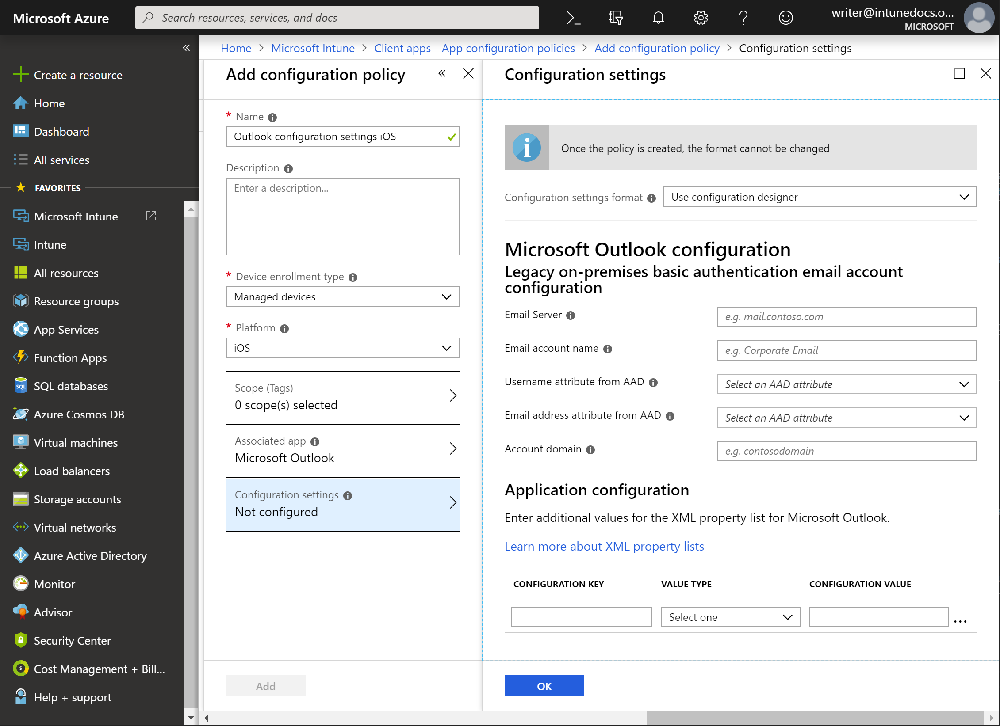

---
# required metadata

title: Outlook settings for iOS and Android devices in Microsoft Intune
description: Create a configuration policy to set Microsoft Outlook settings running on iOS and Android devices.
keywords:
author: Erikre
ms.author: erikre
ms.reviewer: smithre4
manager: dougeby
ms.date: 01/23/2019
ms.topic: article
ms.prod:
ms.service: microsoft-intune
ms.technology:

# optional metadata

#ROBOTS:
#audience:
#ms.devlang:
ms.suite: ems
search.appverid: MET150
#ms.tgt_pltfrm:
ms.custom: intune-azure

---

# Microsoft Outlook configuration settings 

Use a configuration policy to set Microsoft Outlook settings running on iOS and Android devices. 

To create an app configuration policy for managed iOS devices, see [Add app configuration policies for managed iOS devices](app-configuration-policies-use-ios.md). To create an app configuration policy for managed Android devices, see [Add app configuration policies for managed Android devices](app-configuration-policies-use-android.md). 

## Configuration settings

When adding a configuration policy in Intune, you can specify settings to configure Microsoft Outlook on iOS and Android. In the **Configuration settings** pane you can specify the email account configuration and configure app specific settings. In addition, you can configure these settings and/or use name/value pairs.

For more information about Outlook configuration settings, see [Deploying Outlook for iOS and Android app configuration settings](https://docs.microsoft.com/exchange/clients-and-mobile-in-exchange-online/outlook-for-ios-and-android/outlook-for-ios-and-android-configuration-with-microsoft-intune).

### Basic authentication email account settings
Outlook for iOS and Android offers Exchange administrators the ability to "push" account configurations to their on-premises users who use Basic authentication with the ActiveSync protocol.

For more information about implementing Outlook settings for iOS and Android devices in Microsoft Intune, see [Account setup in Outlook for iOS and Android using Basic authentication](https://docs.microsoft.com/Exchange/clients/outlook-for-ios-and-android/account-setup). 

For legacy on-premises basic email account authentication for Microsoft Outlook, you can configure the following settings:

- **Email server**: Enter the host name of your on-premises Exchange server (e.g., mail.contoso.com).
- **Email account name**: Enter the display name for the email account. This name is shown to users on their devices.
- **Username attribute from AAD**: This name is the attribute Intune gets from Azure Active Directory (Azure AD). Intune dynamically generates the username that's used by this profile. Your options include:
  - **User Principal Name**: Gets the name, such as `user1` or `user1@contoso.com`
  - **Primary SMTP address**: Gets the name in email address format, such as `user1@contoso.com`
- **Email address attribute from AAD**: Choose how the email address for the user is generated. Select **User principal name** (`user1@contoso.com` or `user1`) to use the full principal name as the email address, or **Primary SMTP address** (`user1@contoso.com`) to use the primary SMTP address to sign in to Exchange. The recommendation is to select **Primary SMTP address**.
- **Account domain**: (Optional) The domain of the account.

## Next steps
[Configure email settings in Intune](email-settings-configure.md)

