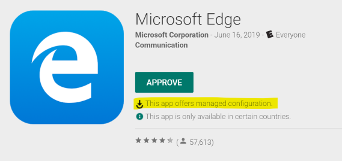
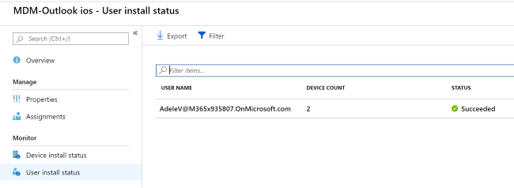
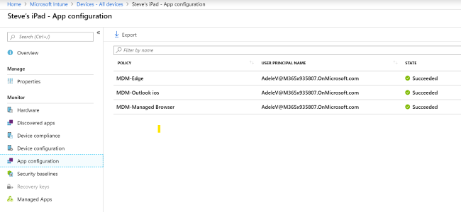

---
# required metadata

title: App configuration policies for Microsoft Intune
titleSuffix: 
description: Learn how to use app configuration policies on an iOS or Android device in Microsoft Intune.
keywords:
author: Erikre
ms.author: erikre
manager: dougeby
ms.date: 08/28/2019
ms.topic: conceptual
ms.service: microsoft-intune
ms.localizationpriority: high
ms.technology:
ms.assetid: 834B4557-80A9-48C0-A72C-C98F6AF79708

# optional metadata 

#ROBOTS:
#audience:
#ms.devlang:
ms.reviewer: mghadial
ms.suite: ems
search.appverid: MET150
#ms.tgt_pltfrm:
ms.custom: intune-azure
ms.collection: M365-identity-device-management
---

# App configuration policies for Microsoft Intune

App configuration policies can help you eliminate app setup up problems by letting you assign configuration settings to a policy that is assigned to end-users before they run the app. The settings are then supplied automatically when the app is configured on the end-users device, and end-users don't need to take action. The configuration settings are unique for each app. 

You can create and use app configuration policies to provide configuration settings for both iOS or Android apps. These configuration settings allow an app to be customized by using app configuration and management. The configuration policy settings are used when the app checks for these settings, typically the first time the app is run. 

An app configuration setting, for example, might require you to specify any of the following details:

- A custom port number
- Language settings
- Security settings
- Branding settings such as a company logo

If end-users were to enter these settings instead, they could do this incorrectly. App configuration policies can help provide consistency across an enterprise and reduce helpdesk calls from end-users trying to configure settings on their own. By using app configuration policies, the adoption of new apps can be easier and quicker.

The available configuration parameters are ultimately decided by the developers of the app. Documentation from the application vendor should be reviewed to see if an app supports configuration and what configurations are available. For some applications, Intune will populate the available configuration settings. 

> [!NOTE]
> In the Managed Google Play Store, apps that support configuration will be marked as such:
> 
> 
>
> You will only see apps from [Managed Google Play store](https://play.google.com/work), not the [Google Play store](https://play.google.com/store/apps), when using Managed Devices as the Enrollment Type for Android devices. Managed Google Play Store, which you may also know as Android for Work (AfW) and Android Enterprise, are the apps in the Work Profile that contain the app versions that support app configuration.

You can assign an app configuration policy to a group of end-users and devices by using a combination of [include and exclude assignments](apps-inc-exl-assignments.md). Once you add an app configuration policy, you can set the assignments for the app configuration policy. When you set the assignments for the policy, you can choose to include and exclude the [groups](groups-add.md) of end-users for which the policy applies. When you choose to include one or more groups, you can choose to select specific groups to include or select built-in groups. Built-in groups include **All Users**, **All Devices**, and **All Users + All Devices**.

You have two options to use app configuration policies with Intune:
- **Managed devices** - The device is managed by Intune as the mobile device management (MDM) provider. The app must be designed to support the app configuration.
- **Managed apps** - An app that has been developed to integrate the Intune App SDK. This is known as Mobile Application Management without enrollment ([MAM-WE](app-management.md#mobile-application-management-mam-basics)). You can also wrap an app to implement and support the Intune App SDK. For more information about wrapping an app, see [Prepare line-of-business apps for app protection policies](developer/apps-prepare-mobile-application-management.md).

    > [!NOTE]
    > Intune managed apps will check-in with an interval of 30 minutes for Intune App Configuration Policy status, when deployed in conjunction with an Intune App Protection Policy. If an Intune App Protection Policy isn't assigned to the user, then the Intune App Configuration Policy check-in interval is set to 720 minutes.

## Apps that support app configuration

### Managed devices
You can use app configuration policies for apps that support it. To support app configuration in Intune, apps must be written to support the use of app configurations as defined by the OS. Consult your app vendor for details for which app config keys they support.

### Managed apps
You can prepare your line-of-business apps by either incorporating the [Intune App SDK](developer/app-sdk.md) into the app, or wrapping the app after it is developed using the [Intune App Wrapping Tool](developer/apps-prepare-mobile-application-management.md). The Intune App SDK strives to minimize the amount of code changes required from the app developer. For more information, see the [Intune App SDK overview](developer/app-sdk.md). For a comparison between the Intune App SDK and the Intune App Wrapping Tool, see [Prepare line-of-business apps for app protection policies](developer/apps-prepare-mobile-application-management.md#feature-comparison).

Selecting **Managed apps** as the **Device Enrollment Type** specifically refers to apps configured by Intune configuration policies on a device that is not enrolled in device management, whereas **Managed devices** applies to apps deployed through the MDM channel and thus are managed by Intune. Select the appropriate choice based on these descriptions. 

> [!NOTE]
> For multi-identity apps, such as Microsoft Outlook, user preferences may be considered. Focused Inbox, for example, will respect the user setting and not change the configuration. Other parameters do let you control whether a user can or cannot change the setting. For more information, see [Deploying Outlook for iOS and Android app configuration settings](https://docs.microsoft.com/exchange/clients-and-mobile-in-exchange-online/outlook-for-ios-and-android/outlook-for-ios-and-android-configuration-with-microsoft-intune).

## Validate the applied app configuration policy

You can validate the app configuration policy using the following three methods:

   1. Visibly on the device. Is the targeted app exhibiting the behavior applied in the App Configuration policy?
   2. Via Diagnostic Logs (see the Diagnostic Logs section below).
   3. In the Intune Portal. The **Monitor** section of a policy can provide the relevant status:

      

      

      Additionally, under **Intune** -> **Devices** -> **All Devices** on the left side of the screen, the **App Configuration** option will display all the assigned policies and their state:

      

## Graph API support for app configuration

You can use Graph API to accomplish app configuration tasks. For details, see [Graph API Reference MAM Targeted Config](https://graph.microsoft.io/docs/api-reference/beta/api/intune_mam_targetedmanagedappconfiguration_create).

## Troubleshooting

### Using logs to show a configuration parameter
When the logs show a configuration parameter that is confirmed to be applying but doesn't seem to work, there may be an issue with the configuration implementation by the app developer. Reaching out to that app developer first, or checking their knowledge base, may save you a support call with Microsoft. If it is an issue with how the configuration is being handled within an app, it would have to be addressed in a future updated version of that app.

## Next steps

### Managed devices

- Learn how to use app configuration with your iOS devices.  See [Add app configuration policies for managed iOS devices](app-configuration-policies-use-ios.md).
- Learn how to use app configuration with your Android devices.  See [Add app configuration policies for managed Android devices](app-configuration-policies-use-android.md).

### Managed apps

- Learn how to use app configuration with managed apps. See [Add app configuration policies for managed apps without device enrollment](app-configuration-policies-managed-app.md).
