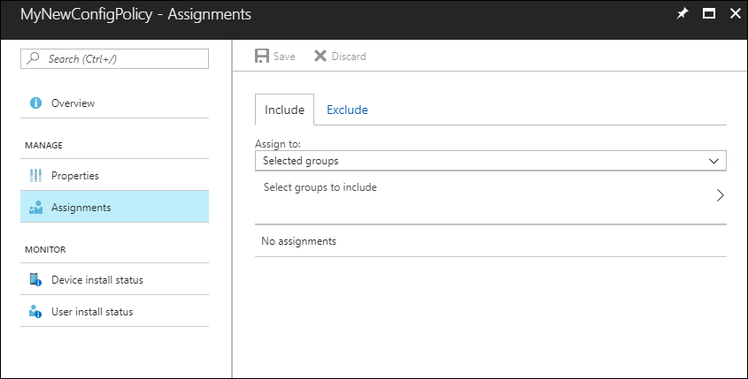
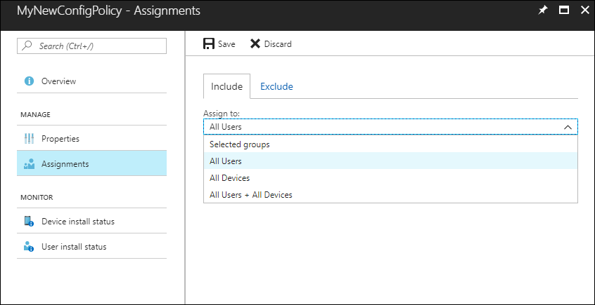
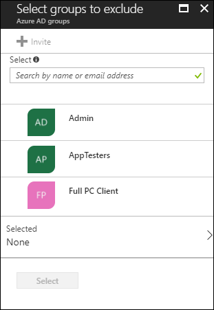

---
# required metadata

title: Add app configuration policies for managed iOS devices
titleSuffix: Microsoft Intune
description: Learn how to use app configuration policies to provide configuration data to an iOS app when it is run.
keywords:
author: Erikre
ms.author: erikre
manager: dougeby
ms.date: 04/16/2019
ms.topic: conceptual
ms.prod:
ms.service: microsoft-intune
ms.localizationpriority: high
ms.technology:
ms.assetid: c9163693-d748-46e0-842a-d9ba113ae5a8

# optional metadata

#ROBOTS:
#audience:
#ms.devlang:
ms.reviewer: mghadial
ms.suite: ems
search.appverid: MET150
#ms.tgt_pltfrm:
ms.custom: intune-azure
ms.collection: M365-identity-device-management
---

# Add app configuration policies for managed iOS devices

[!INCLUDE [azure_portal](./includes/azure_portal.md)]

Use app configuration policies in Microsoft Intune to provide custom configuration settings for an iOS app. These configuration settings allow an app to be customized based on the app suppliers direction. You must get these configuration settings (keys and values) from the supplier of the app. To configure the app, you specify the settings as keys and values, or as XML containing the keys and values. Also, you do not assign these configuration policies directly to users and devices. Instead, you associate a configuration policy with an app, and then assign the app. The configuration policy settings are used when the app checks for them, typically the first time it is run.

Once you add an app configuration policy, you can set the assignments for the app configuration policy. When you set the assignments for the policy, you can choose to include and exclude the groups of users for which the policy applies. When you choose to include one or more groups, you can choose to select specific groups to include or select built-in groups. Built-in groups include **All Users**,  **All Devices**, and **All Users + All Devices**. 

>[!NOTE]
>Intune provides pre-created **All Users** and **All Devices** groups in the console with built-in optimizations for your convenience. It is highly recommended that you use these groups to target all users and all devices instead of any ‘All users’ or ’All devices’ groups you may have created yourself.<p></p>
>As the Microsoft Intune admin, you can control which user accounts are added to Microsoft Office applications on managed devices. You can limit access to only allowed organization user accounts and block personal accounts on enrolled devices. The supporting applications process the app configuration and remove and block unapproved accounts.

Once you have selected the included groups for your application configuration policy, you can also choose the specific groups to exclude. For more information, see [Include and exclude app assignments in Microsoft Intune](apps-inc-exl-assignments.md).

> [!TIP]
> This policy type is currently available only for devices running iOS 8.0 and later. It supports the following app installation types:
>
> -   **Managed iOS app from the app store**
> -   **App package for iOS**
>
> For more information about app installation types, see [How to add an app to Microsoft Intune](apps-add.md).

## Create an app configuration policy

1. Sign into the [Azure portal](https://portal.azure.com).
2. Choose **All services** > **Intune**. Intune is located in the **Monitoring + Management** section.
3. Choose the **Client apps** workload.
4. Choose **App configuration policies** in the **Manage** group, and then choose **Add**.
5. Set the following details:
    - **Name** - The name of the profile that appears in the Azure portal.
    - **Description** - The description of the profile that appears in the Azure portal.
    - **Device enrollment type** - Choose **Managed devices** for devices that have been enrolled in Intune.
6. Select **iOS** for **Platform**.
7.	Choose **Associated app**. Then, on the **Associated app** pane, choose the managed app to which you want to apply the configuration and select **OK**.
8.	On the **Add configuration policy** pane, choose **Configuration settings**.
9. Select **Configuration settings format**. Select one of the following methods to add configuration information:
    - **Use configuration designer**
    - **Enter XML data**<br><br>
    For details about using the configuration designer, see [Use configuration designer](#use-configuration-designer). For details about entering XML data, see [Enter XML data](#enter-xml-data). 
10. Once you have added your configuration information, choose **OK**, and then choose **Add** to add the configuration policy. The overview pane for the configuration policy is displayed.
11. Select **Assignments** to display the include and exclude options. 

    
12. Select **All Users** on the **Include** tab.

    
13. Select the **Exclude** tab. 
14. Click **Select groups to exclude** to display the related pane.

    
15. Choose the groups you want to exclude and then click **Select**.

    >[!NOTE]
    >When adding a group, if any other group has already been included for a given assignment type, it is pre-selected and unchangeable for other include assignment types. Therefore, that group that has been used, cannot be used as an excluded group.
16. Click **Save**.

## Use configuration designer

Microsoft Intune provides configuration settings that are unique to an app. You can use the configuration designer for apps on devices that are enrolled or not enrolled in Microsoft Intune. The designer lets you configure specific configuration keys and values that helps you create the underlying XML. You must also specify the data type for each value. These settings are supplied to apps automatically when the apps are installed.

### Add a setting

1. For each key and value in the configuration, set:
   - **Configuration key** - The key that uniquely identifies the specific setting configuration.
   - **Value type** - The data type of the configuration value. Types include Integer, Real, String, or Boolean.
   - **Configuration value** - The value for the configuration.
2. Choose **OK** to set your configuration settings.

### Delete a setting

1. Choose the ellipsis (**...**) next to the setting.
2. Select **Delete**.

The \{\{ and \}\} characters are used by token types only and must not be used for other purposes.

### Allow only configured organization accounts in multi-identity apps 

For iOS devices, use the following key/value pairs:

| **Key** | IntuneMAMAllowedAccountsOnly |
|--------|-------------------------------------------------------------------------------------------------------------------------------------------------------------------------------------------------------------------------------|
| **Values** | <ul><li>**Enabled**: The only account allowed is the managed user account defined by the [IntuneMAMUPN](data-transfer-between-apps-manage-ios.md#configure-user-upn-setting-for-microsoft-intune-or-third-party-emm) key.</li><li>**Disabled** (or any value that is not a case insensitive match to **Enabled**): Any account is allowed.</li></ul> |.

   > [!NOTE]
   > You must use OneDrive for iOS 10.34 or later and Outlook for iOS 2.99.0 or later and the app must be targeted with [Intune app protection policies](app-protection-policy.md) when allowing only configured organization accounts with multi-identity.

## Enter XML data

You can type or paste an XML property list that contains the app configuration settings for devices enrolled in Intune. The format of the XML property list varies depending on the app that you are configuring. For details about the exact format to use, contact the supplier of the app.

Intune validates the XML format. However, Intune does not check that the XML property list (PList) works with the target app.

To learn more about XML property lists:

  -  Refer to [Understand XML Property Lists](https://developer.apple.com/library/ios/documentation/Cocoa/Conceptual/PropertyLists/UnderstandXMLPlist/UnderstandXMLPlist.html) in the iOS Developer Library.

### Example format for an app configuration XML file

When you create an app configuration file, you can specify one or more of the following values by using this format:

```xml
<dict>
  <key>userprincipalname</key>
  <string>{{userprincipalname}}</string>
  <key>mail</key>
  <string>{{mail}}</string>
  <key>partialupn</key>
  <string>{{partialupn}}</string>
  <key>accountid</key>
  <string>{{accountid}}</string>
  <key>deviceid</key>
  <string>{{deviceid}}</string>
  <key>userid</key>
  <string>{{userid}}</string>
  <key>username</key>
  <string>{{username}}</string>
  <key>serialnumber</key>
  <string>{{serialnumber}}</string>
  <key>serialnumberlast4digits</key>
  <string>{{serialnumberlast4digits}}</string>
  <key>udidlast4digits</key>
  <string>{{udidlast4digits}}</string>
  <key>aaddeviceid</key>
  <string>{{aaddeviceid}}</string>
</dict>
```
### Supported XML PList data types

Intune supports the following data types in a property list:

- &lt;integer&gt;
- &lt;real&gt;
- &lt;string&gt;
- &lt;array&gt;
- &lt;dict&gt;
- &lt;true /&gt; or &lt;false /&gt;

### Tokens used in the property list

Additionally, Intune supports the following token types in the property list:
- \{\{userprincipalname\}\}—for example, **John@contoso.com**
- \{\{mail\}\}—for example, **John@contoso.com**
- \{\{partialupn\}\}—for example, **John**
- \{\{accountid\}\}—for example, **fc0dc142-71d8-4b12-bbea-bae2a8514c81**
- \{\{deviceid\}\}—for example, **b9841cd9-9843-405f-be28-b2265c59ef97**
- \{\{userid\}\}—for example, **3ec2c00f-b125-4519-acf0-302ac3761822**
- \{\{username\}\}—for example, **John Doe**
- \{\{serialnumber\}\}—for example, **F4KN99ZUG5V2** (for iOS devices)
- \{\{serialnumberlast4digits\}\}—for example, **G5V2** (for iOS devices)
- \{\{aaddeviceid\}\}—for example, **ab0dc123-45d6-7e89-aabb-cde0a1234b56**

## Monitor iOS  app configuration status per device 
Once a configuration policy has been assigned, you can monitor iOS app configuration status for each managed device. From **Microsoft Intune** in the Azure portal, select **Devices** > **All devices**. From the list of managed devices, select a specific device to display a blade for the device. On the device blade, select **App configuration**.  

## Next steps

Continue to [assign](apps-deploy.md) and [monitor](apps-monitor.md) the app.
