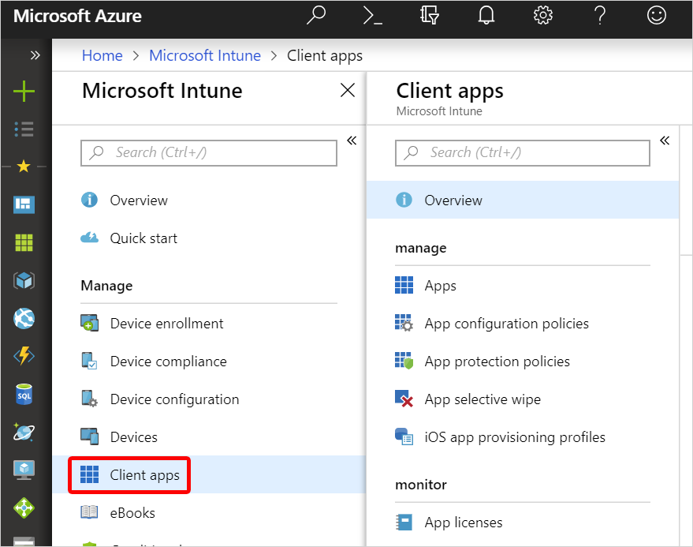

---
# required metadata

title: What is app management in Microsoft Intune
titlesuffix: 
description: Learn the basics of app management with Microsoft Intune.
keywords:
author: Erikre
ms.author: erikre
manager: dougeby
ms.date: 03/01/2018
ms.topic: get-started-article
ms.prod:
ms.service: microsoft-intune
ms.technology:
ms.assetid: 1975a2dc-3a14-4cb9-9afb-e2ba01a1c51b

# optional metadata

#ROBOTS:
#audience:
#ms.devlang:
ms.reviewer: mghadial
ms.suite: ems
#ms.tgt_pltfrm:
ms.custom: intune-azure

---

# What is Microsoft Intune app management?

[!INCLUDE[azure_portal](./includes/azure_portal.md)]

Microsoft Intune allows you, as the IT admin, to mange the mobile apps that your company's workforce uses. This functionality is in addition to managing devices and protecting data. As part of this functionality, one of your priorities is to make sure that your end users have access to the apps they need to do their work. This can be a challenge because:
- There are a wide range of device platforms and app types.
- You might need to manage apps on both company devices and user's own devices.
- You must ensure your network and your data remain secure.

Additionally, you might want to assign and manage apps on devices that are not enrolled with Intune.

Intune offers a range of capabilities to help you get the apps you need on the devices you want. The following table provides a summary of app manaagement capabilities. Below the table is a starting point to understand Microsoft Intune in the Azure portal. 

## App management capabilities by platform

||||||
|-|-|-|-|-|
|&nbsp; |Android|iOS|Windows Phone 8.1|Windows 10|
|Add and assign apps to devices and users|Yes|Yes|Yes|Yes|
|Assign apps to devices not enrolled with Intune|Yes|Yes|No|No|
|Use app configuration policies to control the startup behavior of apps|No|Yes|No|No|
|Use mobile app provisioning policies to renew expired apps|No|Yes|No|No|
|Protect company data in apps with app protection policies|Yes|Yes|No|No1|
|Remove only corporate data from an installed app (App selective wipe)|Yes|Yes|Yes|Yes|
|Monitor app assignments|Yes|Yes|Yes|Yes|
|Assign and track volume-purchased apps from an app store|No|No|No|Yes|
|Mandatory install of apps on devices (Required)2|Yes|Yes|Yes|Yes|
|Optional installation on devices from the Company Portal (Available install)|Yes|Yes|Yes|Yes|
|Install shortcut to an app on the web (web clip)|Yes|Yes|Yes|Yes|
|In-house (line-of-business) apps|Yes|Yes|No|Yes|
|Apps from a store|Yes|Yes|Yes|Yes|
|Update apps|Yes|Yes|Yes|Yes|

1 Consider using [Windows Information Protection](windows-information-protection-configure.md) to protect apps on devices that run Windows 10.

2Applies to devices managed by Intune only.

## How to get started

You can find most things app-related in the **Mobile Apps** workload that you can access as follows:

1. Sign into the [Azure portal](https://portal.azure.com).
2. Choose **All services** > **Intune**. Intune is located in the **Monitoring + Management** section.
3. On the **Intune** blade, choose **Mobile apps**.

	

### Manage
- **Apps** - This node is where you add, assign, and monitor most of your apps.
	- [Add apps](apps-add.md)
	- [Assign apps](apps-deploy.md)
	- [Monitor apps](apps-monitor.md)
- **App configuration policies** - App configuration policies let you supply settings that might be required when a user runs an app.
	- [iOS app configuration policies](app-configuration-policies-use-ios.md)
	- [Android app configuration policies](app-configuration-policies-use-android.md)
- **App protection policies** - Lets you associate settings with an app to help protect the company data it uses. For example, you might restrict the capabilities of an app to communicate with other apps, or require the user to enter a PIN to access a company app.
	- [App protection policies](app-protection-policies.md)
- **App selective wipe** - Remove only corporate data from a users device you select.
	- [App selective wipe](apps-selective-wipe.md)
- **iOS provisioning profiles** - iOS apps include a provisioning profile and code that is signed by a certificate. When the certificate expires, the app can no longer be run. Intune gives you the tools to proactively assign a new provisioning profile policy to devices that have apps that are nearing expiry.
	- [iOS app provisioning profiles](app-provisioning-profile-ios.md)

For more details, see [Manage apps](app-management.md).

### Monitor
- **App licenses** - View, assign, and monitor volume-purchased apps from the app stores.
	- [Microsoft Store for Business volume-purchased apps](windows-store-for-business.md)
- **Discovered Apps** - Shows all apps that were assigned by Intune and installed on a device.
- **App Install Status** - Shows the status of an app assignment you created.
- **App protection status** - Shows the status of an app protection policy for a user you select.
- **Audit logs** - Shows the Intune app related activity made by all IT admins.

For more details, see [Monitor apps](apps-monitor.md).

### Setup
- **iOS VPP tokens** - Apply and view your iOS Volume Purchase Program (VPP) licenses.
	- [iOS volume-purchased apps](vpp-apps-ios.md)
- **Windows enterprise certificate** - Apply or view the status of a code-signing certificate used to distribute line-of-business apps to your managed Windows devices. 
- **Windows Symantec certificate** - Apply or view the status of a Symantec code-signing certificate which is needed to distribute XAP and WP8.x appx files to Windows 10 Mobile devices. 
- **Microsoft Store for Business** - Set up integration to the Microsoft Store for Business. Afterwards, you can synchronize purchased applications to Intune, assign them, and track your license usage.
	- [Microsoft Store for Business volume-purchased apps](windows-store-for-business.md)
- **Windows side loading keys** - You can add a Windows side loading key that can be used to install an app directly to devices rather than publishing and downloading the app from the Windows store.
	- [Side load a Windows app](app-sideload-windows.md) 
- **Company Portal branding** - Customize the Company Portal to give it your company branding.
	- [Company portal configuration](company-portal-app.md)
- **App categories** - Add, pin, and delete app category names.
- **Android for Work** - Approve and sync the apps you have approved for your enterprise.
	- [Android for Work apps](apps-add-android-for-work.md) 

### Help and Support
- **Help and support** - Troubleshoot, request support, or view Intune status.
	- [Troubleshoot problems](help-desk-operators.md)
	
## Next steps

- [How to add an app to Microsoft Intune](apps-add.md)
