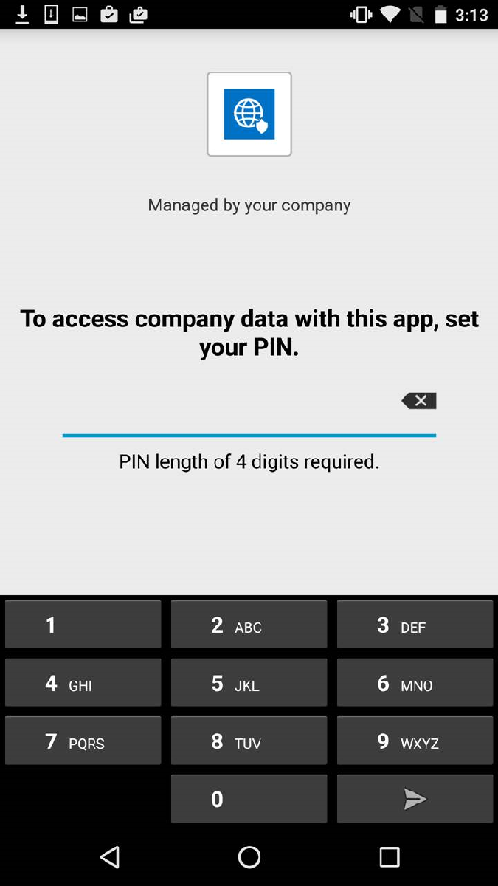
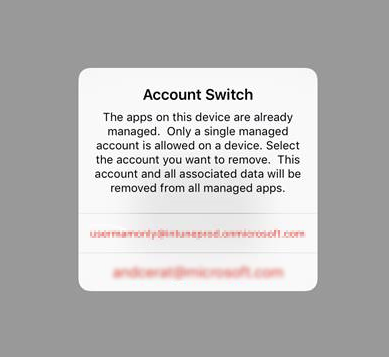

---
# required metadata

title: iOS apps with app protection policies
titleSuffix: "Intune on Azure"
description: This topic describes what to expect when your iOS app is managed by app protection policies."
keywords:
author: NathBarn
ms.author: nathbarn
manager: angrobe
ms.date: 12/07/2016
ms.topic: article
ms.prod:
ms.service: microsoft-intune
ms.technology:
ms.assetid: 586d9440-3813-4dec-b865-8bd319befde0

# optional metadata

#ROBOTS:
#audience:
#ms.devlang:
ms.reviewer: andcerat
ms.suite: ems
#ms.tgt_pltfrm:
ms.custom: intune-azure

---

# What to expect when your iOS app is managed by app protection policies
[!INCLUDE[azure_portal](./includes/azure_portal.md)]
This topic describes the user experience for apps with app protection policies. App protection polices are applied only when apps are used in the work context: like accessing apps using your work account, or accessing files stored in your company OneDrive business location.
##  Accessing apps

If the device is **not enrolled in Intune**, the end-user will be asked to restart the app when they first use the app.  A restart is required so app protection polices can be applied to the app. The following screenshot illustrates this using the Skype app:

For devices that are **enrolled for management in Intune**, the end-user will see a message that their app is now managed:

##  Using apps with multi-identity support

App protection polices are only applied in the work context when using the app, so you may see different app behaviors depending on the context: work or personal.  

For apps that support multi-identity, Intune only applies the app protection policies when the end-user is using the app in the work context.  For example, the end-user will get a PIN prompt when accessing work data.  For the **Outlook app**, the end-user is prompted for a PIN on launching the app. For the **OneDrive app**, this happens when the end-user types in the work account.  For Microsoft **Word**, **PowerPoint*, and **Excel**, this happens when the end-user accesses documents stored in the company OneDrive for Business location.
##  Managing user accounts on the device

Intune only supports deploying app protection policies to only one user account per device.

* Depending on the app that you are using, the second user may or may not be blocked on the device. However, in all cases, only the first user who gets the app protection policies is affected by the policy.
  * **Microsoft Word**, **Excel**, and **PowerPoint** don't block a second user account, but the second user account is not affected by the app protection policies.  

  * For **OneDrive and Outlook apps**, you can only use one work account.  Adding multiple work accounts are blocked on these apps.  You can however, remove a user and add a different user on the device.

* If a device has existing multiple user accounts before the app protection policies are deployed, the account that the app protection policies is deployed to first is managed by Intune app protection policies.

Read the example scenario below to get a deeper understanding of how multiple user accounts are treated.

User A works for two companies - **Company X**, and **Company Y**. User A has a work account for each company, and both use Intune to deploy app protection policies. **Company X** deploys app protection policies **before** **Company Y**. The account associated with **Company X** will get the app protection policy, but not the account associated with Company Y. If you want the user account associated with Company Y to be managed by the app protection policies, you must remove the user account associated with Company X.
### Adding a second account

If you are using an iOS device, when you try to add a second work account on the same device, you may see a blocking message.  The accounts will be displayed and you can choose the account you want to remove.

## Next steps
[What to expect when your Android app is managed by app protection policies](app-protection-enabled-apps-android.md)
### See also
[Create and deploy app protection policies with Microsoft Intune](app-protection-policies.md)
