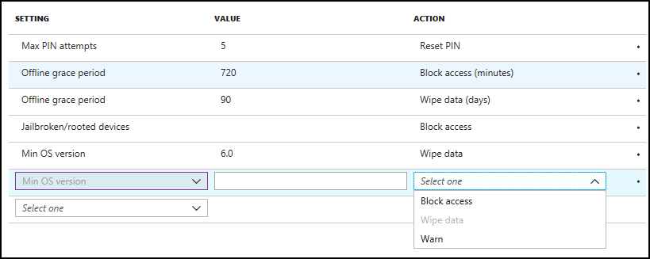

---
# required metadata

title: Selectively wipe data using app protection policy access actions
titleSuffix: Microsoft Intune
description: Learn how to selectively wipe data using app protection policy access actions in Microsoft Intune.
keywords:
author: Erikre
ms.author: erikre
manager: dougeby
ms.date: 07/03/2018
ms.topic: article
ms.prod:
ms.service: microsoft-intune
ms.technology:
ms.assetid: f5ca557e-a8e1-4720-b06e-837c4f0bc3ca

# optional metadata

#ROBOTS:
#audience:
#ms.devlang:
ms.reviewer: mghadial
ms.suite: ems
#ms.tgt_pltfrm:
ms.custom: intune-azure
---

# Selectively wipe data using app protection policy access actions in Intune

Using Intune app protection policies, you can configure settings to block end users from accessing a corporate app or account. These settings target data relocation and access requirements set by your organization for things like jail-broken devices and minimum OS versions.
 
You can explicitly choose to wipe your company’s corporate data from the end user’s device as the action to take on non-compliance for these settings. For some settings, you will be able to configure multiple actions, such as block access and wipe data based on different specified values.

## Create an app protection policy using access actions

1. Sign in to the [Azure portal](https://portal.azure.com).
2. Select **All services** > **Intune**.  
    Intune is located in the **Monitoring + Management** section.
3. In the **Intune** blade, select **Mobile apps** > **App protection Policies**.
4. Click **Add a policy** (or you can edit an existing policy). 
5. Click **Configure required settings** to see the list of settings available to be configured for the policy. 
6. By scrolling down in the **Settings** blade you will see a section titled **Access Actions** with an editable table.

    

7. Select a **Setting** and enter the **Value** that users must meet to sign in to your company app. 
8. Select the **Action** you want to take if users do not meet your requirements. In some cases, multiple actions can be configured for a single setting. For more information, see [How to create and assign app protection policies](app-protection-policies.md).

>[!NOTE]
> To use the **Device model(s)** setting, input a semi-colon separated list of model identifiers. 

## Policy settings 

The app protection policy settings table has columns for **Setting**, **Value**, and **Action**.

For iOS, you will be able to configure actions for the following settings using the **Setting** dropdown:
-  Max PIN attempts
-  Offline grace period
-  Jailbroken/rooted devices
-  Min OS version
-  Min app version
-  Min SDK version
-  Device model(s)

For Android, you will be able to configure actions for the following settings using the **Setting** dropdown:
-  Max PIN attempts
-  Offline grace period
-  Jailbroken/rooted devices
-  Min OS version
-  Min app version
-  Min patch version
-  Device manufacturer(s)

By default, the table will have populated rows as settings configured for **Offline grace period**, and **Max PIN attempts**, if the **Require PIN for access** setting is set to **Yes**.
 
To configure a setting, select one from the dropdown under the **Setting** column. Once a setting is selected, the editable text box will become enabled under the **Value** column in the same row, if a value is required to be set. Also, the dropdown will become enabled under the **Action** column with the set of conditional launch actions applicable to the setting. 

The common list of actions in the dropdown are as follows:
-  **Block access** – Block the end user from accessing the corporate app.
-  **Wipe data** – Wipe the corporate data from the end user’s device.
-  **Warn** – Provide dialog to end user as a warning message.

### Additional settings and actions 

In some cases, such as the **Min OS version** setting, you can configure the setting to perform all applicable actions based on different version numbers. 

Once a setting is fully configured, the row will appear in a read-only view and be available to be edited at any time. In addition, the following row will appear to have a dropdown available for selection in the **Setting** column. Settings that have already been configured and do not allow multiple actions will not be available for selection in the dropdown.

## Next steps

Learn more information on Intune app protection policies, see:
- [How to create and assign app protection policies](app-protection-policies.md)
- [iOS app protection policy settings](app-protection-policy-settings-ios.md)
- [Android app protection policy settings in Microsoft Intune](app-protection-policy-settings-android.md) 

