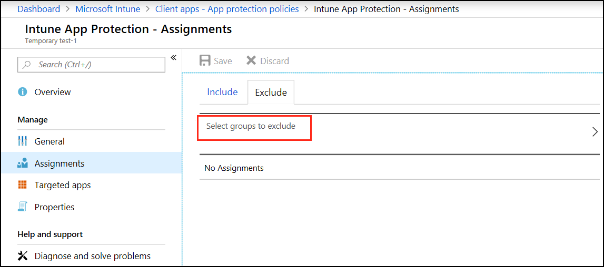
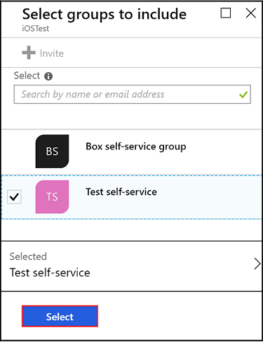

---
# required metadata

title: Create and deploy app protection policies 
titleSuffix: Microsoft Intune
description: Learn how to create and assign Microsoft Intune app protection policies.
keywords:
author: msmimart
ms.author: mimart
manager: dougeby
ms.date: 02/20/2018
ms.topic: article
ms.prod:
ms.service: microsoft-intune
ms.technology:
ms.assetid: f31b2964-e932-4cee-95c4-8d5506966c85

# optional metadata

#ROBOTS:
#audience:
#ms.devlang:
ms.reviewer: joglocke
ms.suite: ems
#ms.tgt_pltfrm:
ms.custom: intune-azure
---

# How to create and assign app protection policies

[!INCLUDE [azure_portal](./includes/azure_portal.md)]

Learn how to create and assign Microsoft Intune app protection policies to your users. This topic also describes how to make changes to existing policies.

## Before you begin

If you're looking for instructions in the Intune classic portal, see [how to create app protection policies](https://docs.microsoft.com/intune-classic/deploy-use/create-and-deploy-mobile-app-management-policies-with-microsoft-intune).

App protection policies can be applied to apps running on devices that may or may not be managed by Intune. For a more detailed description of how app protection policies work and the scenarios supported by Intune app protection policies, see [What is Microsoft Intune app protection policies](app-protection-policy.md).

If you're looking for a list of MAM supported apps, see [MAM apps list](https://www.microsoft.com/cloud-platform/microsoft-intune-apps).

##  Create an app protection policy
1. In the **Mobile apps** workload, select **App protection policies** from the **Manage** section. This selection opens the **App protection policies** details, where you create new policies and edit existing policies.
2. Choose **Add a policy**.

   

3. Type a name for the policy, add a brief description, and select the platform type for your policy. If needed, you can create more than one policy for each platform.

4. Choose **Apps** to open the **Apps** blade, where a list of available apps is displayed. Select one or more apps from the list that you want to associate with the policy that you're creating.
5. Once you've selected the apps, choose **Select** to save your selection.

    > [!IMPORTANT]
    > You must select at least one app to create a policy.

6. Choose **Configure required settings** on the **Add a policy** blade to open **Settings**.

   There are two categories of policy settings, **Data relocation** and **Access**.  Data relocation policies are applicable to data movement in and out of the apps. The access polices determine how the end user accesses the apps in a work context.
   To get you started, the policy settings have default values. If the default values meet your requirements, you don't have to make any changes.

   > [!TIP]
   > These policy settings are enforced only when using apps in the work context. When end users use the app to do a personal task, they aren't affected by these policies.

7. Choose **OK** to save this configuration. You are now back in the **Add a policy** pane. Choose **Create** to create the policy and save your settings.
8. Choose **OK** to save this configuration. You're now back in the **Add a policy** blade.
9. Choose **Create** to create the policy and save your settings.

When you finish creating a policy as described in the previous procedure, it is not deployed to any users. To deploy a policy, see [Deploy a policy to users](app-protection-policies.md#deploy-a-policy-to-users).

## Deploy a policy to users

1. In the **App protection policies** pane, select a policy.

1. In the **Policy** pane, choose  **Assignments**, which opens the **Intune App Protection - Assignments** pane. Choose **Select groups to include** in the **Assignments** pane to open the **Select groups to include** pane.

   

2.  A list of user groups is displayed on the **Add user group** pane. This list shows all the security groups in your **Azure Active Directory**. Select the user groups you want this policy to apply to, and then choose **Select**. Choosing **Select**, deploys the policy to users.

    

You've now created a policy and deployed it to users.

Only users with assigned Microsoft Intune licenses are affected by the policy. Users in the selected security group that don’t have an assigned Intune license aren't affected.

>[!IMPORTANT]
> If you're using Intune with Configuration Manager to manage your devices, the policy is only applied to the users directly in the group that you selected. Members of child groups nested within the group you selected aren't affected.

End users can download the apps from the App store or Google Play. For more information, see:
* [What to expect when your Android app is managed by app protection policies](app-protection-enabled-apps-android.md)
* [What to expect when your iOS app is managed by app protection policies](app-protection-enabled-apps-ios.md)

##  Change existing policies
You can edit an existing policy and apply it to the targeted users. However, when you change existing policies, users who are already signed in to the apps won’t see the changes for an 8-hour period.

To see the effect of the changes immediately, the end user must log out of the app, and sign back in.

### To change the list of apps associated with the policy

1.  In  the **App protection policies** pane, choose the policy you want to change to open a pane specific to the policy you just selected.

2.  In the policy pane, choose **Targeted apps** to open the list of apps.

3.  Remove or add apps from the list and choose the **Save** icon to save your changes.

### To change the list of user groups

1.  In  the **App protection policies** pane, choose the policy you want to change to open the pane specific to the policy you selected.

2.  In the policy pane, choose **Assignments** to open the **Intune App Protection - Assignments** pane that shows the list of current user groups who have this policy.

3.  To add a new user group to the policy, on the **Include** tab choose **Select groups to include**, and select the user group. Choose **Select** to deploy the policy to the group you selected.

4.  To delete a user group, on the **Exclude** tab choose **Select groups to exclude**, and select the user group. Choose **Select** to remove the user group.

### To change policy settings

1.  In the **App protection policies** pane, choose the policy you want to change to open a pane specific to the policy you just selected.

2.  Choose **Policy settings** to open the **Policy settings** pane.

3.  Change the settings, and choose the **Save** icon to save your changes.

## Target app protection policies based on device management state
In many organizations it’s common to allow end users to use both Intune Mobile Device Management (MDM) managed devices, such as corporate owned devices, and un-managed devices protected with only Intune app protection policies, such as BYO devices.

Because Intune app protection policies are targeted to a user’s identity, the protection settings for a user traditionally apply to both enrolled (MDM managed) and non-enrolled devices (no MDM). Therefore, you can target an Intune app protection policy to either Intune enrolled or un-enrolled iOS and Android devices. You can have one protection policy for un-managed devices in which strict data loss prevention (DLP) controls are in place, and a separate protection policy for MDM managed devices, where the DLP controls may be a little more relaxed. 

To create these policies, browse to **Mobile apps** > **App protection** policies in the Intune console, and click **Add a policy**. You can also edit an existing app protection policy. If you want the app protection policy to apply to both managed and un-managed devices, confirm that the **Target to all app types** is set to **Yes**, the default value. If you want to granularly assign base on management state, set the **Target to all app types** option to **No**. 

> [!NOTE]
> For specific iOS support information about app protection policies based on device management state, see [MAM protection policies targeted based on management state](whats-new.md#mam-protection-policies-targeted-based-on-management-state----1665993---).

## Policy settings
To see a full list of the policy settings for iOS and Android, select one of the following links:

- [iOS policies](app-protection-policy-settings-ios.md)
- [Android policies](app-protection-policy-settings-android.md)

## Next steps
[Monitor compliance and user status](app-protection-policies-monitor.md)

### See also
* [What to expect when your Android app is managed by app protection policies](app-protection-enabled-apps-android.md)
* [What to expect when your iOS app is managed by app protection policies](app-protection-enabled-apps-ios.md)
