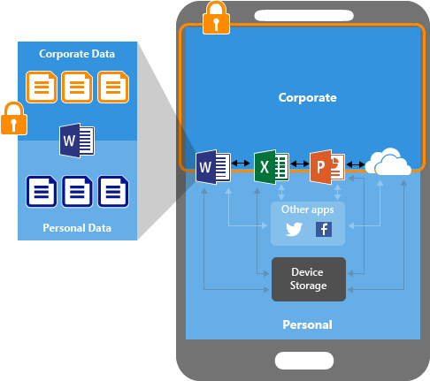
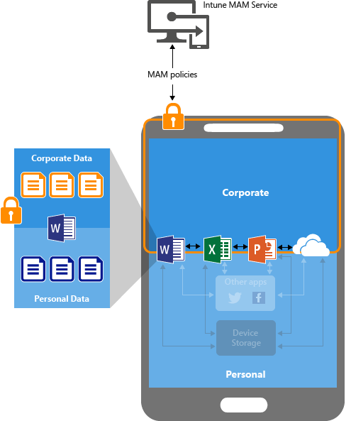

---
# required metadata

title: What are app protection policies
titleSuffix: Microsoft Intune
description: Learn how Microsoft Intune app protection policies help protect your company data and prevent data loss.
keywords:
author: brenduns
ms.author: brenduns
manager: dougeby
ms.date: 10/11/2018
ms.topic: conceptual
ms.prod:
ms.service: microsoft-intune
ms.technology:
ms.assetid: 1c086943-84a0-4d99-8295-490a2bc5be4b

# optional metadata

#ROBOTS:
#audience:
#ms.devlang:
ms.reviewer: joglocke
ms.suite: ems
search.appverid: MET150
#ms.tgt_pltfrm:
ms.custom: intune-azure; get-started

---

# What are app protection policies?

[!INCLUDE [azure_portal](./includes/azure_portal.md)]

Microsoft Intune app protection policies help protect your company data and prevent data loss.

## How you can protect app data
Your employees use mobile devices for both personal and work tasks. While making sure your employees can be productive, you want to prevent data loss, intentional and unintentional. You'll also want to protect company data that is accessed from devices that are not managed by you.

You can use Intune app protection policies **independent of any mobile-device management (MDM) solution**. This independence helps you protect your company’s data with or without enrolling devices in a device management solution. By implementing **app-level policies**, you can restrict access to company resources and keep data within the purview of your IT department.

App protection policies can be configured for apps that run on devices that are:

- **Enrolled in Microsoft Intune:** These devices are typically corporate owned.

- **Enrolled in a third-party Mobile device management (MDM) solution:** These  devices are typically corporate owned.

  > [!NOTE]
  > Mobile app management policies should not be used with third-party mobile app management or secure container solutions.

- **Not enrolled in any mobile device management solution:** The devices are typically employee owned devices that aren't managed or enrolled in Intune or other MDM solutions.

> [!IMPORTANT]
> You can create mobile app management policies for Office mobile apps that connect to Office 365 services. You can also protect access to Exchange on-premises mailboxes by creating Intune app protection policies for Outlook for iOS and Android enabled with hybrid Modern Authentication. Before using this feature, make sure you meet the [Outlook for iOS and Android requirements](https://technet.microsoft.com/library/mt846639(v=exchg.160).aspx). App protection policies are not supported for other apps that connect to on-premises Exchange or SharePoint services.

**The important benefits of using App protection policies are**

-   Protecting your company data at the app level. Because mobile app management doesn't require device management, you can protect company data on both managed and unmanaged devices. The management is centered on the user identity, which removes the requirement for device management.

-   End-user productivity isn't affected and policies don't apply when using the app in a personal context. The policies are applied only in a work context, which gives you the ability to protect company data without touching personal data.

There are additional benefits to using MDM with App protection policies, and companies can use App protection policies with and without MDM at the same time. For example, consider an employee that uses both a phone issued by the company, and their own personal tablet. The company phone is enrolled in MDM and protected by App protection policies while the personal device is protected by App protection policies only.

- **MDM makes sure that the device is protected**. For example, you can require a PIN to access the device, or you can deploy managed apps to the device. You can also deploy apps to devices through your MDM solution, to give you more control over app management.

- **App protection policies makes sure that the app-layer protections are in place**. For example, you can:
  - Require a PIN to open an app in a work context 
  - Control the sharing of data between apps 
  - Prevent the saving of company app data to a personal storage location

### Supported platforms for app protection policies
Intune app protection policies platform support aligns with Office mobile application platform support for Android and iOS devices. For details, see the **Mobile apps** section of [Office System Requirements](https://products.office.com/office-system-requirements#coreui-contentrichblock-9r05pwg).

Windows devices are currently not supported. However, you can use Windows Information Protection, which offers similar functionality. For details, see [Protect your enterprise data using Windows Information Protection (WIP)](https://technet.microsoft.com/itpro/windows/keep-secure/protect-enterprise-data-using-wip).

## How app protection policies protect app data

#### Apps without app protection policies

When apps are used without restrictions, company and personal data can get intermingled. Company data can end up in locations like personal storage or transferred to apps beyond your purview and result in data loss. The arrows in the preceding diagram show unrestricted data movement between both corporate and personal apps, and to storage locations.

### Data protection with app protection policies

You can use App protection policies to prevent company data from saving to the local storage of the device. You can also restrict data movement to other apps that aren't protected by App protection policies. App protection policy settings include:
- Data relocation policies like
 **Prevent Save As**, and **Restrict cut, copy, and paste**.
- Access policy settings like **Require simple PIN for access**, and **Block managed apps from running on jailbroken or rooted devices**.

### Data protection with app protection policies on devices managed by a Mobile Device Management solution

**For devices enrolled in an MDM solution**-

The preceding illustration shows the layers of protection that MDM and App protection policies offer together.

The MDM solution:

-   Enrolls the device

-   Deploys the apps to the device

-   Provides ongoing device compliance and management

**App protection policies add value by:**

-   Helping protect company data from leaking to consumer apps and services

-   Applying restrictions like *save-as*, *clipboard*, or *PIN*, to client apps

-   Wipe company data from apps without removing those apps from the device

### Data protection with app protection policies for devices without enrollment

The preceding diagram illustrates how the data protection policies work at the app level without MDM.

For BYOD devices not enrolled in any MDM solution, App protection policies can help protect company data at the app level.
However, there are some limitations to be aware of, like:

-   You can't deploy apps to the device. The end user has to get the apps from the store.

-   You can't provision certificate profiles on these devices.

-   You can't provision company Wi-Fi and VPN settings on these devices.

## App protection Global policy

If a OneDrive administrator browses to **admin.office.com** and selects **Device** access, they can set **Mobile application management** controls to the OneDrive and SharePoint client apps. 

The settings, made available to the OneDrive Admin console, configure a special Intune app protection policy called the **Global** policy. This global policy applies to all users in your tenant, and has no way to control the policy targeting. 

Once enabled, the OneDrive and SharePoint apps for iOS and Android are protected with the selected settings by default. An IT Pro can edit this policy in the Intune console to add more targeted apps and to modify any policy setting. 

By default, there can only be one **Global** policy per tenant. However, you can use [Intune Graph APIs](intune-graph-apis.md) to create extra global policies per tenant, but doing so isn't recommended. Creating extra global policies isn’t recommended because troubleshooting the implementation of such a policy can become complicated.

While the **Global** policy applies to all users in your tenant, any standard Intune app protection policy will override these settings.

## Multi-identity

Apps that support multi-identity let you use different accounts (work and personal) to access the same apps, while app protection policies apply only when the apps are used in the work context.

For an example of personal context, consider a user who starts a new document in Word, this is considered personal context so Intune App Protection policies are not applied. Once the document is saved on the corporate OneDrive account then it will be consieered corporatte context and Intune App Protection polices will be applied.

For an example of work context, consider a user who starts the OneDrive app by using their work account. In the work context, they can't move files to a personal storage location. Later, when they use OneDrive with their personal account, they can copy and move data from their personal OneDrive without restrictions.

- Learn more about the apps that support [MAM and multi-identity](https://www.microsoft.com/cloud-platform/microsoft-intune-apps) with Intune.

## Next steps

[How to create and deploy app protection policies with Microsoft Intune](app-protection-policies.md)

## See also
Third-party apps such as the Salesforce mobile app work with Intune in specific ways to protect corporate data. To learn more about how the Salesforce app in particular works with Intune (including MDM app configurations settings), see [Salesforce App and Microsoft Intune](https://gallery.technet.microsoft.com/Salesforce-App-and-Intune-c47d44ee/file/188000/1/Salesforce%20App%20and%20Intune%20for%20external.pdf).
