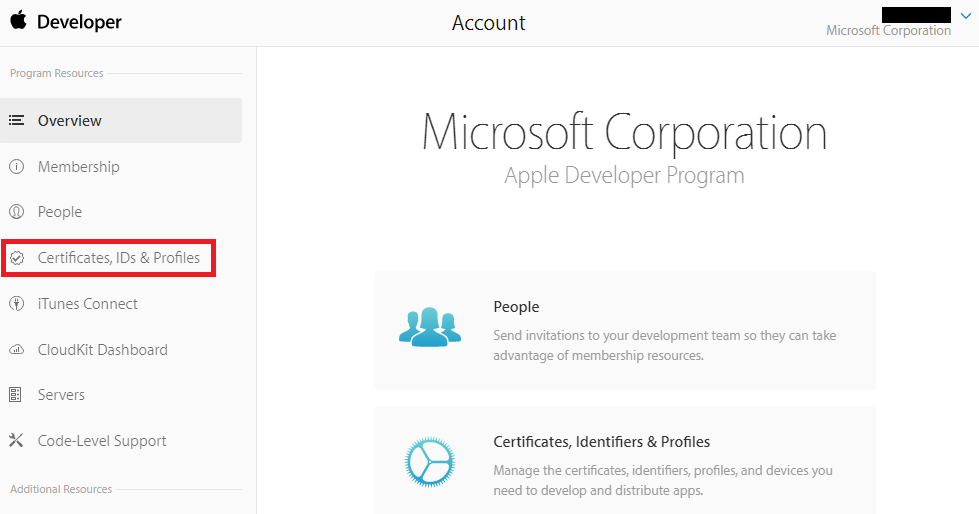
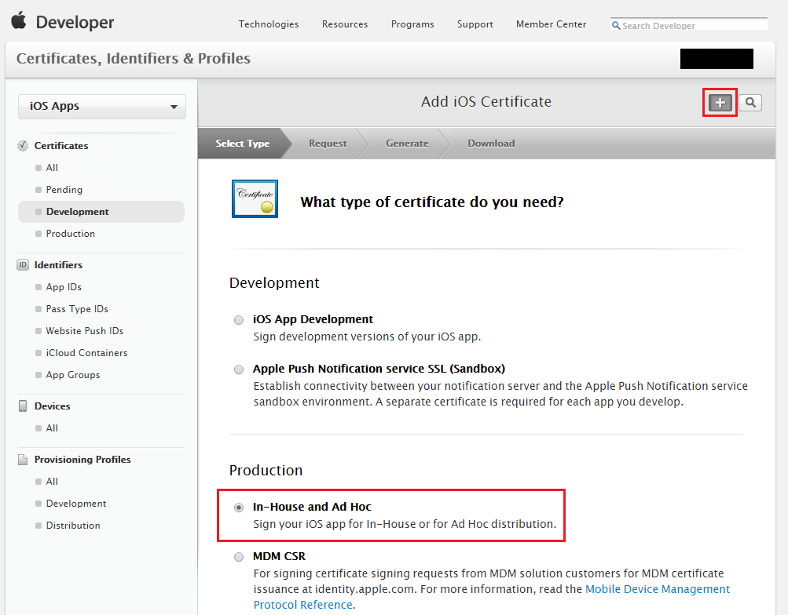
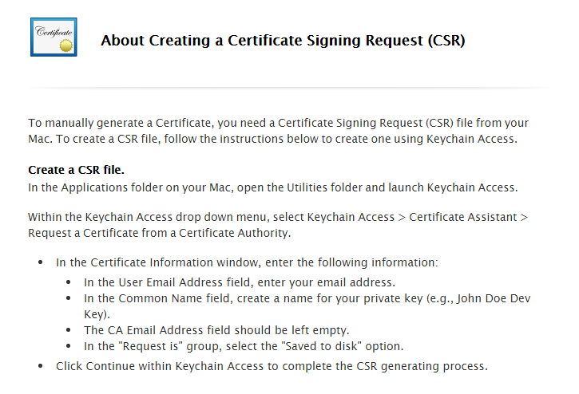
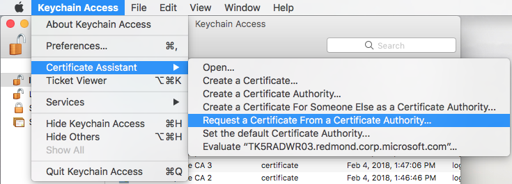
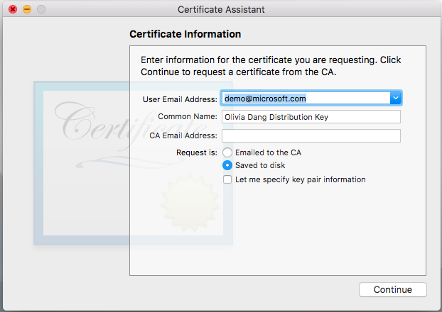
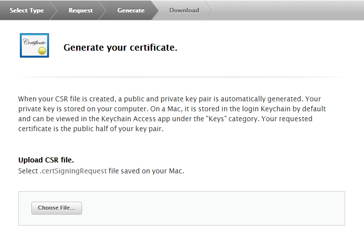
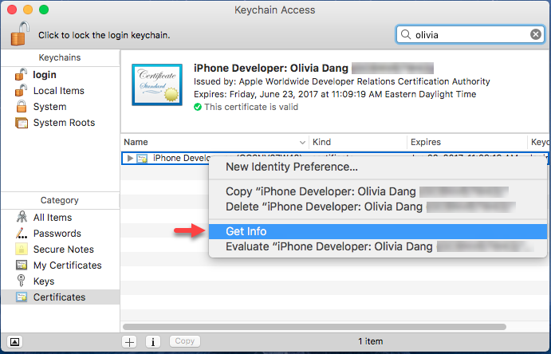
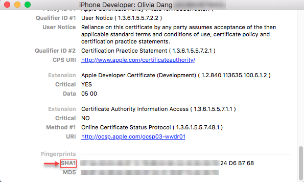
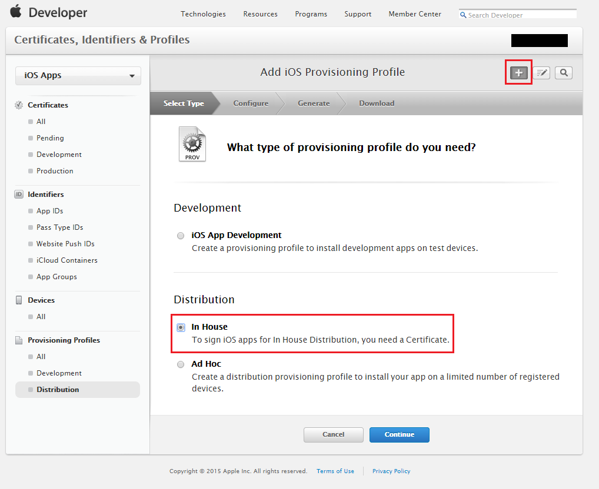

---
# required metadata

title: Wrap iOS apps with the Intune App Wrapping Tool 
description: Learn how to wrap your iOS apps without changing the code of the app itself. Prepare the apps so you can apply mobile app management policies.
keywords:
author: Erikre
ms.author: erikre
manager: dougeby
ms.date: 12/14/2018
ms.topic: conceptual
ms.prod:
ms.service: microsoft-intune
ms.localizationpriority: medium
ms.technology:
ms.assetid: 99ab0369-5115-4dc8-83ea-db7239b0de97

# optional metadata

#ROBOTS:
#audience:
#ms.devlang:
ms.reviewer: aanavath
ms.suite: ems
search.appverid: MET150
#ms.tgt_pltfrm:
ms.custom: intune-classic
ms.collection: M365-identity-device-management
---

# Prepare iOS apps for app protection policies with the Intune App Wrapping Tool

[!INCLUDE [both-portals](./includes/note-for-both-portals.md)]

Use the Microsoft Intune App Wrapping Tool for iOS to enable Intune app protection policies for in-house iOS apps without changing the code of the app itself.

The tool is a macOS command-line application that creates a wrapper around an app. Once an app is processed, you can change the app's functionality by deploying [app protection policies](app-protection-policies.md) to it.

To download the tool, see [Microsoft Intune App Wrapping Tool for iOS](https://github.com/msintuneappsdk/intune-app-wrapping-tool-ios) on GitHub.


## General prerequisites for the App Wrapping Tool

Before you run the App Wrapping Tool, you need to fulfill some general prerequisites:

* Download the [Microsoft Intune App Wrapping Tool for iOS](https://github.com/msintuneappsdk/intune-app-wrapping-tool-ios) from GitHub.

* A macOS computer that runs OS X 10.8.5 or later and has the Xcode toolset version 9 or later installed.

* The input iOS app must be developed and signed by your company or an independent software vendor (ISV).

  * The input app file must have the extension **.ipa** or **.app**.

  * The input app must be compiled for iOS 10 or later.

  * The input app cannot be encrypted.

  * The input app cannot have extended file attributes.

  * The input app must have entitlements set before being processed by the Intune App Wrapping Tool. [Entitlements](https://developer.apple.com/library/content/documentation/Miscellaneous/Reference/EntitlementKeyReference/Chapters/AboutEntitlements.html) give the app additional permissions and capabilities beyond those typically granted. See [Setting app entitlements](#setting-app-entitlements) for instructions.

## Apple Developer prerequisites for the App Wrapping Tool

To distribute wrapped apps exclusively to your organization's users, you need an account with the [Apple Developer Enterprise Program](https://developer.apple.com/programs/enterprise/) and several entities for app signing that are linked to your Apple Developer account.

To learn more about distributing iOS apps internally to your organization's users, read the official guide to [Distributing Apple Developer Enterprise Program Apps](https://developer.apple.com/library/content/documentation/IDEs/Conceptual/AppDistributionGuide/DistributingEnterpriseProgramApps/DistributingEnterpriseProgramApps.html#//apple_ref/doc/uid/TP40012582-CH33-SW1).

You will need the following to distribute apps wrapped by Intune:

* A developer account with the Apple Developer Enterprise Program.

* In-house and ad-hoc distribution signing certificate with valid Team Identifier.

  * You will need the SHA1 hash of the signing certificate as a parameter to the Intune App Wrapping Tool.


* In-house distribution provisioning profile.

### Steps to create an Apple Developer Enterprise account
1. Go to the [Apple Developer Enterprise Program site](https://developer.apple.com/programs/enterprise/).

2. In the top right of the page, click **Enroll**.

3. Read the checklist of what you need to enroll. Click **Start Your Enrollment** at the bottom of the page.

4. **Sign in** with the Apple ID of your organization. If you don't have one, click **Create Apple ID**.

5. Select your **Entity Type** and click **Continue**.

6. Fill out the form with your organization's information. Click **Continue**. At this point, Apple contacts you to verify that you are authorized to enroll your organization.

8. After verification, click **Agree to License**.

9. After agreeing to license, finish by **purchasing and activating the program**.

10. If you are the team agent (the person who joins the Apple Developer Enterprise Program on behalf of your organization), build your team first by inviting team members and assigning roles. To learn how to manage your team, read the Apple documentation on [Managing Your Developer Account Team](https://developer.apple.com/library/content/documentation/IDEs/Conceptual/AppDistributionGuide/ManagingYourTeam/ManagingYourTeam.html#//apple_ref/doc/uid/TP40012582-CH16-SW1).

### Steps to create an Apple signing certificate

1. Go to the [Apple Developer portal](https://developer.apple.com/).

2. In the top right of the page, click **Account**.

3. **Sign in** with your organizational Apple ID.

4. Click **Certificates, IDs & Profiles**.

   

5. Click the  in the top right corner to add an iOS certificate.

6. Choose to create an **In-House and Ad Hoc** certificate under **Production**.

   

   >[!NOTE]
   >If do not plan to distribute the app, and only want to test it internally, you can use an iOS App Development certificate instead of a certificate for Production. If you use a development certificate, make sure the mobile provisioning profile references the devices on which the app will be installed.

7. Click **Next** at the bottom of the page.

8. Read the instructions on creating a **Certificate Signing Request (CSR)** using the Keychain Access application on your macOS computer.

   

9. Follow the instructions above to create a Certificate Signing Request. On your macOS computer, launch the **Keychain Access** application.

10. On the macOS menu at the top of the screen, go to  **Keychain Access > Certificate Assistant > Request a Certificate From a Certificate Authority**.  

    

11. Follow the instructions from the Apple developer site above on how to create a CSR file. Save the CSR file to your macOS computer.

    

12. Return to the Apple developer site. Click **Continue**. Then upload the CSR file.

13. Apple generates your signing certificate. Download and save it to a memorable location on your macOS computer.

    

14. Double-click the certificate file you just downloaded to add the certificate to a keychain.

15. Open **Keychain Access** again. Locate your certificate by searching for its name in the top right search bar. Right-click on the item to bring up the menu and click **Get Info**. In the example screens, we are using a development certificate instead of a production certificate.

    

16. An informational window appears. Scroll to the bottom and look under the **Fingerprints** label. Copy the **SHA1** string (blurred out) to use as the argument for "-c" for the App Wrapping Tool.

    


### Steps to create an In-House Distribution Provisioning profile

1. Go back to the [Apple Developer account portal](https://developer.apple.com/account/) and **sign in** with your organizational Apple ID.

2. Click **Certificates, IDs & Profiles**.

3. Click the  in the top right corner to add an iOS provisioning profile.

4. Choose to create an **In House** provisioning profile under **Distribution**.

   

5. Click **Continue**. Make sure to link the previously generated signing certificate to the provisioning profile.

6. Follow the steps to download your profile (with extension .mobileprovision) to your macOS computer.

7. Save the file in a memorable location. This file will be used for the -p parameter while using the App Wrapping Tool.


## Download the App Wrapping Tool

1.  Download the files for the App Wrapping Tool from [GitHub](https://github.com/msintuneappsdk/intune-app-wrapping-tool-ios) to a macOS computer.

2.  Double-click **Microsoft Intune App Wrapping Tool for iOS.dmg**. A window with the End User License Agreement (EULA) will appear. Read the document carefully.

3. Choose **Agree** to accept EULA, which mounts the package to your computer.

## Run the App Wrapping Tool

### Use terminal

Open the macOS Terminal and run the following command:

```bash
/Volumes/IntuneMAMPackager/Contents/MacOS/IntuneMAMPackager -i /<path of input app>/<app filename> -o /<path to output folder>/<app filename> -p /<path to provisioning profile> -c <SHA1 hash of the certificate> [-b [<output app build string>]] [-v] [-e] [-x /<array of extension provisioning profile paths>]
```

> [!NOTE]
> Some parameters are optional as shown in the following table.

**Example:** The following example command runs the App Wrapping Tool on the app named MyApp.ipa. A provisioning profile and SHA-1 hash of the signing certificate are specified and used to sign the wrapped app. The output app (MyApp_Wrapped.ipa) is created and stored in your Desktop folder.

```bash
./IntuneMAMPackager/Contents/MacOS/IntuneMAMPackager -i ~/Desktop/MyApp.ipa -o ~/Desktop/MyApp_Wrapped.ipa -p ~/Desktop/My_Provisioning_Profile_.mobileprovision -c "12 A3 BC 45 D6 7E F8 90 1A 2B 3C DE F4 AB C5 D6 E7 89 0F AB"  -v true
```

### Command-line parameters
You can use the following command line parameters with the App Wrapping Tool:

|Property|How to use it|
|---------------|--------------------------------|
|**-i**|`<Path of the input native iOS application file>`. The file name must end in .app or .ipa. |
|**-o**|`<Path of the wrapped output application>` |
|**-p**|`<Path of your provisioning profile for iOS apps>`|
|**-c**|`<SHA1 hash of the signing certificate>`|
|**-h**|Shows detailed usage information about the available command line properties for the App Wrapping Tool.|
|**-v**|(Optional) Outputs verbose messages to the console. It is recommended to use this flag to debug any errors.|
|**-e**| (Optional) Use this flag to have the App Wrapping Tool remove missing entitlements as it processes the app. See [Setting app entitlements](#setting-app-entitlements) for more details.|
|**-xe**| (Optional) Prints information about the iOS extensions in the app and what entitlements are required to use them. See  [Setting app entitlements](#setting-app-entitlements) for more details. |
|**-x**| (Optional) `<An array of paths to extension provisioning profiles>`. Use this if your app needs extension provisioning profiles.|
|**-f**|(Optional) `<Path to a plist file specifying arguments.>` Use this flag in front of the [plist](https://developer.apple.com/library/mac/documentation/Cocoa/Conceptual/PropertyLists/Introduction/Introduction.html) file if you choose to use the plist template to specify the rest of the IntuneMAMPackager properties like -i, -o, and -p. See Use a plist to input arguments. |
|**-b**|(Optional) Use -b without an argument if you want the wrapped output app to have the same bundle version as the input app (not recommended). <br/><br/> Use `-b <custom bundle version>` if you want the wrapped app to have a custom CFBundleVersion. If you choose to specify a custom CFBundleVersion, it's a good idea to increment the native app’s CFBundleVersion by the least significant component, like 1.0.0 -> 1.0.1. |

### Use a plist to input arguments
An easy way to run the App Wrapping Tool is to put all the command arguments into a [plist](https://developer.apple.com/library/mac/documentation/Cocoa/Conceptual/PropertyLists/Introduction/Introduction.html) file. Plist is a file format similar to XML that you can use to input your command line arguments using a form interface.

In the IntuneMAMPackager/Contents/MacOS folder, open `Parameters.plist` (a blank plist template) with a text editor or Xcode. Enter your arguments for the following keys:

| Plist key |  Default value| Notes |
|------------------|--------------|-----|
| Input Application Package Path  |empty| Same as -i|
| Output Application Package Path |empty| Same as -o|
| Provisioning Profile Path |empty| Same as -p|
| SHA-1 Certificate Hash |empty| Same as -c|
| Verbose Enabled |false| Same as -v|
| Remove Missing Entitlements | false| Same as -c|
| Prevent Default Build |false | Equivalent to using -b without arguments|
|Build String Override | empty| The custom CFBundleVersion of the wrapped output app |
|Extension Provisioning Profile Paths | empty| An array of extension provisioning profiles for the app.


Run the IntuneMAMPackager with the plist as the sole argument:

```bash
./IntuneMAMPackager –f Parameters.plist
```

### Post-wrapping

After the wrapping process completes, the message "The application was successfully wrapped" will be displayed. If an error occurs, see [Error messages](#error-messages-and-log-files) for help.

The wrapped app is saved in the output folder you specified previously. You can upload the app to the Intune admin console and associate it with a mobile application management policy.

> [!IMPORTANT]
> When uploading a wrapped app, you can try to update an older version of the app if an older (wrapped or native) version was already deployed to Intune. If you experience an error, upload the app as a new app and delete the older version.

You can now deploy the app to your user groups and target app protection policies to the app. The app will run on the device using the app protection policies you specified.

## How often should I rewrap my iOS application with the Intune App Wrapping Tool?
The main scenarios in which you would need to rewrap your applications are as follows:
* The application itself has released a new version. The previous version of the app was wrapped and uploaded to the Intune console.
* The Intune App Wrapping Tool for iOS has released a new version that enables key bug fixes, or new, specific Intune application protection policy features. This happens after 6-8 weeks through GitHub repo for the [Microsoft Intune App Wrapping Tool for iOS](https://github.com/msintuneappsdk/intune-app-wrapping-tool-ios).

For iOS, while it is possible to wrap with different cert/provisioning profile than the original used to sign the app, if the entitlements specified in the app are not included in the new provisioning profile, wrapping will fail. Using the “-e” command-line option, which removes any missing entitlements from the app, to force wrapping to not fail in this scenario can cause broken functionality in the app.

Some best practices for rewrapping include:
* Ensuring that a different provisioning profile has all the required entitlements as any previous provisioning profile. 

## Error messages and log files
Use the following information to troubleshoot issues you have with the app wrapping tool.

### Error messages
If the app wrapping tool fails to finish successfully, one of the following error messages will be displayed in the console:

|Error message|More information|
|-----------------|--------------------|
|You must specify a valid iOS provisioning profile.|Your provisioning profile might not be valid. Check to make sure you have the correct permissions for devices and that your profile is correctly targeting development or distribution. Your provisioning profile might also be expired.|
|Specify a valid input application name.|Make sure that the input application name you specified is correct.|
|Specify a valid path to the output application.|Make sure that the path to the output application you specified exists, and is correct.|
|Specify a valid input provisioning profile.|Make sure you supplied a valid provisioning profile name and extension. Your provisioning profile might be missing entitlements, or you might not have included the –p command line option.|
|The input application you specified was not found. Specify a valid input application name and path.|Make sure your input app path is valid and exists. Make sure the input app exists at that location.|
|The input provisioning profile file you specified was not found. Specify a valid input provisioning profile file.|Make sure that the path to the input provisioning file is valid and that the file you specified exists.|
|The output application folder you specified was not found. Specify a valid path to the output application.|Make sure that the output path you specified is valid and exists.|
|Output app does not have **.ipa** extension.|Only apps with the **.app** and **.ipa** extensions are accepted by the App Wrapping Tool. Make sure your output file has a valid extension.|
|An invalid signing certificate was specified. Specify a valid Apple signing certificate.|Make sure you’ve downloaded the correct signing certificate from the Apple developer portal. Your certificate might be expired or might be missing a public or private key. If your Apple certificate and provisioning profile can be used to correctly sign an app within Xcode, then they are valid for the App Wrapping Tool.|
|The input application you specified is invalid. Specify a valid application.|Make sure you have a valid iOS application that has been compiled as an .app or .ipa file.|
|The input application you specified is encrypted. Specify a valid unencrypted application.|The App Wrapping Tool does not support encrypted apps. Provide an unencrypted app.|
|The input application you specified is not in a Position Independent Executable (PIE) format. Specify a valid application in PIE format.|Position Independent Executable (PIE) apps can be loaded at a random memory address when run. This can have security benefits. For more about security benefits, see your Apple Developer documentation.|
|The input app you specified has already been wrapped. Specify a valid unwrapped application.|You cannot process an app that has already been processed by the tool. If you want to process an app again, run the tool using the original version of the app.|
|The input application you specified is not signed. Specify a valid signed application.|The app wrapping tool requires apps to be signed. Consult your developer documentation to learn how to sign a wrapped app.|
|The input application you specified must be in the .ipa or .app format.|Only .app and .ipa extensions are accepted by the app wrapping tool. Make sure your input file has a valid extension and has been compiled as a .app or .ipa file.|
|The input app you specified has already been wrapped and is on the latest policy template version.|The App Wrapping Tool will not rewrap an existing wrapped app with the latest policy template version.|
|WARNING: You did not specify a SHA1 certificate hash. Make sure that your wrapped application is signed before deploying.|Ensure that you specify a valid SHA1 hash following the –c command line flag. |

### Log files for the App Wrapping Tool
Apps that have been wrapped by using the App Wrapping Tool generate logs that are written to the iOS client device console. This information is useful when you are having problems with the application and need to determine if the issue is related to the App Wrapping Tool. To retrieve this information, use the following steps:

1.  Reproduce the issue by running the app.

2.  Collect the console output by following Apple's instructions for [Debugging Deployed iOS Apps](https://developer.apple.com/library/ios/qa/qa1747/_index.html).

3.  Filter the saved logs for App Restrictions output by entering the following script into the console:

    ```bash
    grep “IntuneAppRestrictions” <text file containing console output> > <required filtered log file name>
    ```
    You can submit the filtered logs to Microsoft.

    > [!NOTE]
    > In the log file, the item ‘build version’ represents the build version of Xcode.

    Wrapped apps will also present users the option to send logs directly from the device via email after the app crashes. Users can send the logs to you to examine and forward to Microsoft if necessary.


### Certificate, provisioning profile, and authentication requirements

The App Wrapping Tool for iOS has some requirements that must be met in order to guarantee full functionality.

|Requirement|Details|
|---------------|-----------|
|iOS provisioning profile|Make sure that the provisioning profile is valid before you include it. The App Wrapping Tool does not check whether the provisioning profile is expired when processing an iOS app. If an expired provisioning profile is specified, the app wrapping tool will include the expired provisioning profile, and you will not know there is a problem until the app fails to install on an iOS device.|
|iOS signing certificate|Make sure that the signing certificate is valid before you specify it. The tool does not check whether a certificate is expired when processing iOS apps. If the hash for an expired certificate is provided, the tool will process and sign the app, but it will fail to install on devices.<br /><br />Make sure that the certificate provided for signing the wrapped app has a match in the provisioning profile. The tool does not validate if the provisioning profile has a match for the certificate provided for signing the wrapped application.|
|Authentication|A device must have a PIN for encryption to work. On devices to which you have deployed a wrapped app, touching the status bar on the device will require the user to sign in again with a work or school account. The default policy in a wrapped app is *authentication on re-launch*. iOS handles any external notification (like a phone call) by exiting the app and then re-launching it.


## Setting app entitlements
Before wrapping your app, you can grant *entitlements* to give the app additional permissions and capabilities that exceed what an app can typically do. An *entitlement file* is used during code signing to specify special permissions within your app (for example, access to a shared keychain). Specific app services called *capabilities* are enabled within Xcode during app development. Once enabled, the capabilities are reflected in your entitlements file. For more information about entitlements and capabilities, see [Adding Capabilities](https://developer.apple.com/library/ios/documentation/IDEs/Conceptual/AppDistributionGuide/AddingCapabilities/AddingCapabilities.html) in the iOS Developer Library. For a complete list of supported capabilities, see [Supported capabilities](https://developer.apple.com/library/ios/documentation/IDEs/Conceptual/AppDistributionGuide/SupportedCapabilities/SupportedCapabilities.html).

### Supported capabilities for the App Wrapping Tool for iOS

|Capability|Description|Recommended guidance|
|--------------|---------------|------------------------|
|App groups|Use app groups to allow multiple apps to access shared containers and allow additional interprocess communication between apps.<br /><br />To enable app groups, open the **Capabilities** pane and click **ON** in **App Groups**. You can add app groups or select existing ones.|When using App Groups, use reverse DNS notation:<br /><br />*group.com.companyName.AppGroup*|
|Background modes|Enabling background modes lets your iOS app continue running in the background.||
|Data protection|Data protection adds a level of security to files stored on disk by your iOS app. Data protection uses the built-in encryption hardware present on specific devices to store files in an encrypted format on disk. Your app needs to be provisioned to use data protection.||
|In-app purchase|In-app purchase embeds a store directly into your app by enabling you to connect to the store and securely process payments from the user. You can use in-app purchase to collect payment for enhanced functionality or for additional content usable by your app.||
|Keychain sharing|Enabling keychain sharing lets your app share passwords in the keychain with other apps developed by your team.|When using keychain sharing, use reverse DNS notation:<br /><br />*com.companyName.KeychainGroup*|
|Personal VPN|Enable personal VPN to allow your app to create and control a custom system VPN configuration using the Network Extension framework.||
|Push notifications|Apple Push Notification service (APNs) lets an app that isn’t running in the foreground notify the user that it has information for the user.|For push notifications to work, you need to use an app-specific provisioning profile.<br /><br />Follow the steps in the [Apple developer documentation](https://developer.apple.com/library/ios/documentation/IDEs/Conceptual/AppDistributionGuide/AddingCapabilities/AddingCapabilities.html).|
|Wireless accessory configuration|Enabling wireless accessory configuration adds the External Accessory framework to your project and lets your app set up MFi Wi-Fi accessories.||

### Steps to enable entitlements

1.  Enable capabilities in your app:

    a.  In Xcode, go to your app’s target, and click **Capabilities**.

    b.  Turn on the appropriate capabilities. For detailed information about each capability and how to determine the correct values, see [Adding Capabilities](https://developer.apple.com/library/ios/documentation/IDEs/Conceptual/AppDistributionGuide/AddingCapabilities/AddingCapabilities.html) in the iOS Developer Library.

    c.  Note any IDs that you created during the process. These may also be referred to as the `AppIdentifierPrefix` values.

    d.  Build and sign your app to be wrapped.

2.  Enable entitlements in your provisioning profile:

    a.  Sign in to the Apple Developer Member Center.

    b.  Create a provisioning profile for your app. For instructions, see [How to Obtain the Prerequisites for the Intune App Wrapping Tool for iOS](https://blogs.technet.microsoft.com/enterprisemobility/2015/02/25/how-to-obtain-the-prerequisites-for-the-intune-app-wrapping-tool-for-ios/).

    c.  In your provisioning profile, enable the same entitlements that you have in your app. You will need to supply the same IDs (the `AppIdentifierPrefix` values) that you specified during the development of your app. 

    d.  Finish the provisioning profile wizard and download your file.

3.  Ensure that you have satisfied all the prerequisites, and then wrap the app.

### Troubleshoot common errors with entitlements
If the App Wrapping Tool for iOS shows an entitlement error, try the following troubleshooting steps.

|Issue|Cause|Resolution|
|---------|---------|--------------|
|Failed to parse entitlements generated from the input application.|The App Wrapping Tool cannot read the entitlements file that was extracted from the app. The entitlements file might be malformed.|Inspect the entitlements file for your app. The following instructions explain how to do so. When inspecting the entitlements file, check for any malformed syntax. The file should be in XML format.|
|Entitlements are missing in the provisioning profile (missing entitlements are listed). Repackage the app with a provisioning profile that has these entitlements.|There is a mismatch between the entitlements enabled in the provisioning profile and the capabilities enabled in the app. This mismatch also applies to the IDs associated with particular capabilities (like app groups and keychain access).|Generally, you can create a new provisioning profile that enables the same capabilities as the app. When IDs between the profile and app don't match, the App Wrapping Tool will replace the IDs if it is able to. If you still get this error after creating a new provisioning profile, you can try  removing entitlements from the app by using the –e parameter (see Using the –e parameter to remove entitlements from an app section).|

### Find the existing entitlements of a signed app
To review the existing entitlements of a signed app and provisioning profile:

1.  Find the .ipa file and change its the extension to .zip.

2.  Expand the .zip file. This will produce a Payload folder containing your .app bundle.

3.  Use the codesign tool to check the entitlements on the .app bundle, where `YourApp.app` is the actual name of your .app bundle.:

    ```bash
    $ codesign -d --entitlements :- "Payload/YourApp.app"
    ```

4.  Use the security tool to check the entitlements of the app's embedded provisioning profile, where `YourApp.app` is the actual name of your .app bundle.

    ```bash
    $ security -D -i "Payload/YourApp.app/embedded.mobileprovision"
    ```

### Remove entitlements from an app by using the –e parameter
This command removes any enabled capabilities in the app that are not in the entitlements file. If you remove capabilities that are being used by the app, it can break your app. An example of where you might remove missing capabilities is in a vendor-produced app that has all capabilities by default.

```bash
./IntuneMAMPackager/Contents/MacOS/IntuneMAMPackager –i /<path of input app>/<app filename> -o /<path to output folder>/<app filename> –p /<path to provisioning profile> –c <SHA1 hash of the certificate> -e
```

## Security and privacy for the App Wrapping Tool
Use the following security and privacy best practices when you use the App Wrapping Tool.

-   The signing certificate, provisioning profile, and the line-of-business app you specify must be on the same macOS machine that you use to run the app wrapping tool. If the files are on a UNC path, ensure that these are accessible from the macOS machine. The path must be secured via IPsec or SMB signing.

    The wrapped application imported into the admin console should be on the same computer that you run the tool on. If the file is on a UNC path, ensure that it is accessible on the computer running the admin console. The path must be secured via IPsec or SMB signing.

-   The environment where the App Wrapping Tool is downloaded from the GitHub repository needs to be secured via IPsec or SMB signing.

-   The app you process must come from a trustworthy source to ensure protection against attacks.

-   Ensure that the output folder you specify in the App Wrapping Tool is secured, particularly if it is a remote folder.

-   iOS apps that include a file upload dialog box can allow users to circumvent, cut, copy, and paste restrictions applied to the app. For example, a user could use the file upload dialog box to upload a screenshot of the app data.

-   When you monitor the documents folder on your device from within a wrapped app, you might see a folder named .msftintuneapplauncher. If you change or delete this file, it might affect the correct functioning of restricted apps.

## Intune App Wrapping Tool for iOS with Citrix MDX mVPN
This feature is an integration with the Citrix MDX app wrapper for iOS. The integration is simply an additional, optional command-line flag, `-citrix` to the general Intune App Wrapping Tools.

### Requirements

To use the `-citrix` flag, you will also need to install the [Citrix MDX app wrapper for iOS](https://docs.citrix.com/en-us/mdx-toolkit/10/xmob-mdx-kit-app-wrap-ios.html) on the same macOS machine. The downloads are found on [Citrix XenMobile Downloads](https://www.citrix.com/downloads/xenmobile/) and are restricted to Citrix customers only after signing in. Make sure this is installed in the default location: `/Applications/Citrix/MDXToolkit`. 

> [!NOTE] 
> Support for Intune and Citrix integration is limited to iOS 10+ devices only.

### Use the `-citrix` flag
Simply run your general app wrapping command and with the `-citrix` flag appended. The `-citrix` flag currently does not take any arguments.

**Usage format**:
```bash
./IntuneMAMPackager/Contents/MacOS/IntuneMAMPackager -i /<path of input app>/<app filename> -o /<path to output folder>/<app filename> -p /<path to provisioning profile> -c <SHA1 hash of the certificate> [-b [<output app build string>]] [-v] [-e] [-x /<array of extension provisioing profile paths>] [-citrix]
```

**Example command**:
```bash
./IntuneMAMPackager/Contents/MacOS/IntuneMAMPackager -i ~/Desktop/MyApp.ipa -o ~/Desktop/MyApp_Wrapped.ipa -p ~/Desktop/My_Provisioning_Profile_.mobileprovision -c 12A3BC45D67EF8901A2B3CDEF4ABC5D6E7890FAB  -v true -citrix
```

## Getting logs for your wrapped applications
Use the following steps to get logs for your wrapped applications during troubleshooting.

1. Go to the iOS Settings app on your device and select your LOB app.
2. Toggle the **Diagnostics Console** to **On**.
3. Launch your LOB application.
4. Click on the "Get Started" link.
5. You can now share logs through email or copying them to a OneDrive location.

> [!NOTE]
> The logging functionality is enabled for apps that have wrapped with the Intune App Wrapping Tool version 7.1.13 or above.

## See also

- [Decide how to prepare apps for mobile application management with Microsoft Intune](apps-prepare-mobile-application-management.md)
- [Common questions, issues, and resolutions with device policies and profiles](device-profile-troubleshoot.md)
- [Use the SDK to enable apps for mobile application management](app-sdk.md)
