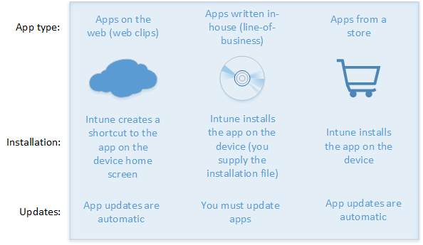

---
# required metadata

title: How to add apps to Microsoft Intune 
titleSuffix: "Intune on Azure"
description: These procedures help you get your apps into Intune ready to be assigned to users and devices. "
keywords:
author: robstackmsft
ms.author: robstack
manager: angrobe
ms.date: 06/28/2017
ms.topic: article
ms.prod:
ms.service: microsoft-intune
ms.technology:
ms.assetid: a1ded457-0ecf-4f9c-a2d2-857d57f8d30a

# optional metadata

#ROBOTS:
#audience:
#ms.devlang:
ms.reviewer: mghadial
ms.suite: ems
#ms.tgt_pltfrm:
ms.custom: intune-azure
---

# How to add an app to Microsoft Intune

[!INCLUDE[azure_portal](./includes/azure_portal.md)]

Before you can manage and assign apps for your users, you must add them to Intune. Intune supports a wide range of different app types, and the options might be different for each type.

Intune lets you add and assign these app types:

The following platforms are supported.

- Android store apps
- Android line-of-business (LOB) apps
- iOS store apps
- iOS line-of-business (LOB) apps
- Web apps
- Windows Phone 8.1 store apps
- Windows Phone line-of-business apps (.xap files)
- Windows store apps
- Windows line-of-business apps (.msi files only)

>[!TIP]
> A line-of-business (or LOB) app is one that you do not install from an app store, but install from the app installation file. For example, to install an iOS LOB app, you add the application archive file (with the extension .ipa). These are typically apps you have written in-house.

## Before you start

Consider the following points before you begin to add and assign apps.

- When you add and assign an app from a store, end users must have an account with that store in order to be able to install the app.
- Some apps or items you assign might be dependent on built-in iOS apps. For example, if you assign a book from the iOS store, then the iBooks app must be present on the device. If you have removed the iBooks built-in app, you cannot use Intune to reinstate it.

## Cloud storage space
All apps that you create by using the software installer installation type (for example, a line-of-business app) are packaged and uploaded to Intune cloud storage. A trial subscription of Intune includes 2 gigabytes (GB) of cloud-based storage that is used to store managed apps and updates. A full subscription includes 20 GB of storage space.

You can purchase additional storage for Intune using your original purchase method.  If you paid by invoice or credit card, visit the [Subscription Management portal](https://portal.office.com/adminportal/home?switchtomodern=true#/subscriptions).  Otherwise, contact your partner or sales associate.

Requirements for cloud storage space are as follows:

-   All app installation files must be in the same folder.
-   The maximum file size for any file that you upload is 2 GB.

## How to create and edit categories for apps

App categories can be used to help you sort apps to make them easier for end users to find in the company portal. You can assign one or more categories to an app, for example, **Developer apps**, or **Communication apps**.
When you add an app to Intune, you are given the option to select the category you want. Use the platform-specific topics to add an app, and assign categories. To create and edit your own categories, use the following procedure:

1. Sign into the Azure portal.
2. Choose **More Services** > **Monitoring + Management** > **Intune**.
3. On the **Intune** blade, choose **Mobile apps**.
4. In the **Mobile apps** workload, choose **Setup** > **App categories**.
5. On the **App categories** blade, a list of the current categories is shown. Choose one of the following actions:
	- **Create a category** - On the **Create category** blade, enter a name for the new category. Names can be entered in one language only, and are not translated by Intune. When you are done, click **Create**.
	- **Edit a category** - For any category in the list, choose '**...**'. On the **Properties** blade, you can enter a new name for the category, or delete the category.

## Apps added automatically by Intune

The following apps, published by Microsoft, are built-into Intune, and ready for you to assign:

|||
|-|-|
|Name|Platform|App type|
|Azure Information Protection|Android|Managed Android store app|
|Dynamics CRM for Phones|Android|Managed Android store app|
|Dynamics CRM for Tablets|Android|Managed Android store app|
|Excel|iOS|Managed iOS store app|
|Excel|Android|Managed Android store app|
|Managed Browser|Android|Managed Android store app|
|Managed Browser|iOS|Managed iOS store app|
|Microsoft Dynamics CRM on Phones|iOS|Managed iOS store app|
|Microsoft Dynamics CRM on Tablets|iOS|Managed iOS store app|
|Microsoft Power BI|iOS|Managed iOS store app|
|Microsoft Power BI|Android|Managed Android store app|
|Microsoft SharePoint|iOS|Managed iOS store app|
|Microsoft SharePoint|Android|Managed Android store app|
|Microsoft Teams|Android|Managed Android store app|
|Microsoft Teams|iOS|Managed iOS store app|
|OneDrive|iOS|Managed iOS store app|
|OneDrive|Android|Managed Android store app|
|OneNote|iOS|Managed iOS store app|
|Outlook|Android|Managed Android store app|
|Outlook|iOS|Managed iOS store app|
|Outlook Groups|Android|Managed Android store app|
|Outlook Groups|iOS|Managed iOS store app|
|PowerPoint|iOS|Managed iOS store app|

## Next Steps

Choose one of the following topics to find out how to add apps for each platform to Intune:

- [Android store apps](store-apps-android.md)
- [Android LOB apps](lob-apps-android.md)
- [iOS store apps](store-apps-ios.md)
- [iOS LOB apps](lob-apps-ios.md)
- [Web apps (for all platforms)](web-app.md)
- [Windows Phone 8.1 store apps](store-apps-windows-phone-8-1.md)
- [Windows Phone LOB apps](lob-apps-windows-phone.md)
- [Windows store apps](store-apps-windows.md)
- [Windows LOB app](lob-apps-windows.md)
- [Office 365 apps for Windows 10](apps-add-office365.md)
