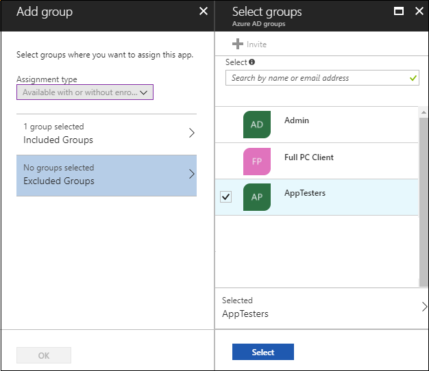
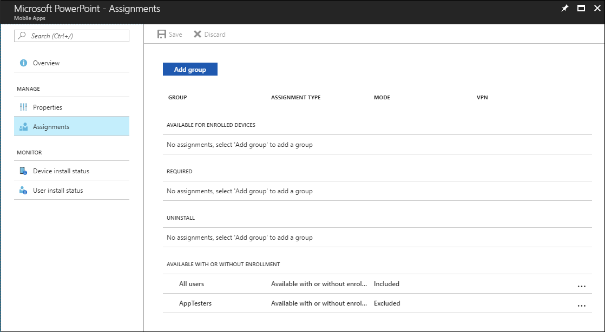

---
# required metadata

title: Include and exclude app assignments in Microsoft Intune
titlesuffix: 
description: Learn how you can use Microsoft Intune to include and exclude app assignments.
keywords:
author: Erikre
ms.author: erikre
manager: dougeby
ms.date: 03/08/2018
ms.topic: article
ms.prod:
ms.service: microsoft-intune
ms.technology:
ms.assetid: c59f6df5-3317-4dff-8f19-fdeec33faedf

# optional metadata

#ROBOTS:
#audience:
#ms.devlang:
ms.reviewer: mghadial
ms.suite: ems
#ms.tgt_pltfrm:
ms.custom: intune-azure

---

# Include and exclude app assignments in Microsoft Intune

Using Intune, you can determine who has access to an app by assigning the groups to include, as well as exclude. However, before you assign groups for the app, you set the assignment type of an app, which makes the app available, required, or uninstalls the app. 

When focusing on the availability of an app, you include and exclude app assignments to a group of users or devices by using a combination of include and exclude group assignments. This capability can be useful when you make the app available by including a large group, and then narrow the selected users by also excluding a smaller group. The smaller group could be a test group or executive group. 

When you exclude groups from an app assignment, you must exclude only user or only device groups, not a mixture of groups. Intune does not consider user to device association when excluding groups. Including user groups while excluding device groups is unlikely to produce the results you need, as inclusion will take precedence over exclusion. For example, if you target an iOS app to **All Users** and exclude **All iPads**, the net result will be that any user using an iPad will still get the app. If, however, you target the iOS app to **All Devices** and exclude **All iPads**, the deployment will be successful.  

>[!NOTE]
>When setting a group assignment for an app, the **Not Applicable** type is deprecated and replaced with exclude group functionality. 
>
>Intune provides pre-created **All Users** and **All Devices** groups in the console with built-in optimizations for your convenience. It is highly recommended that you use these groups to target all users and all devices instead of any ‘All users’ or ’All devices’ groups you may have created yourself.  

## Including and excluding groups when assigning apps 
To assign an app to groups using the include and exclude assignment:
1. Sign into the [Azure portal](https://portal.azure.com).
2. Choose **All services** > **Intune**. Intune is located in the **Monitoring + Management** section.
3. Select **Mobile apps** from the Microsoft Intune blade.
4. Select **Apps** from the **Mobile apps** blade. The list of added apps is displayed.
5. Select the app that you want to assign. A dashboard is displayed related to the app. 
6. Select **Assignments** under the **Manage** section. 

    
7. Select **Add group** to add the groups of users who are assigned the app. 
8. Select an **Assignment type** from the available assignment types on the **Add group** blade.
9. Select **Available with or without enrollment** as the assignment type.

    
10. Select **Included Groups** to select the group of users that you want to make this app available.

    >[!NOTE]
    >When adding a group, if any other group has already been included for a given assignment type, it will be pre-selected and unchangeable for other include assignment types. Therefore, that group that has been used, cannot be used as an included group.

11. Select **Yes** to make this app available to all users.

    
12. Click **OK** to set the group to include.
13. Select **Excluded Groups** to select the groups of users that you want to make this app unavailable. 
14. Select the groups to exclude, which makes this app unavailable.

    
15. Click **Select** to complete your groups selection.
16. Click **OK** on the **Add group** blade. The app **Assignments** list is displayed.
17. Click **Save** to make your group assignments active for the app.

When making group assignments, groups that have already been assigned or selected are disabled. If you want to select a group that is currently disabled, remove it from the app’s assigned list. You can edit assignments from the app **Assignments** list by selecting the row containing the specific assignment that you want to change. In addition, you can remove an assignment by clicking on the ellipse (…) at the end of a row and selecting **Remove**. Also, you can change the view of the **Assignments** list by choosing to group by **Assignment type** or by **Included/Excluded**.

## Next steps

- For more information about including and excluding group assignments for apps, see the [Microsoft Intune Blog](https://aka.ms/new_app_assignment_process).
- [How to monitor app information and assignments](apps-monitor.md)