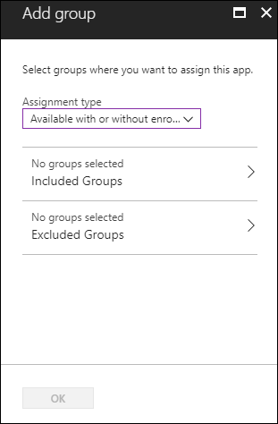
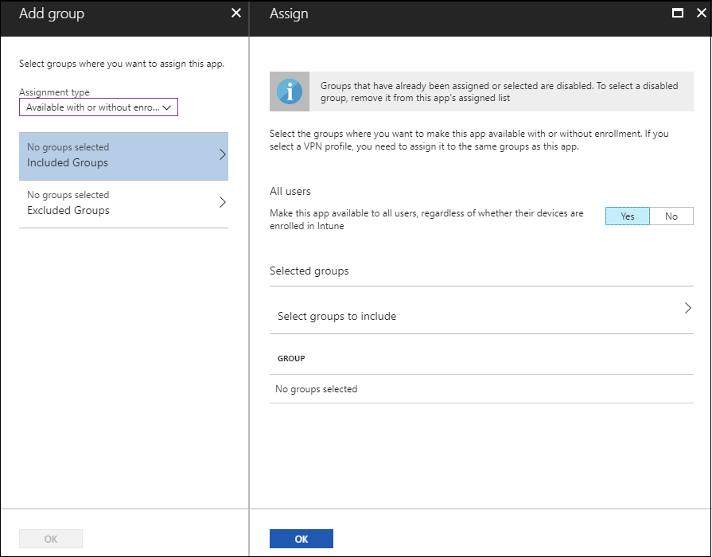

---
# required metadata

title: Include and exclude app assignments in Microsoft Intune
titlesuffix: 
description: Learn how you can use Microsoft Intune to include and exclude app assignments.
keywords:
author: Erikre
ms.author: erikre
manager: dougeby
ms.date: 03/08/2018
ms.topic: article
ms.prod:
ms.service: microsoft-intune
ms.technology:
ms.assetid: c59f6df5-3317-4dff-8f19-fdeec33faedf

# optional metadata

#ROBOTS:
#audience:
#ms.devlang:
ms.reviewer: mghadial
ms.suite: ems
#ms.tgt_pltfrm:
ms.custom: intune-azure

---

# Include and exclude app assignments in Microsoft Intune

In Intune, you can determine who has access to an app by assigning groups of users to include and exclude. Before you assign groups to the app, you must set the assignment type for an app. The assignment type makes the app available, required, or uninstalls the app. 

To set the availability of an app, you include and exclude app assignments to a group of users or devices by using a combination of include and exclude group assignments. This capability can be useful when you make the app available by including a large group, and then narrow the selected users by also excluding a smaller group. The smaller group might be a test group or an executive group. 

When you exclude groups from an app assignment, you must exclude only user groups or only device groups. You can't exclude a mixture of user groups and device groups. 

Intune doesn't consider user-to-device association when it excludes groups. Including user groups while excluding device groups is unlikely to produce the results you need. Inclusion takes precedence over exclusion. For example, if you target an iOS app to **All Users** and exclude **All iPads**, the net result is that any user who is using an iPad still gets the app. However, if you target the iOS app to **All Devices** and exclude **All iPads**, the deployment will be successful.  

> [!NOTE]
> When you set a group assignment for an app, the **Not Applicable** type is deprecated and replaced with exclude group functionality. 
>
> Intune provides pre-created **All Users** and **All Devices** groups in the console. The groups have built-in optimizations for your convenience. It's highly recommended that you use these groups to target all users and all devices instead of any "all users" or "all devices" groups that you might create yourself.  
>
>Android Enterprise (formerly known as Android for Work) supports including and excluding groups, but doesn't support the pre-created **All Users** and **All Devices** built-in groups that Intune provides.

## Include and exclude groups when assigning apps 
To assign an app to groups by using the include and exclude assignment:
1. Sign in to the [Azure portal](https://portal.azure.com).
2. Select **All services** > **Intune**. Intune is located in the **Monitoring + Management** section.
3. In the **Intune** menu, select **Mobile apps**.
4. In the **Mobile apps** pane, select **Apps**. The list of added apps is shown.
5. Select the app that you want to assign. A dashboard displays information about the app. 
6. In the **Manage** section of the menu, select **Assignments**. 

    
7. Select **Add group** to add the groups of users who are assigned the app. 
8. In the **Add group** pane, select an **Assignment type** from the available assignment types.
9. For the assignment type, select **Available with or without enrollment**.

    
10. Select **Included Groups** to select the group of users that you want to make this app available to.

    > [!NOTE]
    > When you add a group, if any other group has already been included for a specific assignment type, the app is preselected and can't be modified for other include assignment types. The group that has been used can't be used as an included group.

11. Select **Yes** to make this app available to all users.

    
12. Select **OK** to set the group to include.
13. Select **Excluded Groups** to select the groups of users that you want to make this app unavailable to. 
14. Select the groups to exclude. This makes this app unavailable to those groups.

    
15. Select **Select** to complete your group selection.
16. In the **Add group** pane, select **OK**. The app **Assignments** list appears.
17. Click **Save** to make your group assignments active for the app.

When you make group assignments, groups that have already been assigned aren't available to be modified. If you want to select a group that currently isn't available, first remove the app from the app’s assigned list. 

To edit assignments, in the app **Assignments** list, select the row that contains the specific assignment that you want to change. You can also remove an assignment by selecting the ellipse (**…**) at the end of a row, and then selecting **Remove**. To change the view of the **Assignments** list, group by **Assignment type** or by **Included/Excluded**.

## Next steps

- For more information about including and excluding group assignments for apps, see the [Microsoft Intune blog](https://aka.ms/new_app_assignment_process).
- Learn how to [monitor app information and assignments](apps-monitor.md).
