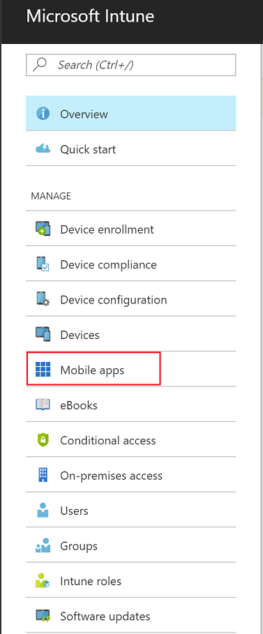

---
# required metadata

title: How to wipe only corporate data from apps
titleSuffix: Microsoft Intune
description: Learn how to selectively wipe only corporate data from Intune-managed apps with Microsoft Intune.
keywords:
author: Erikre
ms.author: erikre
manager: dougeby
ms.date: 07/08/2019
ms.topic: conceptual
ms.service: microsoft-intune
ms.localizationpriority: high
ms.technology:
ms.assetid: 42605e6e-5b84-44ff-b86e-346ea123b53e

# optional metadata

#ROBOTS:
#audience:
#ms.devlang:
ms.reviewer: mghadial
ms.suite: ems
search.appverid: MET150
#ms.tgt_pltfrm:
ms.custom: intune-azure
ms.collection: M365-identity-device-management
---

# How to wipe only corporate data from Intune-managed apps

[!INCLUDE [azure_portal](./includes/azure_portal.md)]

When a device is lost or stolen, or if the employee leaves your company, you want to make sure company app data is removed from the device. But you might not want to remove personal data on the device, especially if the device is an employee-owned device.

>[!NOTE]
> The iOS, Android, and Windows 10 platforms are the only platforms currently supported for wiping corporate data from Intune managed apps. Intune managed apps are applications that include the Intune APP SDK and have a licensed user account for your organization. Deployment of Application Protection Policies are not required to enable app selective wipe.

To selectively remove company app data, create a wipe request by using the steps in this topic. After the request is finished, the next time the app runs on the device, company data is removed from the app. In addition to creating a wipe request, you can configure a selective wipe of your organization's data as a new action when the conditions of Application Protection Policies (APP) Access settings are not met. This feature helps you automatically protect and remove sensitive organization data from applications based on pre-configured criteria.

>[!IMPORTANT]
> Contacts synced directly from the app to the native address book are removed. Any contacts synced from the native address book to another external source can't be wiped. Currently, this only applies to the Microsoft Outlook app.

## Deployed WIP policies without user enrollment
Windows Information Protection (WIP) policies can be deployed without requiring MDM users to enroll their Windows 10 device. This configuration allows companies to protect their corporate documents based on the WIP configuration, while allowing the user to maintain management of their own Windows devices. Once documents are protected with a WIP policy, the protected data can be selectively wiped by an Intune administrator. By selecting the user and device, and sending a wipe request, all data that was protected via the WIP policy will become unusable. From the Intune in the Azure portal, select **Client app** > **App selective wipe**. For more information, see [Create and deploy Windows Information Protection (WIP) app protection policy with Intune](windows-information-protection-policy-create.md).

## Create a wipe request

1. Sign in to the [Azure portal](https://portal.azure.com).

2. Choose **All services**, type **Intune** in the filter textbox, and select **Intune**. The Intune pane opens, choose the **Client apps** pane.

    

3. On the **Client apps pane**, choose **App selective wipe**.

4. Choose  **New wipe request**. The **New wipe request** pane opens.

    

5. Choose a user and then choose **Select** to select the user whose app data you want to wipe.

6. Next, choose **Device** from the **New wipe request** pane. This opens the **Select Device** pane that lists all the devices associated with the selected user, and also provides two columns, the device name, which is a friendly name defined by the user, and the device type, its device platform. Select the device you want to wipe.

7. You are now back on the **New wipe request** pane. Choose **OK** to make a wipe request.

The service creates and tracks a separate wipe request for each protected app on the device, and the user associated with the wipe request.

## Monitor your wipe requests

You can have a summarized report that shows the overall status of the wipe request, and includes the number of pending requests and failures. To get more details, follow these steps:

1. On the **Client Apps - App selective wipe** pane, you can see the list of your requests grouped by users. Because the system creates a wipe request for each protected app running on the device, you might see multiple requests for a user. The status indicates whether a wipe request is **pending**, **failed**, or **successful**.

    

Additionally, you are able to see the device name, and its device type, which can be helpful when reading the reports.

>[!IMPORTANT]
> The user must open the app for the wipe to occur, and the wipe may take up to 30 minutes after the request was made.

## Delete a wipe request

Wipes with pending status are displayed until you manually delete them. To manually delete a wipe request:

1. On the **Client Apps - App selective wipe** pane.

2. From the list, right-click on the wipe request you want to delete, then choose **Delete wipe request**.

    

3. You're prompted to confirm the deletion, choose **Yes** or **No**, then click **OK**.

### See also
[What's app protection policy](app-protection-policy.md)

[What's app management](app-management.md)
